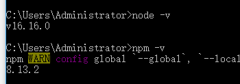
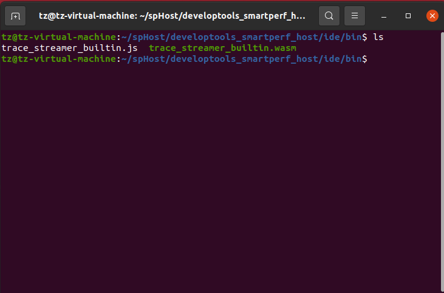
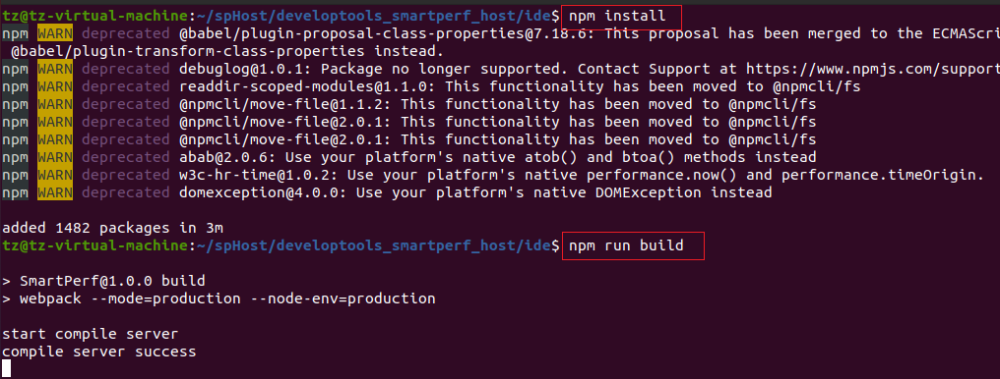
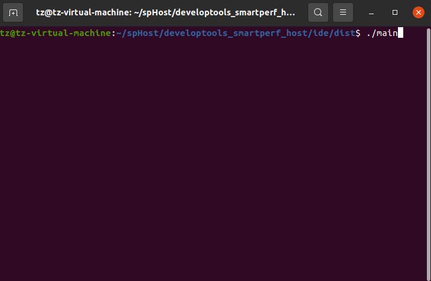
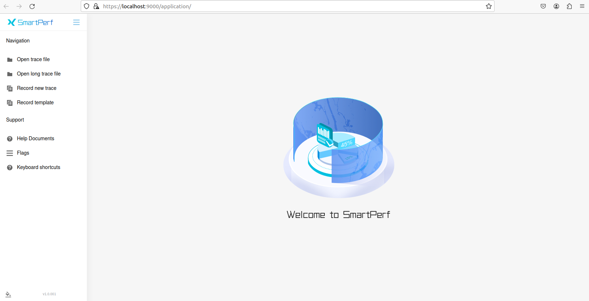

# SmartPerf 编译部署指导文档


## 编译环境搭建
注意:在linux编译环境安装时以root或者其他 sudo 用户身份运行下面的命令。
### node 环境安装
##### 下载Node js安装包(windows推荐， linux跳过此步骤)
从网站下载node js安装包 https://nodejs.org/en/download/current/。
##### 安装nodejs
- ubuntu 20.04 与Debian 11系统中，直接用apt-get安装，先切换到 root用户下，命令如下(node 版本 >= 16.15.1  npm 版本 >= 8.13.2)
```
        sudo su
        apt-get update 
        apt-get install nodejs npm
```


- centos 系统中使用yum安装，先切换到root用户下，命令如下：
```
        sudo su 
        sudo yum -y install nodejs npm 
```


- windows系统中， 用安装包一路next即可

           
- 安装完成后运行检查是否安装成功
```
        node -v 
        npm -v
```


  出现版本号就代表安装成功了。

##### 更换npm源
```
        npm config set registry http://registry.npmmirror.com
```   

##### 安装tsc typeScript 编译器
直接使用npm 安装运行命令。
```
        npm install -g typescript
        tsc -v
```
 
 验证安装完成:


### go 编译环境安装
- ubuntu 环境下直接使用apt安装，以root用户执行(go 版本 >= 1.13.8 )
```
        apt-get install golang-go
```


- centos系统中使用yum安装，先切换到root用户下，命令如下：

```
        sudo su
        sudo yum -y install go 
```


- windows 系统下 从 https://golang.google.cn/dl/ 下载安装包， 一路next 完成 安装即可
           
- 安装完成后 命令行运行验证是否安装成功

```
        go version 
``` 
## 项目编译
#### 先下载sql.js的二进制包
从如下 https://github.com/sql-js/sql.js/releases/download/v1.6.2/sqljs-all.zip 获取到sql.js的二进制包。
将压缩包解压后，将文件放置到项目third-party 目录下，如果项目中无third-party目录，先创建third-party目录

        


#### 先编译获取trace_streamer 的二进制包
参照:smartperf/trace_streamer/compile_trace_streamer.md 编译出wasm版本的二进制文件。
将获取到二进制文件放入到项目bin目录下，如果项目目录中无bin目录 先创建bin目录。
然后将trace_streamer的二进制文件放入bin目录中。
	   



#### 代码编译(依赖于上面node环境 和 go环境)
在项目目录安装项目依赖:
```
        npm install 
```
在项目目录下运行命令:
```
        npm run build 
```                

    编译成功后会有main 可执行文件生成。
    
## 项目部署
直接运行 ./main 可执行程序，完成项目的部署。

 ## 访问项目     
在浏览器上打开 https://[部署机器ip地址]:9000/application/ 
!!! 注意一定是https。



 备注：如果未出现如图所示网页.而是显示 无法访问此网站。
可以在window cmd 里执行telnet [部署机器ip地址] 9000。
如果显示端口连接失败 可能是防火墙未对9000 端口放开即可。