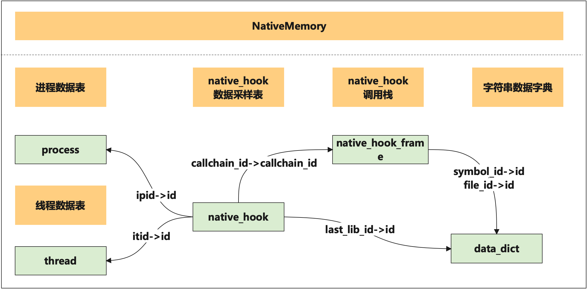
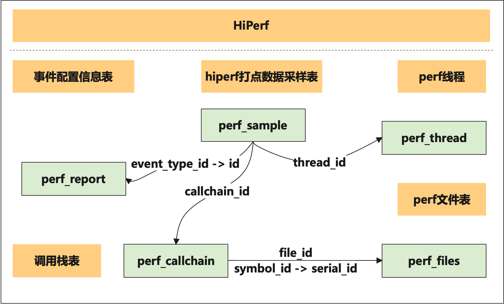
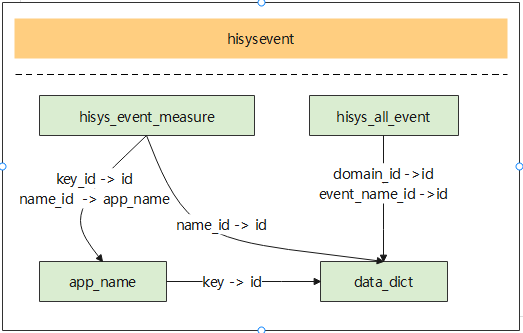
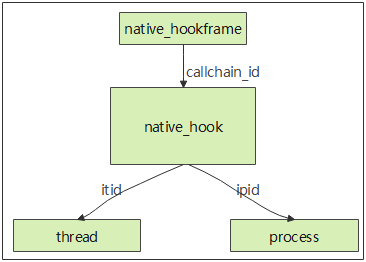
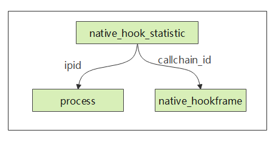
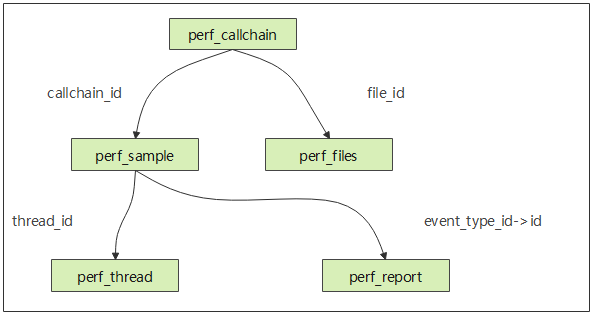
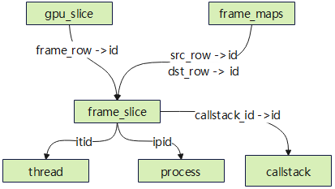

# TraceStreamer数据表概述
TraceStreamer可以将trace数据源转化为易于理解和使用的数据库。用户可以通过SmartPerf界面直观的研究系统跟踪数据，也可在理解TraceStreamer生成的数据库的基础上，在TraceStreamer的交互模式或者Smartperf的数据库查询模式下，使用SQL查询语句自由组装查看用户关心的数据。下文将对TraceStreamer生成的数据库进行详细描述，给用户使用SQL查询系统跟踪数据提供帮助。

## TraceStreamer输出的数据表分类
* 常规泳道图数据表

* native memory数据源相关表

* perf相关数据表

* hisysevent相关数据表

## TraceStreamer输出数据库包含以下表格
| 表名称 |作用|
| ----          |----      |
| animation | 记录动效的响应时延和完成时延|
| app_name | 记录HiSysEvent事件的事件名与IDE部分事件的字段名为APPNAME中存放的相关信息的映射关系|
| app_startup | 记录了应用启动相关数据|
| args | 记录方法参数集合|
| bio_latency_sample | 记录IO操作相关方法调用，及调用栈数据|
| callstack | 记录调用堆栈和异步调用信息，其中depth,stack_id和parent_stack_id仅在非异步调用中有效。当cookid不为空时，为异步调用，此时callid为进程唯一号，否则为线程唯一号|
| clk_event_filter | 记录时钟相关的信息|
| clock_event_filter | 此结构用来维护时钟事件，cpu与唯一的ID做关联|
| clock_snapshot | 时钟号和时间，时钟名的映射表|
| cpu_measure_filter | cpu事件过滤器表|
| cpu_usage | 记录CPU使用率事件|
| datasource_clockid | 数据源和时钟号的映射表|
| data_dict | 记录常用的字符串，将字符串和索引关联，降低程序运行的内存占用，用作辅助数据|
| data_type | 记录数据类型和typeId的关联关系|
| device_info | 记录设备分辨率和帧率|
| device_state | 记录设备屏幕亮度，蓝牙，位置，wifi，音乐，媒体等信息|
| diskio | 记录磁盘读写数据事件|
| dynamic_frame | 记录动效帧的分辨率和结束时间等|
| ebpf_callstack | 记录了采样相关信息|
| file_system_sample | 记录了调用栈的相关信息|
| frame_maps | 记录应用到RS的帧的映射关系|
| frame_slice | 记录RS(RenderService)和应用的帧渲染|
| gpu_slice | 记录RS的帧对应的gpu渲染时长|
| hidump | 记录FPS（Frame Per Second）数据|
| hisys_all_event | 记录了所有HiSysEvent事件相关的原始数据 |
| hisys_event_measure | 记录了HiSysEvent事件相关数据，目前HiSysEvent事件包括了异常事件，IDE事件，器件状态事件 |
| instant |  记录Sched_waking, sched_wakeup事件， 用作ThreadState表的上下文使用 |
| irq | 记录中断相关事件|
| js_config | 记录了arkTs数据采集的相关配置|
| js_cpu_profiler_node | 记录了cpu profiler中node节点的数据|
| js_cpu_profiler_sample | 记录了cpu profiler中sample节点的数据|
| js_heap_edges | 记录了js内存数据类对象对应的成员的信息|
| js_heap_files | 记录了js内存数据的名称和时间|
| js_heap_info | 记录了js内存数据类型，如nodes和edges的字段类型和数据总数|
| js_heap_location | 记录了js内存location节点相关数据|
| js_heap_nodes | 记录了js内存类对象和其成员的对应关系|
| js_heap_sample | 记录了timeline模式下的时间轴信息|
| js_heap_string | 记录了js内存数据中的字符串|
| js_heap_trace_function_info | 记录了timeline模式下的调用栈的每个函数信息|
| js_heap_trace_node | 记录了timeline模式下的调用栈信息|
| live_process | 记录了一些实时的进程中执行的一些数据|
| log | 记录hilog打印日志数据|
| measure | 记录所有的计量值|
| measure_filter | 记录一个递增的filterid队列，所有其他的filter类型在获取过程中，均从此数据列表中获取下一个可用的filter_id并做记录|
| memory_ashmem | 记录了进程所占用的ashmem相关信息|
| memory_dma | 记录了进程占用的DMA内存相关信息|
| memory_process_gpu | 记录进程占用GPU内存相关信息|
| memory_window_gpu | 记录窗口占用GPU内存相关信息|
| meta | 记录执行解析操作相关的基本信息|
| native_hook | 记录堆内存申请与释放相关的数据|
| native_hook_frame | 记录堆内存申请与释放相关的调用栈|
| native_hook_statistic | 记录堆内存申请与释放相关的统计信息|
| network | 抓取网络信息传输时产生的一些相关信息|
| paged_memory_sample | 记录内存操作相关方法调用，及调用栈数据|
| perf_callchain | 记录Hiperf采样数据的调用栈信息|
| perf_files | 记录Hiperf工具采集到的函数符号表和文件名|
| perf_report | 记录Hiperf工具采集数据时的配置信息。包括抓取的事件类型，抓取数据的命令， 抓数据时指定的进程名称|
| perf_sample | 记录Hiperf工具的采样信息|
| perf_thread | 记录Hiperf工具采集到的进程和线程数据|
| process | 记录所有的进程信息|
| process_measure | 保存进程的所有计量值|
| process_measure_filter | 将进程ID作为key1，进程的内存，界面刷新，屏幕亮度等信息作为key2，唯一确定一个filter_id|
| raw | 此数据结构主要作为ThreadState的上下文使用，这张表是sched_waking,sched_wakup, cpu_idle事件的原始记录|
| sched_slice | 此数据结构主要作为ThreadState的上下文使用，这张表是sched_switch事件的原始记录|
| smaps | 记录进程的内存消耗的相关信息采样|
| stat | 此结果用来统计数据解析中各类数据的数据条数，数据和合法性，数据的匹配程度（begin-end），数据的损失等，查看此结构对应的表，可对数据源有基本的了解|
| static_initalize | 记录了so初始化相关数据|
| memory_cpu       | 记录了cpu内存数据     |
| memory_profile   | 记录了sys/kernel/debug/mali0/ctx/$(pidof xxx)/mem_profile节点相关数据|
| memory_rs_image  | 记录了hidumper抓取的界面的内存大小相关数据|
| symbols | 记录系统调用名称和其函数指针的对应关系，trace中用addr来映射function_name来节省存储空间|
| syscall | 记录用户空间函数与内核空间函数相互调用记录|
| sys_event_filter | 记录所有的filter|
| sys_mem_measure | 记录了所有的系统内存相关的测量信息|
| task_pool | 记录任务池相关数据，与callstack表相关联|
| thread | 记录所有的线程信息|
| thread_state | 记录线程状态信息|
| trace_config | 记录trace数据源，proto的事件-plugin与其process_name|
| trace_range | 记录ftrace数据与其他类型数据的时间交集，供前端展示数据时使用|
## 表与事件来源
|        表名称        |   事件源     |      插件名       |          备注         |
|         ----         |    ----      |         ----      |           ----        |
|animation             |    -         |ftrace-plugin      |记录动效的响应时延和完成时延   |
|app_name              |    -         |hisysevent-plugin  |JSON数据源             |
|args                  |    -         |ftrace-plugin      |配合callstack使用      |
|bio_latency_sample    |    -         |    -              |IO操作相关方法调用，及调用栈数据 |
|callstack             |    -         |ftrace-plugin      |异步或非异步的调用     |
|cpu_measure_filter    |    -         |ftrace-plugin      |cpu跟踪器，cpu频率等   |
|cpu_usage             |    -         |cpu-plugin         |cpu使用率              |
|data_dict             |  通用的      |    -              |所有字符串的记录       |
|data_type             |  通用的      |    -              |辅助表                 |
|device_info           |    -         |ftrace-plugin      |记录设备分辨率和帧率   |
|device_state          |  通用的      |hisysevent-plugin  |记录设备屏幕亮度，蓝牙，位置等信息   |
|dynamic_frame         |    -         |ftrace-plugin      |动效帧的分辨率和结束时间等   |
|ebpf_callstack        |    -         |    -              |磁盘读写相关的数据      |
|file_system_callstack |    -         |    -              |ebpf文件系统           |
|file_system_sample    |    -         |    -              |ebpf文件系统           |
|frame_maps            |    -         |ftrace-plugin      |帧渲染数据，app到RS的映射           |
|frame_slice           |    -         |ftrace-plugin      |帧渲染数据             |
|gpu_slice             |    -         |ftrace-plugin      |gpu渲染时长            |
|hidump                |    -         |hidump-plugin      |FPS数据                |
|hisys_all_event   |    -             |hisysevent-plugin  |JSON数据源             |
|hisys_event_measure   |    -         |hisysevent-plugin  |JSON数据源             |
|instant               |    -         |ftrace-plugin      |waking和wakeup事件     |
|irq                   |    -         |ftrace-plugin      |记录中断事件           |
|js_config             |    -         |arkts-plugin       | arkTs数据采集的配置   |
|js_cpu_profiler_node  |    -         |arkts-plugin       | 记录了cpu profiler中node节点的数据   |
|js_cpu_profiler_sample |    -         |arkts-plugin       | 记录了cpu profiler中sample节点的数据 |
|js_heap_edges        |    -         |arkts-plugin          | js内存数据            |
|js_heap_files        |    -         |arkts-plugin          | js内存数据            |
|js_heap_info         |    -         |arkts-plugin          | js内存数据            |
|js_heap_location     |    -         |arkts-plugin          | js内存数据            |
|js_heap_nodes        |    -         |arkts-plugin          | js内存数据            |
|js_heap_sample       |    -         |arkts-plugin          | js内存数据            |
|js_heap_string       |    -         |arkts-plugin          | js内存数据            |
|js_heap_trace_function_info | -     |arkts-plugin          | js内存数据            |
|js_heap_trace_node   |    -         |arkts-plugin          | js内存数据            |
|app_startup           |    -         |ftrace-plugin      | 应用启动数据           |
|static_initalize      |    -         |ftrace-plugin      | so初始化数据           |
|memory_cpu            |    -         |hidumper-plugin    | cpu内存数据           |
|memory_profile        |    -         |hidumper-plugin    |/sys/kernel/debug/mali0/ctx/$(pidof xxx)/mem_profile节点相关数据|
| memory_rs_image      |    -         |hidumper-plugin    |hidumper抓取的界面内存大小数据|
|live_process          |    -         |process-plugin     |Monitor数据            |
|network               |    -         |network-plugin     |Monitor数据            |
|diskio                |    -         |diskio-plugin      |Monitor数据            |
|log                   |    -         |hilog-plugin       |系统日志               |
|measure               |  通用的      |    -              |系统中的计量值（数值型）|
|measure_filter        |  通用的      |    -              |计量值的查询辅助表      |
|memory_ashmem         |    -         |memory-plugin      |进程所占用ashmem相关信息 |
|memory_dma            |    -         |memory-plugin      |进程占用的DMA内存相关信息 |
|memory_process_gpu    |    -         |memory-plugin      |进程占用GPU内存相关信息 |
|memory_window_gpu     |    -         |memory-plugin      |窗口占用GPU内存相关信息 |
|meta                  |  通用的      |    -              |记录解析现场数据（解析时间，数据类型，解析工具等）|
|native_hook           |    -         |nativehook/hookdaemon |malloc && mmap内存数据            |
|native_hook_frame     |    -         |nativehook/hookdaemon |native_hook调用栈数据            |
|native_hook_statistic |    -         |nativehook/hookdaemon |malloc && mmap统计数据 |
|paged_memory_sample   |    -         |    -              |网络数据传输相关的信息 |
|perf_callchain        |    -         |perf-plugin        |perf数据（非插件模式） |
|perf_files            |    -         |    -              |perf数据（非插件模式） |
|perf_report           |    -         |    -              |perf数据（非插件模式） |
|perf_sample           |    -         |    -              |perf数据（非插件模式） |
|perf_thread           |    -         |    -              |perf数据（非插件模式） |
|process               |    -         |ftrace-plugin      |进程信息               |
|process_measure       |    -         |ftrace-plugin      |进程内存               |
|process_measure_filter|    -         |ftrace-plugin      |process_measure的辅助表|
|raw                   |    -         |ftrace-plugin      |线程唤醒信息           |
|sched_slice           |    -         |ftrace-plugin      |配合线程状态表使用，sched_switch的原始数据|
|smaps                 |    -         |memory-plugin      |进程的内存消耗         |
|stat                  |  通用的      |    -              |记录不同种类数据的数据量|
|symbols               |    -         |ftrace-plugin      |符号表（地址到字符串的映射）|
|syscall               |    -         |ftrace-plugin      |系统调用 sys_enter/exit|
|sys_event_filter      |    -         |ftrace-plugin      |                       |
|sys_mem_measure       |    -         |memory-plugin      |系统内存               |
|thread                |  通用的      |    -              |线程信息（常用）        |
|thread_state          |  通用的      |ftrace-plugin      |线程调度图（常用）      |
|trace_config          |  通用的      |hisysevent-plugin  |记录trace数据源         |
|trace_range           |  通用的      |    -              |trace数据的时长         |
|clock_snapshot        |  通用的      |通用的            |时钟号和时间，时钟名的映射表|
|datasource_clockid    |  通用的      |通用的             |数据源和时钟号的映射表|
|task_pool             |    -         |    -             |任务池数据              |

## ___表格关系图___
---
### 进程表与线程表关系
当一个进程或者线程结束后，系统可能再次将该进程号或者线程号分配给其他进程或者线程，造成一个进程号或线程号代表多个进程或线程的情况。  
Process和Thread表中的id字段可以唯一标识进程和线程。process表中的id在其他表中用作ipid字段。thread表中的id在其他表中用作itid字段。   
thread表通过ipid字段关联process表的id字段，可以查询线程归属进程。  
 
### 查询举例
- 已知pid = 123,查看当前进程下的所有线程信息,可以使用如下SQL语句：  
```select thread.* from thread, process where process.pid = 123 and thread.ipid = process.id```

### 线程表与线程运行状态表关系图
thread_state表记录所有线程的运行状态信息，包含ts(状态起始时间)，dur(状态持续时间)，cpu, itid, state（线程状态）。 thread表的id字段与thread_state表的itid字段相关联。  
 
### 查询举例
- 已知tid = 123, 查看当前线程的所有运行状态信息，可以使用如下SQL语句：  
```select thread_state.* from thread, thread_state where thread.tid = 123 and thread.id = thread_state.itid```

### 堆内存数据变化表关系图
native_hook表记录堆内存申请(AllocEvent)和释放(FreeEvent)数据。native_hook表通过ipid和itid字段分别与process和thread表的id字段关联，通过callchain_id与native_hook_frame表的callchain_id字段相关联。 
native_hook表字段解释如下：  
- callchain_id：唯一标识一次堆内存申请或释放， 通过与native_hook_frame表关联可以拿到当前申请或释放的函数调用堆栈。  
- addr：堆内存申请/释放的地址。  
- native_hook_size：堆内存申请/释放的大小。

native_hook_frame表记录内存申请/释放的调用堆栈。通过callchain_id区分一组调用堆栈，depth为堆栈深度，depth为0时，表示当前行为栈顶数据。  
 

native_hook_statistic表记录内存申请/释放的统计信息。通过callchain_id区分一组调用堆栈。每个统计事件将记录当前事件的callchain_id，并统计当前调用栈内存分配/释放的总次数和总大小。
 

### 查询举例
- 已知tid = 123，查看当前线程的所有堆内存变化信息，可以使用如下SQL语句：  
```select native_hook.* from thread, native_hook where thread.tid = 123 and thread.id = native_hook.itid```
- 已知callchainid = 1, 查看当前内存变化调用堆栈  
```select * from native_hook_frame where callchain_id = 1```
- 已知callchainid = 1, 查看当前内存变化调用堆栈对应的统计信息
```select * from native_hook_statistic where callchain_id = 1```

### 日志表与进程线程表关系图
log表记录日志信息。可以根据seq字段的连续性，来判断是否存在日志丢失的情况。  

### 查询举例
- 已知tid = 123，查看当前线程的所有error级别的日志，可以使用如下SQL语句：  
```select * from log where tid = 123 and level = "error"```

### perf表之间关系图
- perf_report：此表记录Hiperf工具采集数据时的配置信息。  
- perf_thread：此表记录hiperf采集到的进程和线程数据。  
- perf_sample：此表中记录Hiperf工具的采样信息。id唯一表示一次采样记录，通过callchain_id与perf_callchain表中的callchain_id字段相关联。thread_id为线程号,与perf_thread表中的thread_id字段相关联。event_type_id为当前采样的事件类型id，与perf_report表中的id字段相关联。  
- perf_callchain：此表格记录的是调用栈信息。  
- Perf_files：此表格主要存放着获取到的函数符号表和文件信息。file_id唯一表示一个文件，与perf_callchain表中的file_id字段相关联。  

 
### 查询举例
- 已知同步后的时间戳为28463134340470，查询采样数据  
```select * from perf_sample where timestamp_trace = 28463134340470```  

- 已知同步后的时间戳为28463134340470，查询采样数据对应的的调用栈信息  
```select A.* from perf_callchain as A, perf_sample as B where B.timestamp_trace = 28463134340470 and A.callchain_id = B.callchain_id```  

- 已知同步后的时间戳为28463134277762，查询采样数据的函数名及文件路径  
```select A.*, B.name, C.path from perf_sample as A, perf_callchain as B, perf_files as C where A.timestamp_trace = 28463134277762 and B.callchain_id = A.callchain_id and B.callchain_id = 0 and B.file_id = C.file_id and C.serial_id = 0```

- 已知线程号为6700，查询所有的采样记录  
```select * from perf_sample where thread_id = 6700```

- 已知进程号为7863，查询所有的采样记录  
```select A.* from perf_sample as A, perf_thread as B where B.process_id = 7863 and A.thread_id = B.thread_id```

- 查询所有采样对应的事件类型  
```select A.*, B.report_value from perf_sample as A, perf_report as B where A.event_type_id = B.id```

### 帧渲染表之间的关系图
frame_slice: 记录RS(RenderService)和应用的帧渲染。  
gpu_slice: 记录RS的帧对应的gpu渲染时长。  
frame_maps:记录应用到RS的帧的映射关系。  
 
### 查询示例
- 已知进程，查询进程对应的实际渲染帧  
```select * from frame_slice where ipid = 1```

- 已知进程的实际渲染帧的dst为12，求其对应的RS进程的渲染帧  
```select * from frame_slice where id = 12 ```

- 已知RS的渲染帧在frame_slice中所在行是14，求其对应的GPU渲染时长  
```select * from gpu_slice where frame_row = 14```

### JS内存数据表关系图

js_heap_files：记录js内存数据的文件名和文件索引


js_heap_nodes:记录js内存类对象数据
js_heap_edges:记录js内存类对象的成员数据
js_heap_trace_node:记录timeline的调用栈信息
js_heap_sample:记录timeline的时间轴信息

## TraceStreamer输出数据库表格详细介绍
### app_name表
#### 表结构
| Columns Name | SQL TYPE |
|----          |----      |
|id            |INT       |
|app_name      |INT       |
|app_key       |INT       |
#### 表描述
记录HiSysevent上报事件中的IDE相关事件中APPNAME的表关联信息。
#### 字段详细描述
- id：用于与表hisys_event_measure表中的key_id字段做对应  
- app_name：对应的事件的信息ID  
- app_key：对应的事件的APPNAME字段的信息ID

### args表
#### 表结构
| Columns Name | SQL TYPE |
|----          |----      |
|id            |INT       |
|key           |INT       |
|datatype      |INT       |
|value         |INT       |
|argset        |INT       |
#### 表描述
记录方法的参数集合。
#### 字段详细描述
- id: 唯一标识 
- key：键  
- datatype：数据类型  
- value：取值  
- argset：参数集合

### bio_latency_sample表
#### 表结构
| Columns Name | SQL TYPE |
|----          |----      |
|id            |INT       |
|callchain_id  |INT       |
|type          |INT       |
|ipid          |INT       |
|itid          |INT       |
|start_ts      |INT       |
|end_ts        |INT       |
|latency_dur   |INT       |
|tier          |INT       |
|size          |INT       |
|block_number  |TEXT      |
|path          |TEXT      |
|dur_per_4k    |INT       |
#### 表描述
记录IO操作相关方法调用，及调用栈数据。
#### 字段详细描述
- id: 唯一标识 
- callchain_id：调用栈的唯一标识。与ebpf_callstack表中callchain_id字段关联  
- type：事件类型其取值为枚举类型（DATA_READ，DATA_WRITE，METADATA_READ，METADATA_WRITE，PAGE_IN，PAGE_OUT）  
- ipid：TS内部进程号  
- itid：TS内部线程号  
- start_ts：开始时间  
- end_ts：结束时间  
- latency_dur：总延迟  
- tier：优先级  
- size：文件大小  
- block_number：数据量大小（一般为4K）  
- path：路径id  
- dur_per_4k：每4k数据的平均延迟

### callstack表
#### 表结构
| Columns Name | SQL TYPE |
|----          |----      |
|id            |INT       |
|ts            |INT       |
|dur           |INT       |
|callid        |INT       |
|cat           |TEXT      |
|name          |TEXT      |
|depth         |INT       |
|cookie        |INT       |
|parent_id     |INT       |
|argsetid      |INT       |
|chainId       |TEXT      |
|spanId        |TEXT      |
|parentSpanId  |TEXT      |
|flag          |TEXT      |
#### 表描述
记录调用堆栈和异步调用信息，其中depth,stack_id和parent_stack_id仅在非异步的调用中有效。当cookid不为空时，为异步调用，此时callid为进程唯一号，否则为线程唯一号。
#### 字段详细描述
- id: 唯一标识
- ts: 数据事件上报时间戳
- dur：调用时长  
- callid：调用者的ID，比如针对线程表里面的id  
- cat: 表示当前栈帧属于哪个业务(binder/workqueue/null)
- name：调用名称  
- depth：调用深度
- cookie: 异步调用的cookie值
- parent_id：父调用的id  
- argsetid: 调用的参数列表，关联args表的id字段
- chainId:分布式数据中的chainId,id相同则表示为同一个分布式的调用栈
- spanId：分布式调用关联关系，当前帧的id
- parentSpanId: 分布式调用关联关系，当前帧的parent的SpanId，对应当前表的spandId
- flag：C表示分布式调用发送方，S表示接受方  

### clk_event_filter表
#### 表结构
| Columns Name | SQL TYPE |
|----          |----      |
|id            |INT       |
|type          |TEXT      |
|name          |TEXT      |
|cpu           |INT       |
#### 表描述
记录时钟信息。
#### 字段详细描述
- id: 与measure表的filterId字段关联 
- type：时钟事件类型  
- name：时钟事件名称
- cpu: cpu编号

### clock_event_filter表
#### 表结构
| Columns Name | SQL TYPE |
|----          |----      |
|id            |INT       |
|type          |TEXT      |
|name          |TEXT      |
|cpu          |INT       |
#### 表描述
此结构用来维护时钟事件，cpu与唯一的ID做关联。
#### 主要字段描述
- id: 与measure表的filterId字段关联 
- Type：时钟事件类型  
- Name：时钟事件名称
- cpu: cpu编号

### cpu_measure_filter表
#### 表结构
| Columns Name | SQL TYPE |
|----          |----      |
|id            |INT       |
|name          |TEXT      |
|cpu           |INT       |
#### 表描述
将cpu号作为key1，cpu的频率，空闲等状态作为key2，唯一确定一个filter_id。
#### 主要字段描述
- id: 与measure表的filterId字段关联
- name: 事件名(cpu_idle/cpu_frequency/cpu_frequency_limits_max/cpu_frequency_limits_min)
- cpu：cpu号

### cpu_usage表
#### 表结构
| Columns Name | SQL TYPE |
|----          |----      |
|ts            |INT       |
|dur           |INT       |
|total_load    |REAL      |
|user_load     |REAL      |
|system_load   |REAL      |
|process_num   |INT       |
#### 表描述
记录了/proc/pid/stat与CPU使用率相关的数据。
#### 主要字段描述
- ts: 数据上报时间
- dur: 持续时间
- total_load：总负荷  
- user_load：用户负载  
- system_load：系统负载  
- process_num：线程数

### data_dict表
#### 表结构
| Columns Name | SQL TYPE |
|----          |----      |
|id            |INT       |
|data          |TEXT      |
#### 表描述
此表记录了一个数据类型ID和字符串的映射。
#### 主要字段描述
- id：索引值  
- data：字符串

### data_type表
#### 表结构
| Columns Name | SQL TYPE |
|----          |----      |
|id            |INT       |
|typeId        |INT       |
|desc          |TEXT      |
#### 表描述
此表记录了一个数据类型ID和数据描述的映射。
#### 主要字段描述
- id: 唯一标识 
- typeId:：数据类型id  
- Desc：数据类型描述

### diskio表
#### 表结构
| Columns Name | SQL TYPE |
|----          |----      |
|ts            |INT       |
|dur           |INT       |
|rd            |INT       |
|wr            |INT       |
|rd_speed      |REAL      |
|wr_speed      |REAL      |
|rd_count      |INT       |
|wr_count      |INT       |
|rd_count_speed  |REAL      |
|wr_count_speed  |REAL      |
#### 表描述
记录了与磁盘读写相关的数据。
#### 主要字段描述
- ts：时间戳
- dur: 持续时间
- rd: 当前时间段的读取量
- wr: 当前时间段的写入量
- rd_speed:当前时间段的读取速度 
- wr_speed:当前时间段的写入速度
- rd_count:读取的数据总量
- wr_count:写入的数据总量
- rd_count_speed：读数据的平均速度  
- wr_count_speed：写入数据的平均速度  

### ebpf_callstack表
#### 表结构
| Columns Name | SQL TYPE |
|----          |----      |
|id            |INT       |
|callchain_id  |INT       |
|depth         |TEXT      |
|ip            |TEXT      |
|symbols_id    |INT       |
|file_path_id  |INT       |
#### 表描述
记录了与磁盘读写相关的数据。
#### 主要字段描述
- id: 唯一标识 
- callchain_id：调用栈的唯一标识  
- depth：调用栈深度。取值为零时表示栈顶  
- ip：调用栈ip
- symbols_id：调用栈函数名称, 与data_dict中的id字段关联  
- file_path_id：调用栈函数所属文件路径, 与data_dict中的id字段关联

### file_system_sample表
#### 表结构
| Columns Name | SQL TYPE |
|----          |----      |
|callchain_id  |INT       |
|type          |INT       |
|ipid          |INT       |
|itid          |INT       |
|start_ts      |INT       |
|end_ts        |INT       |
|dur           |INT       |
|return_value  |TEXT      |
|error_code    |TEXT      |
|fd            |INT       |
|file_id       |INT       |
|size          |INT       |
|first_argument     |TEXT      |
|second_argument    |TEXT      |
|third_argument     |TEXT      |
|fourth_argument    |TEXT      |
#### 表描述
记录了调用栈的相关信息。
#### 主要字段描述
- callchain_id：调用栈信息ID与file_system_callstack表中call_chain_id字段相关联  
- type：对应文件操作open，close，read，write  
- ipid：样本所属的内部进程ID，关联process表id
- itid: 样本所属的内部线程ID，关联thread表id
- start_ts：开始时间  
- end_ts：结束时间  
- dur：耗时  
- return_value：文件操作的返回值  
- error_code：文件操作发生错误时的错误码  
- fd：文件描述符fd  
- file_id：当type为open，close时为其操作的文件路径，当type为read，write时为固定字段（null）  
- size：在type为read，write时对应的文件的读或者写的大小  
- first_argument：参数一  
- second_argument：参数二  
- third_argument：参数三  
- fourth_argument：参数四

### hidump表
#### 表结构
| Columns Name | SQL TYPE |
|----          |----      |
|id            |INT       |
|ts            |INT       |
|fps           |INT       |
#### 表描述
此表记录了设备的帧率信息，fps。
#### 相关字段描述
- id: 唯一标识 
- ts: 数据上报时间戳
- fps：帧率值

### hisys_event_measure表
#### 表结构
| Columns Name | SQL TYPE |
|----          |----      |
|serial        |INT       |
|ts            |INT       |
|name_id       |INT       |
|key_id        |INT       |
|type          |INT       |
|int_value     |REAL       |
|string_value  |TEXT      |
#### 表描述
记录所有的system event事件的相关数据，及其相关表的映射信息。
#### 相关字段描述
- serial：每条数据过来携带唯一一条id作为标识
- ts: 数据上报时间戳
- name_id：存放事件对应的ID，与data_dict表相关联可以取出对应的字段  
- key_id：存放事件包含的字段的ID，与表app_name的id字段相关联，找到app_name表的 id字段对应行的app_key字段与表data_dict表相关联取出对应的字段  
- type：存放事件所包含的字段的值所属的类型为int型还是string（0为int，1为string）  
- int_value：存放本事件所包含的字段的int型的值  
- string_value：存放本事件所包含的字段的string型的值

### instant表
#### 表结构
| Columns Name | SQL TYPE |
|----          |----      |
|ts            |INT       |
|name          |TEXT      |
|ref           |INT       |
|wakeup_from   |INT       |
|ref_type      |TEXT      |
|value         |REAL      |
#### 表描述
记录了系统中的waking和wakeup事件。
#### 字段描述
- ts：唤醒时间  
- name：唤醒事件的名称  
- ref：索引号  
- wakeup_from：唤醒当前线程的内部线程号（itid）  
- ref_type：描述了value字段的类型（一般取值为itid）  
- value：一般为当前线程的内部线程号取值

### irq表  
#### 表结构 
| Columns Name | SQL TYPE |
|----          |----      |
|id            |INT       |
|ts            |INT       |
|dur           |INT       |
|callid        |INT       |
|cat           |TEXT      |
|name          |TEXT      |
|depth         |INT       |
|cookie        |INT       |
|parent_id     |INT       |
|argsetid      |INT       |
|flag          |TEXT      |
#### 表描述
记录中断相关事件。
#### 相关字段描述
- id: 唯一标识 
- ts: 数据上报时间戳
- dur：调用中断时长  
- callid：调用中断者的ID，比如针对线程表里面的id  
- cat：调用栈数据类型（取值范围：irq，softirq, ipi）  
- name：调用中断的名称  
- depth：中断调用的深度  
- cookie: 异步调用的cookie值
- parent_id：父调用中断的id  
- argsetid: 跟arg_view中的argset关联，保存irq的名字以及值（irq=5 name=IPI）
- flag: 1表示硬中断


### js_config表
#### 表结构
| Columns Name  | SQL TYPE |
| ------------- | -------- |
| pid       | INT      |
| type    | INT      |
| interval          | INT      |
| capture_numeric_value | INT      |
| trace_allocation       | INT      |
| enable_cpu_profiler  | INT      |
| cpu_profiler_interval    | INT      |
#### 表描述
记录arkTs数据采集的相关配置。
#### 相关字段描述
- pid:目标进程ID。
- type:JS数据类型，取值与枚举HeapType对应，0表示JS内存数据为snapshot类型，1表示JS内存数据为timeline类型，-1表示没有JS内存数据。
- interval:当type=0时生效，单位是秒，表示一次snapshot事件和下一次snapshot事件之间的间隔。
- capture_numeric_value:当type=0时生效，表示是否同时抓取numeric。
- track_allocation:当type=1时生效，表示是否抓取allocations。
- enable_cpu_profiler:表示是否存在cpuprofiler的数据。
- cpu_profiler_interval:表示cpuprofiler数据的采集间隔。

### js_cpu_profiler_node表
#### 表结构
| Columns Name  | SQL TYPE |
| ------------- | -------- |
| function_id       | INT      |
| function_index    | INT      |
| script_id          | INT      |
| url_index | INT      |
| line_number       | INT      |
| column_number  | INT      |
| hit_count    | INT      |
| children    | INT      |
| parent_id    | INT      |
#### 表描述
记录cpu profiler中node节点的数据。
#### 相关字段描述
- function_id: 函数的ID号。
- function_index:函数名称在data_dict中的索引号。
- script_id:关联到的类对象所在文件的绝对路径ID。
- url_index:关联到的类对象所在文件的绝对路径名称在data_dict中的索引号。
- line_number:类对象所在文件的行号。
- column_number:类对象所在文件的列号。
- hit_count:采样次数。
- children:子节点的id号。
- parent_id:父节点的id号。

### js_cpu_profiler_sample表
#### 表结构
| Columns Name  | SQL TYPE |
| ------------- | -------- |
| id       | INT      |
| function_id    | INT      |
| start_time          | INT      |
| end_time | INT      |
| dur       | INT      |
#### 表描述
记录了cpu profiler 中sample节点的数据。
#### 相关字段描述
- id: ts内部ID号。
- function_id:函数的ID号。
- start_time:数据上报的起始时间。
- end_time:数据上报的终止时间。
- dur:数据上报的间隔时间。

### js_heap_edges表
#### 表结构
| Columns Name  | SQL TYPE |
| ------------- | -------- |
| file_id       | INT      |
| edge_index    | INT      |
| type          | INT      |
| name_or_index | INT      |
| to_node       | INT      |
| from_node_id  | INT      |
| to_node_id    | INT      |
#### 表描述
记录js内存数据类对象对应的成员的信息。
#### 相关字段描述
- file_id：文件ID
- edge_index：成员的索引号
- type：成员的类型，取值范围为js_heap_info表中的edge_types
- name_or_index：数据名称，取值为js_heap_string表中的下标索引
- to_node：此成员指向的类对象在nodes数组中的索引
- from_node_id：类对象ID，该类对象指向此成员数据
- to_node_id：此成员指向到的类对象nodes数组中的ID

### js_heap_files表
#### 表结构
| Columns Name | SQL TYPE |
| ------------ | -------- |
| id           | INT      |
| file_name    | TEXT     |
| start_time   | INT      |
| end_time     | INT      |
| self_size    | INT      |
#### 表描述
记录了js内存数据的文件名称和时间。
#### 相关字段描述
- id：文件ID
- file_name：文件名称
- start_time：数据抓取的起始时间
- end_time：数据抓取的终止时间
- self_size: 当前snapshot中所有node的size之和

### js_heap_info表
#### 表结构
| Columns Name | SQL TYPE |
| ------------ | -------- |
| file_id      | INT      |
| key          | TEXT     |
| type         | INT      |
| int_value    | INT      |
| str_value    | TEXT     |
#### 表描述
记录了js内存数据类型，如nodes和edges的字段类型和数据总数。
#### 相关字段描述
- file_id：文件ID
- key：类型名称
- type：数据类型索引
- int_value：int类型的数据值，如count类型数据
- str_value：string类型的数据值，如typename

### js_heap_location表
#### 表结构
| Columns Name | SQL TYPE |
| ------------ | -------- |
| file_id      | INT      |
| object_index | INT      |
| script_id    | INT      |
| line         | INT      |
| column       | INT      |
#### 表描述
记录了js内存location节点相关数据，此表目前无抓取到的数据。
#### 相关字段描述
- file_id：文件ID
- object_index：与location关联的类对象的索引，取值为js_heap_nodes的下标索引
- script_id：关联到的类对象所在文件的绝对路径ID
- line：在类对象所在的文件中的行号
- column：在类对象所在的文件中的列号

### js_heap_nodes表
#### 表结构
| Columns Name  | SQL TYPE |
| ------------- | -------- |
| file_id       | INT      |
| node_index    | TEXT     |
| type          | INT      |
| name          | INT      |
| id            | TEXT     |
| self_size     | INT      |
| edge_count    | INT      |
| trace_node_id | INT      |
| detachedness  | INT      |
#### 表描述
记录了js内存数据中类对象的数据。
#### 相关字段描述
- file_id：文件ID
- node_index：类对象的索引
- type：类对象的类型
- name：类对象的名称
- id：类对象的唯一ID
- self_size：该类对象所有成员的大小（以字节为单位）
- edge_count：该类对象指向的类成员的个数
- trace_node_id：该类对象关联到js_heap_trace_node表中的调用栈ID
- detachedness：是否可以从window全局对象访问此节点，0表示是，1表示否

### js_heap_sample表
#### 表结构
| Columns Name     | SQL TYPE |
| ---------------- | -------- |
| file_id          | INT      |
| timestamp_us     | INT      |
| last_assigned_id | INT      |
#### 表描述
记录了timeline模式下的时间轴信息。
#### 相关字段描述
- file_id：文件ID
- timestamp_us：时间信息
- last_assigned_id：当前时间点的id

### js_heap_string表
#### 表结构
| Columns Name | SQL TYPE |
| ------------ | -------- |
| file_id      | INT      |
| file_index   | INT      |
| string       | TEXT     |
#### 表描述
记录了js内存数据中的字符串。
#### 相关字段描述
- file_id：文件ID
- file_index：索引
- string：对应的字符串信息

### js_heap_trace_function_info表
#### 表结构
| Columns Name   | SQL TYPE |
| -------------- | -------- |
| file_id        | INT      |
| function_index | INT      |
| function_id    | INT      |
| name           | INT      |
| script_name    | INT      |
| script_id      | INT      |
| line           | INT      |
| column         | INT      |
#### 表描述
记录了timeline模式下的调用栈的每个函数信息。
#### 相关字段描述
- file_id：文件ID
- function_index：函数索引
- function_id：函数ID
- name：函数名称
- script_name：关联到的类对象所在文件的绝对路径名称
- script_id：关联到的类对象所在文件的绝对路径ID
- line：在类对象所在的文件中的行号
- column：在类对象所在的文件中的列号

### js_heap_trace_node表
#### 表结构
| Columns Name        | SQL TYPE |
| ------------------- | -------- |
| file_id             | INT      |
| id                  | INT      |
| function_info_index | INT      |
| count               | INT      |
| size                | INT      |
| parent_id           | INT      |
#### 表描述
记录了timeline模式下的调用栈的信息。
#### 相关字段描述
- file_id：文件ID
- id：调用栈节点索引
- function_info_index：函数信息索引
- count：调用栈个数
- size：调用栈大小
- parent_id：调用栈父节点

### app_startup表
#### 表结构
| Columns Name        | SQL TYPE |
| ------------------- | -------- |
| call_id             | INT      |
| ipid                | INT      |
| tid                 | INT      |
| start_time          | INT      |
| end_time            | INT      |
| start_name          | INT      |
| packed_name         | INT      |
#### 表描述
记录了应用启动的相关信息。
#### 相关字段描述
- call_id：调用者的ID，比如针对线程表里面的id
- ipid：内部进程号
- tid：内部线程号
- start_time：阶段开始时间
- end_time：阶段结束时间
- start_name：阶段名称
- packed_name：应用名称

### static_intialize表
#### 表结构
| Columns Name        | SQL TYPE |
| ------------------- | -------- |
| call_id             | INT      |
| ipid                | INT      |
| tid                 | INT      |
| start_time          | INT      |
| end_time            | INT      |
| so_name             | INT      |
| depth               | INT      |
#### 表描述
记录了so初始化的相关信息。
#### 相关字段描述
- call_id：调用者的ID，比如针对线程表里面的id
- ipid：内部进程号
- tid：内部线程号
- start_time：阶段开始时间
- end_time：阶段结束时间
- so_name：so文件名称
- depth：泳道图的深度

### live_process表
#### 表结构
| Columns Name | SQL TYPE |
|----          |----      |
|ts            |INT       |
|dur           |INT       |
|cpu_time      |INT       |
|process_id    |INT       |
|process_name  |TEXT      |
|parent_process_id   |INT       |
|uid           |INT       |
|user_name     |TEXT      |
|cpu_usage     |REAL      |
|pss_info      |INT       |
|thread_num    |INT       |
|disk_writes   |INT       |
|disk_reads    |INT       |
#### 表描述
记录了一些实时的进程中（/proc/$PID/status、/proc/$PID/stat、/proc/stat）执行的一些数据（Monitor）。
#### 主要字段描述
- ts: 数据上报时间戳
- dur: 事件持续时间
- cpu_time: /proc/$PID/stat 中的cpu时间
- process_id：进程id  
- process_name：进程名  
- parent_process_id：父进程的id  
- uid：用户id  
- user_name：用户名  
- cpu_usage：cpu使用率  
- pss_info：进程信息  
- thread_num：线程数量  
- disk_writes：磁盘写量  
- disk_reads：磁盘读量

### log表
#### 表结构
| Columns Name | SQL TYPE |
|----          |----      |
|seq           |INT       |
|ts            |INT       |
|pid           |INT       |
|tid           |INT       |
|level         |TEXT      |
|tag           |TEXT      |
|context       |TEXT      |
|origints      |INT       |
#### 表描述
记录日志信息。
#### 关键字段描述
- seq：日志序号，保证日志解析的准确性  
- ts：打印日志时间  
- pid：日志的进程号  
- tid：日志的线程号  
- level：日志级别  
- tag：日志标签  
- context：日志内容
- origints：log中自带的时间

### measure表
#### 表结构
| Columns Name | SQL TYPE |
|----          |----      |
|type          |TEXT      |
|ts            |INT       |
|dur           |INT       |
|value         |INT       |
|filter_id     |INT       |
#### 表描述
记录所有的计量值。
#### 关键字段描述
- type：固定字段（measure）  
- ts：事件时间  
- dur：该值持续的时长  
- value：数值  
- filter_id：对应filter表中的ID

### measure_filter表
#### 表结构
| Columns Name     | SQL TYPE |
|----              |----      |
|id                |INT       |
|type              |TEXT      |
|name              |TEXT      |
|source_arg_set_id |INT       |
#### 表描述
记录一个递增的filterid队列，所有其他的filter类型在获取过程中，均从此数据列表中获取下一个可用的filter_id并做记录。
#### 字段详细描述  
过滤分类（type），过滤名称（key2），数据ID(key1)。  
id: 唯一的filterId,与process_measure_filter, sys_event_filter中的id关联。
type：各种类型（cpu_measure_filter，clk_rate_filter，process_measure_filter...）
name: type的子类型。
source_arg_set_id: 同一个source_arg_set_id代表一组数据，一般取得是itid或者cpu编号。

### meta表
#### 表结构
| Columns Name | SQL TYPE |
|----          |----      |
|name          |TEXT      |
|value         |TEXT      |
#### 表描述
此表记录了数据解析或导出时的一些现场数据，比如使用的TraceStreamer版本， 工具的发布时间，数据解析的时间，数据的持续时长，以及原始数据的格式。
#### 主要字段描述
- Name：指定元数据的key  
- Value：指定元数据的value

### native_hook表
#### 表结构
| Columns Name | SQL TYPE |
|----          |----      |
|id            |INT       |
|callchain_id   |INT       |
|ipid          |INT       |
|itid          |INT       |
|event_type    |TEXT      |
|sub_type_id   |NUM       |
|start_ts      |INT       |
|end_ts        |INT       |
|dur           |INT       |
|addr          |INT       |
|heap_size     |INT       |
|all_heap_size |INT       |
|current_size_dur   |INT       |
|last_lib_id   |INT       |
|last_symbol_id   |INT       |
#### 表描述
记录native_hook抓取的某个进程的堆内存，内存映射相关数据。
#### 关键字段描述
- id: 唯一标识 
- callChainId：唯一标识一条native_hook数据  
- ipid：所属的进程内部id, 关联process表中的id  
- itid：所属的线程内部id, 关联thread表中的id  
- event_type：事件类型取值范围（AllocEvent,FreeEvent,MmapEvent, MunmapEvent）  
- sub_type_id：子事件类型(只有event_type字段为MmapEvent时，该字段才会有值)  
- start_ts：申请内存开始时间  
- end_ts：释放内存时间  
- dur：申请内存活跃时间  
- addr：申请内存地址  
- heap_size: 申请的内存大小
- all_heap_size：从采集数据开始到当前时刻，申请并活跃的内存总量。 event_type为AllocEvent或者FreeEvent时，表示活跃的堆内存总量。当event_type为MmapEvent或者MunmapEvent时，表示活跃的映射内存总量  
- current_size_dur：表示当前活跃内存总量的持续时间  
- last_lib_id：函数调用栈最后一个函数所属的文件路径，除了文件名中带musl和libc++
- last_symbol_id: 函数调用栈最后一个函数名，lib除了文件名中带musl和libc++

### native_hook_frame表
#### 表结构
| Columns Name | SQL TYPE |
|----          |----      |
|id            |INT       |
|callchain_id  |INT       |
|depth         |INT       |
|ip            |INT       |
|symbol_id     |INT       |
|file_id       |INT       |
|offset        |INT       |
|symbol_offset |INT       |
|vaddr |INT       |
#### 表描述
记录了内存的申请和释放的堆栈。
#### 相关字段描述
- id: 唯一标识 
- callchain_id：标识一组调用堆栈  
- depth：调用栈深度  
- ip: 函数ip
- symbol_id：函数名id,对应data_dict中id  
- file_id：函数所属文件id，对应data_dict中id  
- offset: 取自Frame message的offset字段
- symbol_offset: 取自Frame message的symbol_offset字段
- vaddr: 一般取值为offset + symbol_offset

### native_hook_statistic表
#### 表结构
| Columns Name | SQL TYPE |
|----          |----      |
|id      |INT       |
|callchain_id      |INT       |
|ipid      |INT       |
|ts      |INT       |
|type      |INT       |
|sub_type_id      |INT       |
|apply_count      |INT       |
|release_count      |INT       |
|apply_size      |INT       |
|release_size      |INT       |
|last_lib_id      |INT       |
|last_symbol_id      |INT       |
#### 表描述
该表记录了内存申请/释放的统计信息。
#### 关键字段描述 
- id: 唯一标识 
- callchain_id：内存分配的回调链id
- ipid：进程id
- ts：统计数据上报时间
- type：事件类型，0代表malloc事件，1代表mmap事件
- sub_type_id：事件子类型，关联data_dict表id
- apply_count：当前调用栈内存分配总次数
- release_count：当前调用栈内存释放总次数
- apply_size：当前调用栈累计分配总大小
- release_size：当前调用栈累计释放总大小
- last_lib_id：函数调用栈最后一个函数所属的文件路径，除了文件名中带musl和libc++
- last_symbol_id: 函数调用栈最后一个函数名，lib除了文件名中带musl和libc++

### network表
#### 表结构
| Columns Name | SQL TYPE |
|----          |----      |
|ts            |INT       |
|dur           |INT       |
|tx            |INT       |
|rx            |INT       |
|tx_speed      |REAL      |
|rx_speed      |REAL      |
|packet_in     |INT       |
|packet_in_sec |REAL      |
|packet_out    |INT       |
|packet_out_sec   |REAL      |
|net_type      |TEXT      |
#### 表描述
记录了网络数据传输相关的信息。
#### 主要字段描述
- ts:事件上报时间
- dur: 持续时间
- tx: 网络数据的写入次数
- rx: 网络数据的读取次数
- tx_speed: 网络数据的写入次数/s
- rx_speed: 网络数据的读取次数/s
- packet_in：网络数据申请的数据包个数
- packet_in_sec： 网络数据申请的数据包个数/s
- packet_out: 网络数据发送的数据包个数
- packet_out_sec：网络数据发送的数据包个数/s
- net_type:网络类型，wifi/蜂窝

### paged_memory_sample表
#### 表结构
| Columns Name | SQL TYPE |
|----          |----      |
|id            |INT       |
|callchain_id  |INT       |
|type          |INT       |
|ipid          |INT       |
|start_ts      |INT       |
|end_ts        |INT       |
|dur           |INT       |
|size          |INT       |
|addr          |TEXT      |
|itid          |INT       |
#### 表描述
记录了网络数据传输相关的信息。
#### 主要字段描述
- id: 唯一标识 
- callchain_id： 取值相同的一组数据，表示一个完整的调用栈  
- type：事件类型  
- ipid：TS内部进程号  
- start_ts：开始时间  
- end_ts：结束时间  
- dur：持续时间  
- size：操作页数，1页=4kb
- addr: 内存地址
- itid：内部线程号

### perf_callchain表
#### 表结构
| Columns Name | SQL TYPE |
|----          |----      |
|id            |INT       |
|callchain_id  |INT       |
|depth         |INT       |
|ip            |INT       |
|vaddr_in_file |INT       |
|file_id       |INT       |
|symbol_id     |INT       |
|name          |TEXT      |
#### 表描述
记录了Hiperf采样数据的调用栈信息。
#### 主要字段描述
- id: 唯一标识 
- callchain_id：标识一组调用堆栈   
- depth：调用栈深度  
- ip: 函数ip
- vaddr_in_file：函数在文件中的虚拟地址  
- file_id：与perf_files表中的file_id字段相关联  
- symbol_id：与PerfFiles中的serial_id字段相关联  
- name：函数名

### perf_files表
#### 表结构
| Columns Name | SQL TYPE |
|----          |----      |
|id            |INT       |
|file_id       |INT       |
|serial_id     |INT       |
|symbol        |TEXT      |
|path          |TEXT      |
#### 表描述
记录Hiperf工具采集到的函数符号表和文件名。
#### 主要字段描述
- id: 唯一标识 
- file_id：文件编号  
- serial_id：一个文件中可能有多个函数，serial_id表示函数的编号  
- symbol：函数名  
- path：文件路径

### perf_report表
#### 表结构
| Columns Name | SQL TYPE |
|----          |----      |
|id            |INT       |
|report_type   |TEXT      |
|report_value  |TEXT      |
#### 表描述
记录Hiperf工具采集数据时的配置信息。包括：抓取的事件类型，抓取数据的命令， 抓数据时指定的进程名称。
#### 主要字段描述
- id: 唯一标识
- report_type：数据类型。取值只有三种类型：config_name（事件类型）, workload（抓取的进程名）, cmdline（抓取命令）  
- report_value：对应类型的取值

### perf_sample表
#### 表结构
| Columns Name | SQL TYPE |
|----          |----      |
|id            |INT       |
|callchain_id  |INT       |
|timestamp     |INT       |
|thread_id     |INT       |
|event_count   |INT       |
|event_type_id |INT       |
|timestamp_trace   |INT       |
|cpu_id        |INT       |
|thread_state  |TEXT      |
#### 表描述
记录Hiperf工具的采样信息。
#### 主要字段描述
- id: 唯一标识 
- callchain_id：关联perf_callchain表callchain_id
- timestamp：未进行时钟源同步的时间戳  
- thread_id：线程号  
- event_count：采样统计  
- event_type_id：事件类型编号。与PerfReport表的id字段相关联  
- timestamp_trace：时钟源同步后的时间戳  
- cpu_id：cpu核编号  
- thread_state：线程状态。采样对应Sched_Waking事件时，为Runing;对应Sched_Switch事件时，为Suspend。其余事件类型，为“-”

### perf_thread表
#### 表结构
| Columns Name | SQL TYPE |
|----          |----      |
|id            |INT       |
|thread_id     |INT       |
|process_id    |INT       |
|thread_name   |TEXT      |
#### 表描述
记录Hiperf工具采集到的进程和线程数据。
#### 主要字段描述
- id: 唯一标识 
- thread_id：线程号  
- process_id：进程号  
- thread_name：线程名

### process表
#### 表结构
| Columns Name | SQL TYPE |
|----          |----      |
|id            |INT       |
|ipid          |INT       |
|pid           |INT       |
|name          |TEXT      |
|start_ts      |INT       |
|switch_count  |INT       |
|thread_count  |INT       |
|slice_count   |INT       |
|mem_count     |INT      |
#### 表描述
记录了进程相关数据。
#### 关键字段描述
- id：进程在数据库重新重新定义的id，从0开始序列增长  
- ipid：TS内部进程id  
- pid：进程的真实id  
- name：进程名字  
- start_ts：开始时间  
- switch_count：统计内部有多少个线程有切换  
- thread_count：统计其线程个数  
- slice_count：进程内有多少个线程有slice数据  
- mem_count：进程是否有内存数据


### process_measure表
#### 表结构
| Columns Name | SQL TYPE |
|----          |----      |
|type          |TEXT      |
|ts            |INT       |
|dur           |INT       |
|value         |NUM       |
|filter_id     |INT       |
#### 表描述
保存进程的内存，堆栈值等所有计量值信息。
#### 字段详细描述
- type: 固定为measure
- ts：事件时间  
- dur: 持续时间
- value：数值  
- filter_id：对应process_measure_filter表中的id

### process_measure_filter表
#### 表结构
| Columns Name | SQL TYPE |
|----          |----      |
|id            |INT       |
|name          |TEXT      |
|ipid          |INT       |
#### 表描述
将进程ID作为key1，进程的内存，界面刷新，屏幕亮度等信息作为key2，唯一确定一个filter_id, filter_id同时被记录在measure_filter表中。
#### 字段详细描述
- id: 与measure表的filterId字段相关联 
- name：key名  
- ipid：进程内部编号

### raw表
#### 表结构
| Columns Name | SQL TYPE |
|----          |----      |
|id            |INT       |
|ts            |INT       |
|name          |TEXT      |
|cpu           |INT       |
|itid          |INT       |
#### 表描述
记录了系统中的waking、wakup、cpu_idel、cpu_frequency数据。
#### 相关字段描述
- id: 唯一标识 
- ts：事件时间  
- name：调度名称（取值：cpu_idle，sched_wakeup，sched_waking）  
- cpu：事件发生在哪个CPU  
- itid：时间对应哪个itid,对应thread表中id

### sched_slice表
#### 表结构
| Columns Name | SQL TYPE |
|----          |----      |
|id            |INT       |
|ts            |INT       |
|dur           |INT       |
|ts_end        |INT       |
|cpu           |INT       |
|itid          |INT       |
|ipid          |INT       |
|end_state     |TEXT      |
|priority      |INT       |
|arg_setid     |INT       |
#### 表描述
此数据结构主要作为ThreadState的上下文使用，这张表是sched_switch事件的原始记录。
#### 主要字段描述
- id: 唯一标识 
- ts：事件发生时间  
- dur：状态持续时长  
- ts_end：状态结束时长  
- cpu：事件发生在哪个cpu  
- itid：进程内部编号
- ipid：进程内部编号
- end_state：线程的终结状态
- priority: 线程优先级
- argset_id：线程状态参数，对应args中argset

### smaps表
#### 表结构
| Columns Name | SQL TYPE |
|----          |----      |
|id            |INT       |
|timestamp     |INT       |
|start_addr    |TEXT      |
|end_addr      |TEXT      |
|dirty         |INT       |
|swapper       |INT       |
|resident_size |INT       |
|pss           |INT       |
|virtaul_size  |INT       |
|reside        |REAL      |
|protection_id |INT       |
|path_id       |INT       |
|shared_clean       |INT       |
|shared_dirty       |INT       |
|private_clean      |INT       |
|private_dirty      |INT       |
|swap       |INT       |
|swap_pss       |INT       |
|type       |INT       |
#### 表描述
记录进程的内存消耗的相关信息采样,读取/proc/${pid}/smaps节点。
#### 主要字段描述
- id: 唯一标识 
- timestamp：事件发生事件  
- start_addr：内存段地址的起始位置  
- end_addr：内存段地址的结束位置  
- dirty：其他进程共享的被写的页的大小 + 已被改写的私有页面的大小  
- swapper：存在于交换分区的数据大小  
- resident_size：实际分配的内存大小  
- pss：平摊计算后的实际物理使用内存  
- virtaul_size：虚拟内存空间的大小  
- reside：实际分配的内存大小与虚拟内存空间的大小的比  
- protection_id：内存段的权限id与表data_dict的id字段相关联  
- path_id：如果区域是从文件映射的，则这是文件的名称对应的id序号与表data_dict的id字段相关联
- shared_clean:smaps节点中Shared_clean
- shared_dirty:smaps节点中Shared_dirty
- private_clean:smaps节点中Private_clean
- private_dirty:samps节点中Private_dirty
- swap： smap节点中Swap
- swap_pss:smap节点中SwapPss
- type : 根据type分类信息


### stat表
#### 表结构
| Columns Name | SQL TYPE |
|----          |----      |
|event_name    |TEXT      |
|stat_type     |TEXT      |
|count         |INT       |
|serverity     |TEXT      |
|source        |TEXT      |
#### 表描述
此结果用来统计数据解析中各类数据的数据条数，数据和合法性，数据的匹配程度（begin-end），数据的损失等，查看此结构对应的表，可对数据源有基本的了解。
#### 主要字段描述
- event_name：数据类型  
- stat_type：数据状态  
- count：数据条数  
- severity：严重级别  
- source：数据来源

### symbols表
#### 表结构
| Columns Name | SQL TYPE |
|----          |----      |
|id            |INT       |
|funcname      |TEXT      |
|addr          |INT       |
#### 表描述
此表记录了被调用函数与其地址的映射关系。
#### 相关字段描述
- id: 唯一标识
- funcname：系统调用名称  
- addr：系统调用地址

### syscall表
#### 表结构
| Columns Name | SQL TYPE |
|----          |----      |
|syscall_num   |INT       |
|type          |TEXT      |
|ipid          |INT       |
|ts            |INT       |
|ret           |INT       |
#### 表描述
记录用户空间函数与内核空间函数相互调用记录。
#### 相关字段描述
- syscall_num：系统调用的序号  
- type：固定取值：enter或者exit  
- ipid：线程所属的进程ID  
- ts：时间戳  
- ret：返回值，在type为exit时有效

### sys_event_filter表
#### 表结构
| Columns Name | SQL TYPE |
|----          |----      |
|id            |INT       |
|type          |TEXT      |
|name          |TEXT      |
#### 表描述
记录所有的filter。
#### 相关字段描述
- id:  与measure表的filterid字段关联
- type：文件类型  
- name：文件名

### sys_mem_measure表
#### 表结构
| Columns Name | SQL TYPE |
|----          |----      |
|type          |TEXT      |
|ts            |INT       |
|dur           |INT       |
|value         |INT       |
|filter_id     |INT       |
#### 表描述
记录系统内存与系统虚拟内存。
#### 相关字段描述
- type: 固定为measure
- ts：事件时间  
- dur: 持续时间
- value：数值  
- filter_id：对应filter表中的ID

### thread表
#### 表结构
| Columns Name | SQL TYPE |
|----          |----      |
|id	           |INT	      |
|itid	         |INT	      |
|tid	         |INT	      |
|name	         |TEXT      |
|start_ts	     |INT	      |
|end_ts	       |INT	      |
|ipid	         |INT	      |
|is_main_thread|INT       |
|switch_count  |INT       |
#### 表描述  
记录了线程相关数据。
#### 字段详细描述
- id: 唯一标识 
- itid：TS内部线程id  
- tid：线程号  
- name：线程名  
- start_ts：开始时间  
- end_ts：结束时间  
- ipid：线程所属的进程id, 关联process表中的ID  
- is_main_thread：是否主线程，主线程即该线程实际就是进程本身  
- switch_count：当前线程的切换次数

### thread_state表
#### 表结构
| Columns Name | SQL TYPE |
|----          |----      |
|id            |INT       |
|ts            |INT       |
|dur           |INT       |
|cpu           |INT       |
|itid          |INT       |
|tid           |INT       |
|pid           |INT       |
|state         |TEXT      |
|argset_id     |INT       |
#### 表描述
记录了线程状态相关的数据。
#### 字段详细描述  
- id: 唯一标识 
- ts：该线程状态的起始时间  
- dur：该线程状态的持续时间  
- cpu：该线程在哪个cpu上执行（针对running状态的线程）  
- itid：该状态所属的线程id, 关联线程表中的id  
- tid：线程号  
- pid：进程号  
- state：线程实际的的状态值  
- argset_id：线程状态参数，对应args中arg_set

```  
'R', Runnable状态  
"S", interruptible sleep  
"D", uninterruptible sleep  
"D-IO", uninterruptible io  
"D-NIO", uninterruptible nio  
"Runing", Runing状态  
"T", Task stoped.  
"t"  Traced.  
"X", ExitedDead  
"Z", Zombie 
"P", Parked
"I", Task_Dead 
"DK",  
"DK-IO",   
"DK-NIO",  
"TK", TracedKill  
"R+", WakeKill  
"R+", TaskNew  
"R-B", Task runnable binder.  
```

### clock_snapshot表
#### 表结构
| Columns Name | SQL TYPE |
|----          |----      |
|clock_id      |INT       |
|ts      |INT       |
|clock_name      |TEXT       |
#### 表描述
时钟号和时间，时钟名的映射表。
#### 关键字段描述
- clock_id：时钟号  
- ts：时钟快照报的时间  
- clock_name：时钟号对应的时钟名字  
时钟快照是用来对齐不同时钟号的时间
比如，时钟号1的时间100，和时钟号2的时间200对齐
则时钟号为2 的250，转换为时钟号1的时间后，为150

### datasource_clockid表
#### 表结构
| Columns Name | SQL TYPE |
|----          |----      |
|data_source_name      |TEXT       |
|clock_id      |INT       |
#### 表描述
数据源和时钟号的映射表。
#### 关键字段描述
- data_source_name：数据源的名称，和数据源的插件名保持一致
- clock_id：时钟号，对应clock_snapshot中的时钟号  
这个表是用来告诉IDE，不同的事件源的事件，原始时钟号是多少，在数据库中保存的事件，通常是转换为boottime后的时间，但有些情况下，IDE仍然需要知道原始的时钟号是怎样的 

### frame_slice表
### 表结构
| Columns Name | SQL TYPE |
|----          |----      |
|ts      |INT       |
|vsync      |INT       |
|ipid      |INT       |
|itid      |INT       |
|callstack_id      |INT       |
|dur      |INT       |
|src      |TEXT       |
|dst      |INT       |
|type      |INT       |
|type_desc  |TEXT      |
|flag      |INT       |
|depth      |INT       |
|frame_no   |INT|
#### 表描述
应用的实际渲染帧和期望渲染帧的开始时间，持续时长，以及RenderService和App之间的关联关系。
#### 关键字段描述
- ts: 数据上报时间戳
- vsync: 一个id值，用于标识一组渲染帧的期望和实际数据。
- ipid：所属的进程内部id, 关联process表中的id  
- itid：所属的线程id, 关联thread表中的id  
- callstack_id：该帧数据对应着callstack表的调用栈所在的行数 
- dur：该帧渲染时长（当数据不完整时，改行数据为空）  
- src：该帧是被哪一帧（该表中对应的行数）触发的，有多个值时，用逗号分割  
- dst：该帧对应的渲染帧是哪一行  
- type: 0 说明该行数据是实际渲染帧， 1 说明该行数据是期望渲染帧  
- type_desc: 当type值为0时，该字段为actural; 当type值为1时，该字段为expect; 
- flag: 空时，为不完整的数据；0 表示实际渲染帧不卡帧， 1 表示实际渲染帧卡帧(expectEndTime < actualEndTime为异常)， 2 表示数据不需要绘制（没有frameNum信息），3 表示rs进程与app进程起止异常(|expRsStartTime - expUiEndTime| < 1ms 正常，否则异常。这里使用期待帧的时间差做判断，给实际帧打标签)
- depth：预留
- frame_no：预留

### frame_maps表
### 表结构
| Columns Name | SQL TYPE |
|----          |----      |
|ts      |INT       |
|src_row      |INT       |
|dst_row      |INT       |
#### 表描述
该表记录了app到RenderService的帧的映射关系，同frame_slice表中的src映射到dst的关系。
#### 关键字段描述
- src_row：frame_slice表中app的帧所在的行  
- dst_row：frame_slice表中RenderService的帧所在的行 

### gpu_slice表
### 表结构
| Columns Name | SQL TYPE |
|----          |----      |
|frame_row      |INT       |
|dur      |INT       |
#### 表描述
该表记录了每一帧数据在GPU上的渲染时长。
#### 关键字段描述
- frame_row：frame_slice表中渲染帧所在的行  
- dur：帧渲染时长 

### trace_range表
#### 表结构
| Columns Name | SQL TYPE |
|----          |----      |
|start_ts      |INT       |
|end_ts        |INT       |
#### 表描述
该表记录了解析开始时间以及结束时间。
#### 关键字段描述
- start_ts：trace的开始时间，纳秒为单位
- end_ts：trace的结束时间，纳秒为单位

### task_pool表
#### 表结构
| Columns Name | SQL TYPE |
|----          |----      |
|id                   |INT       |
|allocation_task_row  |INT       |
|execute_task_row     |INT       |
|return_task_row      |INT       |
|allocation_itid   |INT       |
|execute_itid      |INT       |
|return_itid       |INT       |
|task_id           |INT       |
|priority             |INT       |
|execute_state        |INT       |
|return_state         |INT       |
|timeout_row          |INT       |
#### 表描述
该表记录了任务池相关数据，与callstack表关联。
#### 关键字段描述
- id: 唯一标识 
- allocation_task_row：与callstack表id号相关联
- execute_task_row：与callstack表id号相关联
- return_task_row：与callstack表id号相关联
- allocation_itid：任务分发的itid
- execute_itid：任务执行的itid
- return_itid：任务返回的itid
- task_id：任务执行id
- priority：任务分发独有的，优先级{HIGH : 0，MEDIUM : 1，LOW : 2}
- execute_state：任务执行独有的执行状态{NOT_FOUND : 0，WAITING : 1，RUNNING : 2，CANCELED : 3}
- return_state：任务返回独有的任务返回状态[IsCanceled DeserializeFailed Successful Unsuccessful]
- timeout_row：任务执行超时时更新此列，将对应的 callstack 表行号存于对应的任务行

### animation表
#### 表结构
| Columns Name | SQL TYPE |
|----          |----      |
|id                   |INT       |
|input_time           |INT       |
|start_point          |INT       |
|end_point            |INT       |
|frame_info           |TEXT      |
|name                 |TEXT      |
#### 表描述
该表记录动效的响应时延和完成时延等信息。
#### 关键字段描述
- id: 唯一标识
- input_time：输入时间点
- start_point：开始时间点
- end_point：结束时间点
- frame_info：动效帧信息，格式：`实际帧个数:实际帧帧率` 
- name: 当前动效名，eg：`H:APP_LIST_FLING, com.taobao.taobao` 

### dynamic_frame表
#### 表结构
| Columns Name | SQL TYPE |
|----          |----      |
|id                   |INT       |
|x                    |INT       |
|y                    |INT       |
|width                |INT       |
|height               |INT       |
|alpha                |TEXT      |
|name                 |INT       |
|end_time             |INT       |
#### 表描述
该表记录动效帧的坐标、分辨率、结束时间等信息。
#### 关键字段描述
- id: 唯一标识 
- x：坐标x
- y：坐标y
- width：宽
- height：高
- alpha：透明度
- name：当前动效帧名字
- end_time：结束时间

### device_info表
#### 表结构
| Columns Name | SQL TYPE |
|----          |----      |
|id                   |INT       |
|physical_width       |INT       |
|physical_height      |INT       |
|physical_frame_rate  |INT       |
#### 表描述
该表记录设备分辨率和帧率等信息。
#### 关键字段描述
- id: 唯一标识
- physical_width：设备宽
- physical_height：设备高
- physical_frame_rate：设备帧率

### device_state表
#### 表结构
| Columns Name | SQL TYPE |
|----          |----      |
|id                |INT       |
|brightness        |INT       |
|bt_state          |INT       |
|location          |INT       |
|wifi              |INT       |
|stream_default    |INT       |
|voice_call        |INT       |
|music             |INT       |
|stream_ring       |INT       |
|media             |INT       |
|voice_assistant   |INT       |
|system            |INT       |
|alarm             |INT       |
|notification      |INT       |
|bt_sco            |INT       |
|enforced_audible  |INT       |
|stream_dtmf       |INT       |
|stream_tts        |INT       |
|accessibility     |INT       |
|recording         |INT       | 
|stream_all        |INT       |
#### 表描述
该表记录设备屏幕亮度，蓝牙，位置，wifi，音乐，媒体等信息。该表目前暂未被使用。
#### 关键字段描述
- id: 唯一标识
- brightness：屏幕亮度
- bt_state：蓝牙状态
- location：位置信息
- wifi：无线网络状态
- stream_default: 取自AudioVolumeInfo message的stream_default字段。
- voice_call：语音通话
- music：音乐播放
- stream_ring: 取自AudioVolumeInfo message的stream_ring字段。
- media：多媒体
- voice_assistant：语音助手
- system：系统
- alarm：闹钟
- notification：消息通知
- bt_sco：蓝牙语音
- enforced_audible: 取自AudioVolumeInfo message的enforced_audible字段
- stream_dtmf: 取自AudioVolumeInfo message的stream_dtmf字段
- stream_tts: 取自AudioVolumeInfo message的stream_tts字段
- accessibility：访问权限
- recording：录音
- stream_all: 取自AudioVolumeInfo message的stream_all字段

### trace_config表
#### 表结构
| Columns Name | SQL TYPE |
|----          |----      |
|id            |INT       |
|trace_source  |INT       |
|key           |INT       |
|value         |INT       |
#### 表描述
该表记录trace数据源，proto的事件-plugin与其process_name（目前只有HisysEvent事件在用）。
#### 关键字段描述
- id: 唯一标识 
- trace_source：事件源
- key：事件需要关注的信息名
- value：事件需要关注的信息名对应的信息值

### memory_ashmem表
#### 表结构
| Columns Name | SQL TYPE |
|----          |----      |
|id            |INT       |
|ts            |INT       |
|ipid          |INT       |
|adj           |INT       |
|fd            |INT       |
|ashmem_name_id|INT       |
|size          |INT       |
|pss           |INT       |
|ashmem_id     |INT       |
|time          |INT       |
|ref_count     |INT       |
|purged        |INT       |
|flag          |INT       |
#### 表描述
该表记录trace数据源/proc/purgeable_ashmem_trigger，proto的事件-plugin与其process_name（目前只有HisysEvent事件在用）。
#### 关键字段描述
- id: 唯一标识 
- ts：时间戳
- ipid：内部进程号
- adj: purgeable_ashmem_trigger中adj
- fd：共享内存文件描述符
- ashmem_name_id：共享内存名
- size：共享内存大小
- pss：PSS内存大小
- ashmem_id：共享内存ID
- time： purgeable_ashmem_trigger中time
- ref_count：引用计数
- purged: purgeable_ashmem_trigger中purged
- flag：去重标记，0表示正常，1表示进程内部重复数据，2表示进程间重复数据

### memory_dma表
#### 表结构
| Columns Name | SQL TYPE |
|----          |----      |
|id            |INT       |
|ts            |INT       |
|ipid          |INT       |
|fd            |INT       |
|size          |INT       |
|ino           |INT       |
|exp_pid       |INT       |
|exp_task_comm_id|INT       |
|buf_name_id   |INT       |
|exp_name_id   |INT       |
|flag          |INT       |
#### 表描述
该表记录trace数据源取/proc/process_dmabuf_info节点，proto的事件-plugin与其process_name（目前只有HisysEvent事件在用）。
#### 关键字段描述
- id: 唯一标识 
- ts：时间戳
- ipid：内部进程号
- fd：dma内存文件描述符
- size：dma内存大小
- ino: process_dmabuf_info中ino列
- exp_pid：申请者的进程号
- exp_task_comm_id：申请者的的线程名，对应data_dict的id
- buf_name_id：dma内存名
- exp_name_id：申请者进程名
- flag：去重标记，0表示正常，1表示进程内部重复数据，2表示进程间重复数据

### memory_process_gpu表
#### 表结构
| Columns Name | SQL TYPE |
|----          |----      |
|id            |INT       |
|ts            |INT       |
|gpu_name_id   |INT       |
|all_gpu_size  |INT       |
|addr          |TEXT      |
|ipid          |INT       |
|itid          |INT       |
|used_gpu_size |INT       |
#### 表描述
该表记录trace数据源读取/proc/gpu_memory节点
#### 关键字段描述
- id: 唯一标识 
- ts：时间戳
- gpu_name_id：gpu内存名称
- all_gpu_size：进程占用gpu总大小
- addr：gpu内存地址
- ipid：内部进程号
- itid：内部线程号
- used_gpu_size：已使用的gpu大小

### memory_window_gpu表
#### 表结构
| Columns Name | SQL TYPE |
|----          |----      |
|id            |INT       |
|ts            |INT       |
|window_name_id|INT       |
|window_id     |INT       |
|module_name_id|INT       |
|category_name_id|INT       |
|size          |INT       |
|count         |INT       |
|purgeable_size|INT       |
|ipid          |INT       |
#### 表描述
该表记录trace数据源/sys/kernel/debug/mali0/ctx/$(pidof xxx)_0/mem_profile
#### 关键字段描述
- id: 唯一标识 
- ts：时间戳
- window_name_id：窗口名
- window_id：窗口id
- module_name_id：模块名
- category_name_id：目录名
- size：内存大小 bytes
- count：内存申请个数
- purgeable_size： 取Total memory对应的字节大小
- ipid: 内部进程号

### static_initalize表
#### 表结构
| Columns Name | SQL TYPE |
|----          |----      |
|id            |INT       |
|ipid          |INT       |
|tid           |INT       |
|call_id       |INT       |
|start_time    |INT       |
|end_time      |INT       |
|so_name       |TEXT      |
|depth         |INT       |
#### 表描述
该表记录了so初始化相关数据。
#### 关键字段描述
- id: 唯一标识 
- ipid：内部进程号
- tid：内部线程号
- call_id：调用者的ID，对应线程表里面的itid
- start_time：阶段开始时间
- end_time：阶段结束时间
- so_name：so文件名称
- depth：泳道图的深度
### memory_cpu表
#### 表结构
| Columns Name | SQL TYPE |
|----          |----      |
|id            |INT       |
|ts            |INT       |
|total_size    |INT       |
#### 表描述
该表记录了hidumper抓取的cpu的内存大小的相关数据。
#### 关键字段描述 
- id: 唯一标识 
- ts：数据上报时间戳
- total_size：hidumper取到的cpu内存大小

###  memory_profile表
#### 表结构
| Columns Name | SQL TYPE |
|----          |----      |
|id            |INT       |
|ts            |INT       |
|channel_id    |INT       |
|total_size    |INT       |
#### 表描述
该表记录了读取/sys/kernel/debug/mali0/ctx/$(pidof xxx)_0/mem_profile节点相关数据。
#### 关键字段描述
- id: 唯一标识 
- ts：数据上报时间戳
- channel_id: 取Channel对应的名称,对应data_dict的id
- total_size：取Total memory对应的字节大小

###  memory_rs_image表
#### 表结构
| Columns Name  | SQL TYPE |
|----           |----      |
|id             |INT       |
|ts             |INT       |
|ipid           |INT       |
|mem_size       |INT       |
|type_id        |INT       |
|surface_name_id|INT       |

#### 表描述
该表记录了hidumper抓取的界面的内存大小的相关数据。
#### 关键字段描述
- id: 唯一标识
- ts：数据上报时间戳
- ipid：内部进程号
- mem_size: 取hidumper的size列
- type_id：取hidumper的type列,对于data_dict表中的id
- surface_name_id: 取hidumper的surfaceName列
### hisys_all_event表
#### 表结构
| Columns Name | SQL TYPE |
|----          |----      |
|id            |INT       |
|domain_id     |INT       |
|event_name_id |INT       |
|ts            |INT       |
|type          |INT       |
|time_zone     |TEXT      |
|pid           |INT       |
|tid           |INT       |
|uid           |INT       |
|level         |TEXT      |
|tag           |TEXT      |
|event_id      |INT       |
|seq           |INT       |
|info          |TEXT      |
|contents      |TEXT      |

#### 表描述
该表记录所有hisysevent采集到的原始数据。  
#### 关键字段描述
- id: 唯一标识一条该表数据 
- domain_id: 对应原始数据中的domain_字段在data_dict表中的索引。 
- event_name_id: 对应原始数据中name_字段在data_dict表中的索引。 
- ts: 对应原始数据中time_(ms)字段转化成ns 
- type: 对应原始数据中type_字段 
- time_zone: 对应原始数据中tz_字段 
- pid: 进程号，对应原始数据中的pid_ 
- tid: 线程号, 对应原始数据中tid_ 
- uid: 对应原始数据中uid_
- level: 对应原始数据中level_
- tag: 对应原始数据中tag_
- event_id: 对应原始数据id_ 
- seq: 对应原始数据中seq_
- info: 对应原数据中info_字段
- contents: 取源数据中除了以上字段外的其他字段，组成新的json数据。
