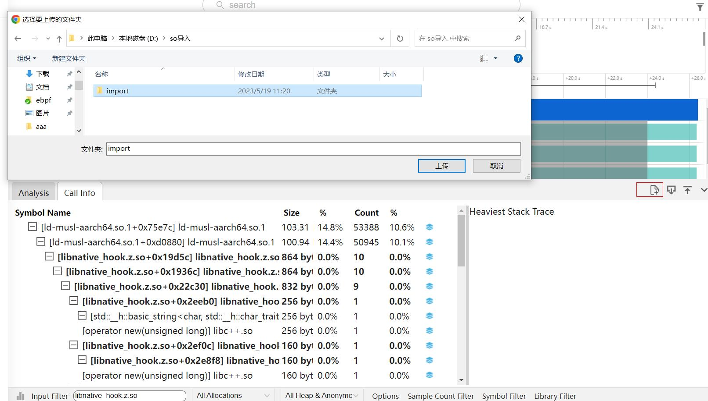
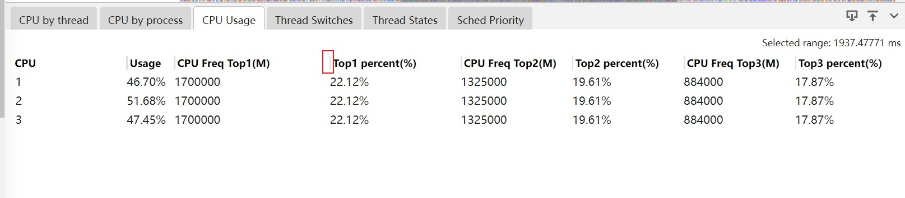
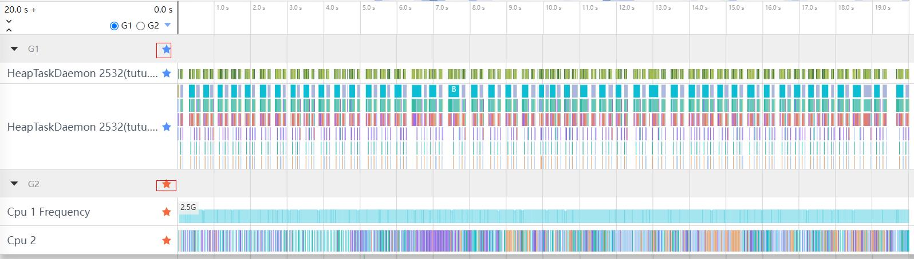
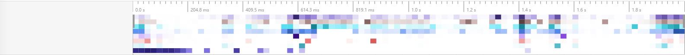
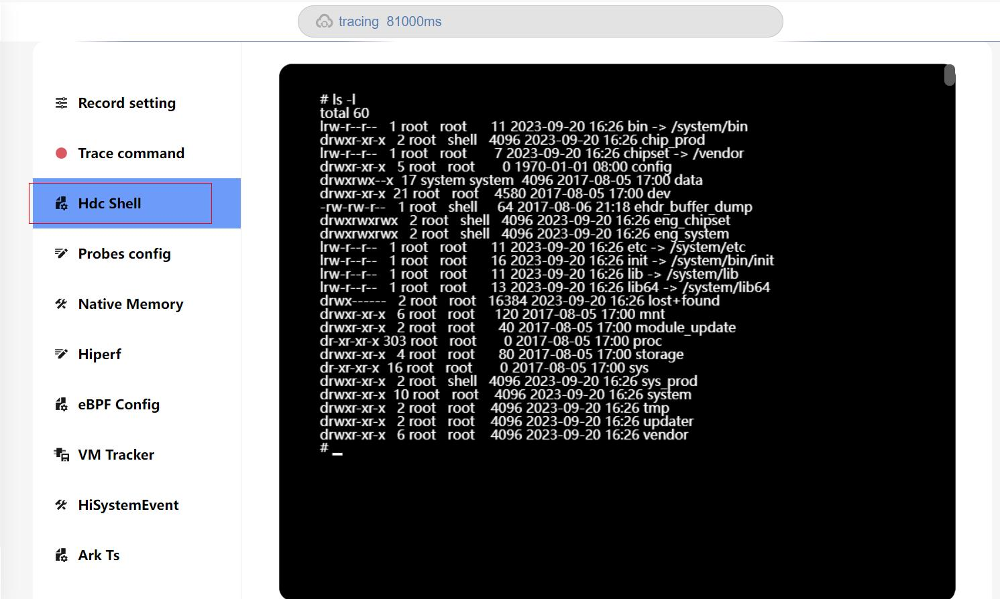

## 应用操作技巧

应用操作技巧主要展示各个小模块的使用技巧。

### 可导入符号表

符号表导入适用于所有支持调用栈的 Tab 页，选择一个文件夹，获取文件下及其子文件夹的所有 so 文件，更新数据库中符号数据。文件夹内 so 的格式需要与在设备上的路径一致，例如下图中，选择的文件夹为 import，选择导入的 libnative_hook.z.so，在设备上的路径是/system/lib64/，那么在本地选择的文件夹内也需要保证路径是 import/system/lib64/libnative_hook.z.so。

以 NativeMemory 举例，导入 NativeMemory 文件，点击 Call info 的 Tab 页，在搜索框中输入 libnative_hook.z.so，会发现该 so 下的调用栈没有符号化完全。

将本地编译的 so 通过导入按钮导入，本地导入路径是 import/system/lib64/libnative_hook.z.so，红框处是导入按钮。

导入 so 以后，在搜索框中输入 libnative_hook.z.so，会发现符号化数据已经更新。

### 网页连接文件打开接口

网页连接文件打开接口可以在网址后增加文件地址，打开后直接打开 trace。
接口的 url 路径如下：

-     蓝色框：是Smartperf工具的url(https://localhost:9000/application/)。
-     绿色框：trace文件的url，其中
                    第一部分是?trace=(固定格式)。
                    第二部分是trace文件的url(https://iot.itocm.com:9001/upload/ftrace_small.txt),此处根据文件的url实际地址填写。
                    第三部分,&link=true(固定格式)。

### 内容支持宽度可伸缩

在表格每行的表头添加一个灰色竖线，拖动时单元格宽度随之改变。

### 一键展开和收起，逐级展开和收起

将树形表格全部改为默认收起，在表头左上角添加双尖箭头图标,默认箭头朝外，点击图标，表格的每一层都展开，图标上的箭头改为朝里面，再次点击表格每一层都收起，图标上的箭头改为朝外面。

### 支持 shift+m 多次框选，框选列表显示和操作（跳转，取消）,快捷键跳转 ctrl+[/]和一键取消

每次框选泳道图后，按下 shift+m 键，在当前框选的开始和结束位置出现卡尺，如果只按下 m 键，会将上一次按 m 键出现的卡尺清除，在当前框选位置画卡尺，页面上每个卡尺都放进 tab 页中，在 tab 页中可以给卡尺改变颜色和移除旗子。用快捷键改变当前选中的卡尺。按下快捷键“ctrl+[”或“ctrl+]”的时候，会跳转到当前选中卡尺的上\下一个卡尺上，也就是上\下一个卡尺两侧变为实心，对应表格中的那行背景颜色变浅蓝色。

### 旗子标记可快速跳转，框选列表显示和操作（跳转，取消）,快捷跳转 ctrl+,/.和一键取消

在时间刻度下方点击会出现旗子和 tab 页，每次点击都将旗子都放进 tab 页中，在 tab 页中可以给旗子改变颜色和移除旗子。用快捷键改变当前选中的旗子。按下快捷键“ctrl+，”或“ctrl+.”的时候，会跳转到当前选中旗子的上\下一个旗子上，也就是上\下一个旗子变为实心有旗杆，对应表格中的那行背景颜色变浅蓝色。

### 泳道图支持一键收起和展开（收起前的状态）

点击时间刻度的最左边的双箭头，可以对已展开的泳道图进行一键收起和展开。

### 单个泳道图显示为多行时可折叠为 1 行（收藏和非收藏）

单个泳道图点击会将泳道图折叠为一行，折腾后的字体是蓝色。

### 已支持的泳道图按照模板分类显示，NaitveMemory，Hisysevent，应用内存等

导入 trace 文件后，页面右上角的出现漏斗图标，点击会出现 Display Template 页面，Template Select 区域显示已经添加到显示模板中的泳道图，每类泳道图后面会有一个多选框，默认不勾选，如果勾选页面上就只保留勾选的泳道图。

### 所有进程的用户输入事件归一显示，观察操作事件和对象

对于用户 InputEvent 会绘制到固定的泳道图。

### 支持收藏的泳道图整体画布可伸缩

收藏以后的泳道图可以在红线位置处上下伸缩拖动。

### 用户自定义分组化收藏（2 组），及一键取消所有收藏

选择界面上的 G1 和 G2，可以根据自己的需求将泳道图收藏到对应 G1 或者 G2 中，点击 G1 和 G2 旁边的星号可以一键取消所有收藏。

### trace 顶部的 cpu 负载预览颜色随着负载降低，亮度降低的能力对比度提升

CPU 负载颜色的亮度，负载越大颜色更深，负载越小颜色越浅。

### 导航栏/泳道图背景颜色支持颜色可选，字体颜色可感知 slice 的颜色而进行变化，颜色动态可配

给用户提供两种模式，浅色模式（导航栏白底黑字，泳道图颜色偏淡）和深色模式（导航栏黑底白字，泳道图颜色偏深），点击最左下方的小桶标志用户可以按需选择，并且用户可以自定义 systemTrace 页面的颜色，给用户更多自由，自己动手设置自己喜欢的颜色，提升用户体验。

### Trace 抓取动态可停

在抓取 trace 过程中，点击 StopRecord 按钮会对抓取命令进行启停,等待抓取停止命令返回后,将生成的文件拉取下来进行文件的解析。

### Smartperf web 端集成 hdc 命令能力

在现有的配置界面上，新增一个 Web 版本的 shell 界面，可以支持 shell 命令。

