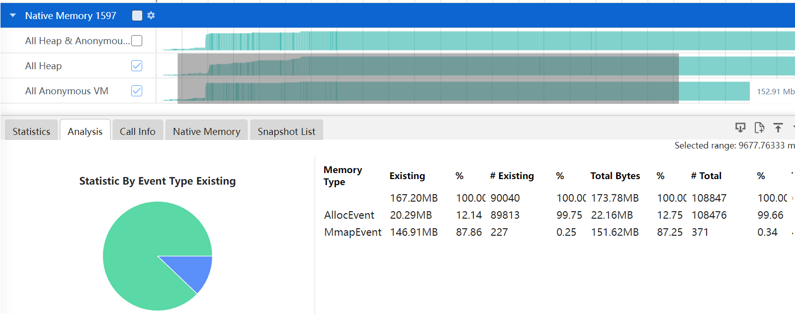
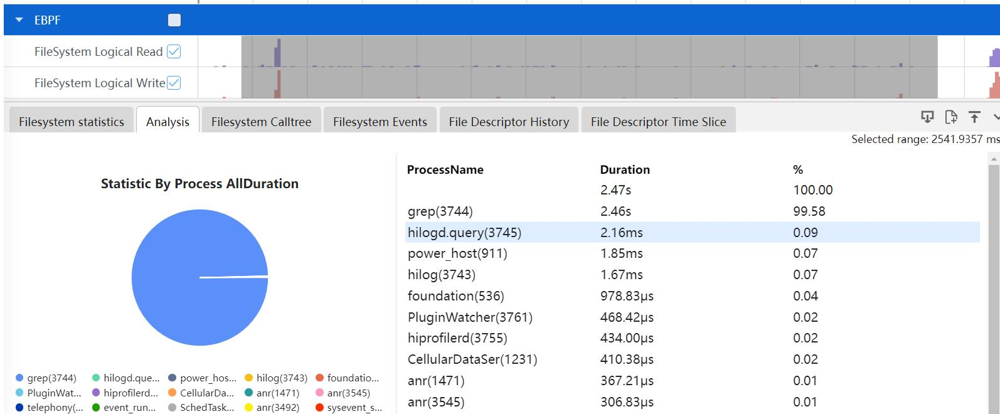
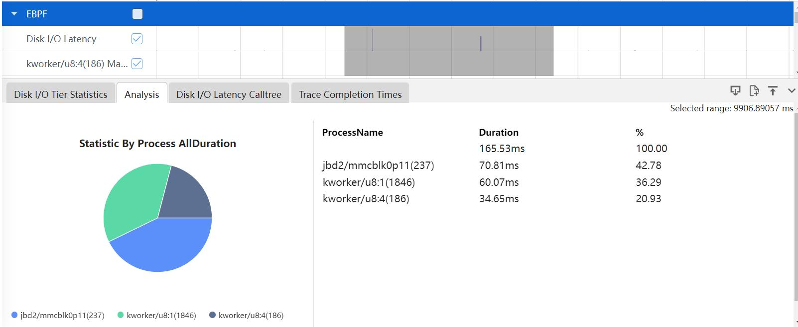
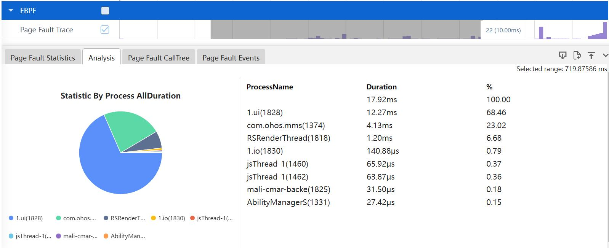

# 调用栈可视化和不同库函数调用占比说明

调用栈可视化可以将开发者编译的 so 符号化结果展示出来，不同库函数的占比通过饼图的方式展示出来。

## Native Memory 文件的不同库函数占比

Native Memory 分为三级统计，分别按照内存分配的类型(Alloc/Mmap)，lib 库，函数进行统计分析。其中 lib 跟函数为每一条调用栈，从栈顶往下查找，非 musl 库与 c++库的第一条函数及其 lib 为每次分配归属的函数及 lib 库。
点击 Analysis 的 Tab 页，先以内存分配的类型去统计。

-     Memory Type：事件类型。
-     Existing：框选区间内申请没有释放的大小。
-     #Existing：框选区间内申请没有释放的次数。
-     Total Bytes：框选区间内申请的大小。
-     #Total：框选区间内申请的次数。
-     Transient：框选区间内释放的大小。
-     #Transient：框选区间内释放的次数。
-     %：各个显示项的占比。
  以线程去统计。
  
  以 lib 库去统计，如图显示的是 AllocEvent 的 so 占比的饼图和 Table 表。
  
-     Library：So名称。
-     Existing：框选区间内申请没有释放的大小。
-     #Existing：框选区间内申请没有释放的次数。
-     Total Bytes：框选区间内申请的大小。
-     #Total：框选区间内申请的次数。
-     Transient：框选区间内释放的大小。
-     #Transient：框选区间内释放的次数。
-     %：各个显示项的占比。
  以函数去统计，如图显示的是 AllocEvent/libmali-bifrost-g52-g2p0-ohos.so 的函数占比的饼图和 Table 表。
  
-     Function：函数名称。
-     Existing：框选区间内申请没有释放的大小。
-     #Existing：框选区间内申请没有释放的次数。
-     Total Bytes：框选区间内申请的大小。
-     #Total：框选区间内申请的次数。
-     Transient：框选区间内释放的大小。
-     #Transient：框选区间内释放的次数。
-     %：各个显示项的占比。

## Hiperf 文件的不同库函数占比

Hiperf 分为四级统计，分别按照进程，线程，lib 库，函数进行统计。其中 lib 跟函数为每一条调用栈的栈顶函数及其 lib。
点击 Analysis 的 Tab 页，先以进程去统计。

-     ProcessName：进程名。
-     Weight：该进程下的调用方法的执行次数。
-     %：该进程下的调用方法的执行占比。
  以线程统计，如图显示的是 hiperf 进程下的线程的饼图和 Table 表。
  
-     ThreadName：线程名。
-     Weight：该线程下的调用方法的执行次数。
-     %：该线程下的调用方法的执行占比。
  以 lib 库统计，如图显示的是 hiperf 线程下的各 so 占比饼图和 Table 表。
  
-     Library：so的名称。
-     Weight：该so的调用方法的执行次数。
-     %：该so的调用方法的执行占比。
  以函数统计，如图显示的是 ld-musl-aarch64.so.1 下的各函数占比饼图和 Table 表。
  
-     Library：so的名称。
-     Weight：该so的调用方法的执行次数。
-     %：该so的调用方法的执行占比。

## FileSystem 文件的不同库函数占比

FileSystem 分为五级统计，分别按照进程，系统调用类型，线程，lib 库，函数进行统计。其中 lib 跟函数为每一条调用栈，从栈顶往下查找，非 musl 库与 c++库的第一条函数及其 lib 为每次分配归属的函数及 lib 库。
点击 Analysis 的 Tab 页，先以进程去统计。

-     ProcessName：进程名。
-     Duration：总时长。
-     %：总时长占比。
  以系统调用类型统计，如图显示的是 grep 进程下的 Read 和 Write 系统调用的时长占比饼图和 Table 表。
  
-     Type：系统调用类型(Read和Write)。
-     Duration：系统调用的总时长。
-     %：总时长占比。
  以线程统计，如图显示的是系统调用是 Read 类型的线程的占比饼图和 Table 表。
  
-     ThreadName：线程名。
-     Duration：该线程的系统调用的总时长。
-     %：总时长占比。
  以 lib 库统计，如图显示 toybox 的 lib 库的占比饼图和 Table 表。
  
-     Library：so的名称。
-     Duration：该so的系统调用的总时长。
-     %：总时长占比。
  以函数统计，如图显示 0x558111afbc (toybox)的函数占比饼图和 Table 表。
  
-     Function：函数名称。
-     Duration：该函数的系统调用的总时长。
-     %：总时长占比。

## Bio 文件的不同库函数占比

Bio 分为五级统计，分别按照进程，系统调用类型，线程，lib 库，函数进行统计。其中 lib 跟函数为每一条调用栈，从栈顶往下查找，非 submit_bio 第一条函数及其 lib 为每次分配归属的函数及 lib 库。
点击 Analysis 的 Tab 页，先以进程去统计。

-     ProcessName：进程名。
-     Duration：总时长。
-     %：总时长占比。
  以系统调用类型统计，如图显示的是 jbd2/mmcblk0p11 进程下的 DATA_WRITE 系统调用的时长占比饼图和 Table 表。
  
-     Type：系统调用类型。
-     Duration：系统调用的总时长。
-     %：总时长占比。
  以线程统计，如图显示的是系统调用是 DATA_WRITE 类型的线程的占比饼图和 Table 表。
  
-     ThreadName：线程名。
-     Duration：该线程的系统调用的总时长。
-     %：总时长占比。
  以 lib 库统计，如图显示 kallsyms 的 lib 库的占比饼图和 Table 表。
  
-     Library：so的名称。
-     Duration：该so的系统调用的总时长。
-     %：总时长占比。
  以函数统计，如图显示 submit_bh 的函数占比饼图和 Table 表。
  
-     Function：函数名称。
-     Duration：该函数的系统调用的总时长。
-     %：总时长占比。

## Page Fault 文件的不同库函数占比

Page Fault 分为五级统计，分别按照进程，系统调用类型，线程，lib 库，函数进行统计。其中 lib 跟函数为每一条调用栈，从栈顶往下查找，非 musl 库与 c++库的第一条函数及其 lib 为每次分配归属的函数及 lib 库。
点击 Analysis 的 Tab 页，先以进程去统计。

-     ProcessName：进程名。
-     Duration：总时长。
-     %：总时长占比。
  以系统调用类型统计，如图显示的是 1.ui 进程下的 File Backed In 和 Copy On Writer 系统调用的时长占比饼图和 Table 表。
  
-     Type：系统调用类型。
-     Duration：系统调用的总时长。
-     %：总时长占比。
  以线程统计，如图显示的是系统调用是 File Backed In 类型的线程的占比饼图和 Table 表。
  
-     ThreadName：线程名。
-     Duration：该线程的系统调用的总时长。
-     %：总时长占比。
  以 lib 库统计，如图显示各 lib 库的占比饼图和 Table 表。
  
-     Library：so的名称。
-     Duration：该so的系统调用的总时长。
-     %：总时长占比。
  以函数统计，如图显示各函数占比饼图和 Table 表。
  
-     Function：函数名称。
-     Duration：该函数的系统调用的总时长。
-     %：总时长占比。
