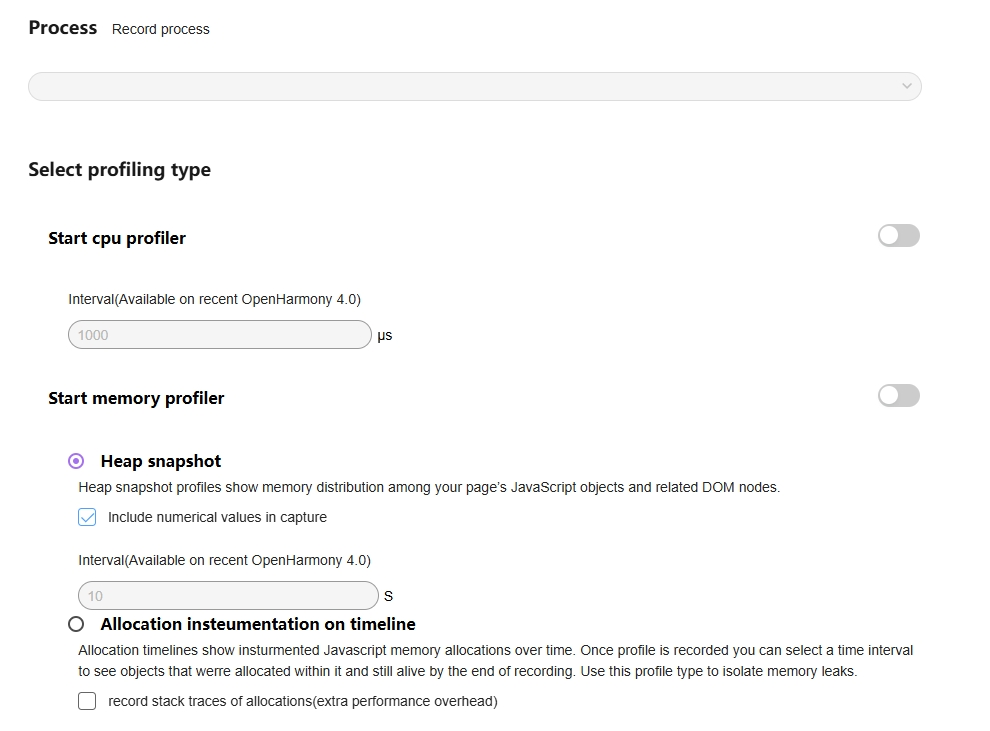
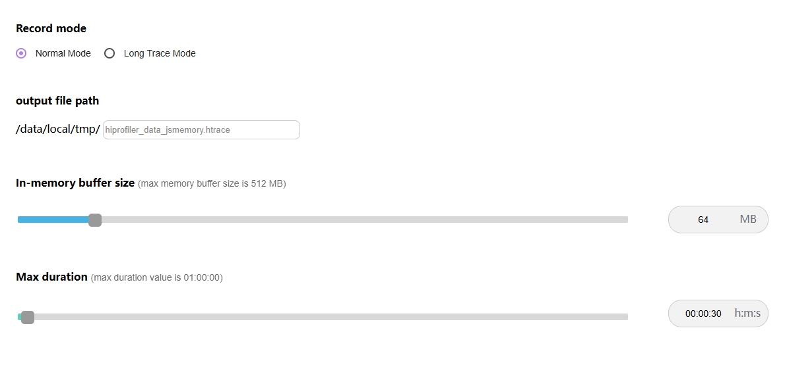
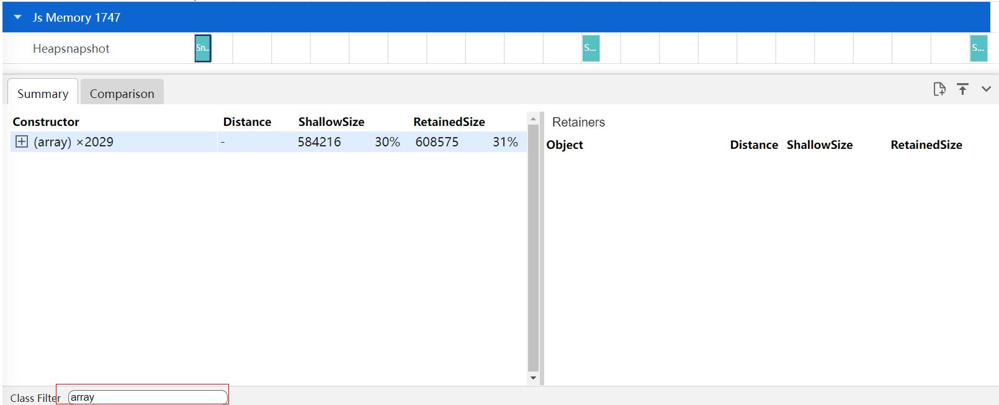

# Js Memory 抓取和展示说明

Js Memory 是查看程序中存量内存的情况。

## Js Memory 的抓取

### Js Memory 抓取配置参数


配置参数说明：

- Process：设置抓取的进程 ID，此处以 1747 进程号为例。
- Heap snapshot：堆快照性能分析会显示网页的 JavaScript 对象和相关 DOM 节点中内存分配情况。
- include numerical values in capture：在快照中添加数字。
- Interval：抓取的时间间隔。
- Allocation insteumentation on timeline：分配时间轴显示了插桩的 JavaScript 内存分配随时间变化的情况。
- record stack traces of allocations(extra performance overhead)：录制各项分配的堆栈轨迹(会产生额外的性能开销)。

再点击 Record setting，在 output file path 输入文件名 hiprofiler_data_jsmemory.htrace，拖动滚动条设置 buffer size 大小是 64MB，抓取时长是 30s。


点击 Trace command，就会根据上面的配置生成抓取命令，点击 Record 抓取，抓取过程中会显示抓取时长。


## Js Memory 展示说明

将抓取的 jsmemory 文件导入到 smartperf 工具中查看，查看程序中存量内存的情况。

### Js Memory 泳道图展示类型

堆快照类型文件的泳道图展示。


-     Heapsnapshot：堆快照性能分析会显示网页的JavaScript对象和相关DOM节点中内存分配情况。
  时间轴上分配插桩类型文件的泳道图展示。
  
-     Heaptimeline：分配时间轴显示了插桩的JavaScript内存分配随时间变化的情况。

### Js Memory 泳道图的框选功能

可以对内存的数据进行框选，框选后在最下方的弹出层中会展示框选数据的统计表格，总共有两个 tab 页。
Summary 的 Tab 页，主要显示了总览视图，通过类的名称来分组显示对象。


-     Constructor：类创建的所有对象，其中
                    第一层为类名，后面的x表示该类创建了多少实例。
                    第二层为该类的实例名+id，id唯一。
                    第三层以下为实例中的成员变量。
-     Distance：使用节点的最短简单路径显示到根的距离。

  例如下图其中 GC Root 为根节点，distance 为 0,G 为上次 GC 之后新申请内存的实例，distance 为 100000000。在界面上显示为-，A、B、C、D、E、F、H 为调用节点；以 E 为例，从 A->D->F>E,distance 为 4，从 A->D->E，distance 为 3;从 B->E,distance 为 2,遵循最小 distance 原则，E 的 distance 为 2,同理 D 的 distance 为 2,F 的 distance 为 2,H 的 distance 也为 2。

  其中第一层类的 distance 为该类所有实例中最小的 distance,如果有实例的 distance 为-，类的 distance 也为-(-表示没有被 root 节点引用的实例，如下图的 G)
  

-     ShallowSize：是指实例自身占用的内存, 可以理解为保存该'数据结构'需要多少内存
        例如下面的代码：

```javascript
class X {
  a: number = 0;
  b: boolean = false;
  c: ChartStruct = new ChartStruct();
}
```

        假设当前是在64位系统, 对于类X来说, 一个X实例的Shallow Size为:

        类定义的8byte
        没有继承其他类, 所以没有父类fields
        a,b变量为基本类型number,boolean型, js中都为8byte;
        c变量是引用类型, 和它是否指向具体实例无关, 固定占4byte

-     RetainedSize：Retained Size含义为表示当一个实例被GC回收时, 可以同时被回收的实例的Shallow Size之和。
  - 如上图所示；假设所有的节点 Size 都为 1,按照 A->B->C 的顺序回收。
    - 当 A 被回收时，H 被 D 调用，先不回收，D 没有被调用，D 回收，由于 D 被回收，H 没有被调用，H 回收，由于 F 被 C 调用，E 被 B、F 也调用了，所以不能被回收,此时 A 的 Retained Size 为 3,D 的 Retained Size 为 2, H 的 Retained Size 为 1。
    - 当 B 被回收时，由于 E 被 F 占用，所以 E 不会被回收，此时 B 的 Retained Size 为 1。
    - 当 C 被回收时，F 没有被调用，E 没有被调用,所以都会被回收，此时 C 的 Retained Size 为 3，F 的 Retained Size 为 2, E 的 Retained Size 为 1。

Comparison 的 Tab 页，主要显示了比较视图，显示两份快照间的不同之处，主要比较类创建与释放的实例数量。


-     #Constructor：类创建的所有对象，类名与id相同视为同一个实例，其中
                    第一层为类的比较，每个时间点的对比其他时间点的类创建与销毁了哪些实例。
                    第二层为实例，由于展示的是创建或者销毁实例，固只展示Size大小。
                    第三层以下为实例的成员变量，不存在比较信息。
-     #New：新增的实例数量，圆点代表有意义的数据，下划线代表无意义的数据。
-     #Deleted：删除的实例数量。
-     #Delta：#New减去#Deleted的数量。
-     Alloc.Size：新增实例的Size。
-     Freed Size：删除实例的Size。
-     Size Delta：Delta的Size。

### Js Memory 的辅助信息功能

在 Summary 和 Comparison 的 Tab 页，选中左边实例，右边 Retainers 的 Tab 页会显示多少个实例引用了左边选中的实例。


-     Object：引用的实例。
-     Distance：使用节点的最短简单路径显示到根的距离。
-     ShallowSize：所有对象的本身的内存大小之和。
-     RetainedSize：对象以及其相关的对象一起被删除后所释放的内存大小，同一组对象之间的最大保留大小。

### Js Memory 详细显示的过滤功能

在下方的 Class Filter 中输入类名，可以对类名进行过滤，如下图输入 array，会过滤出类名是 array 的相关数据。

