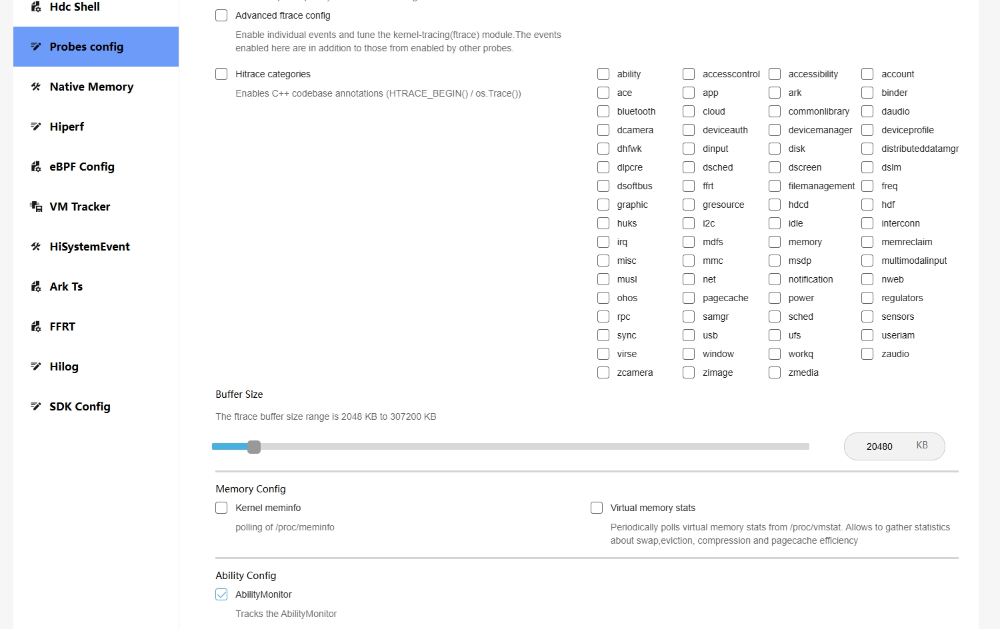
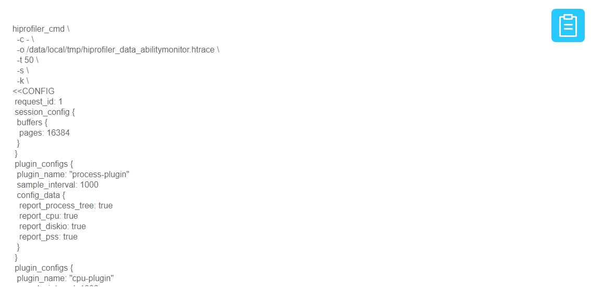
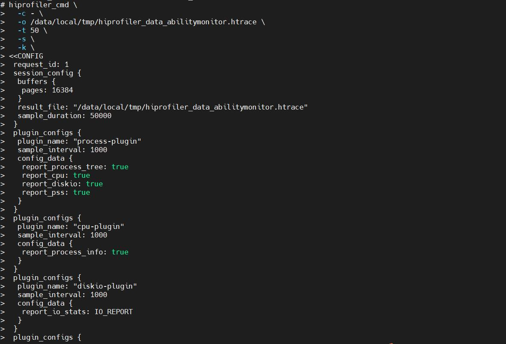
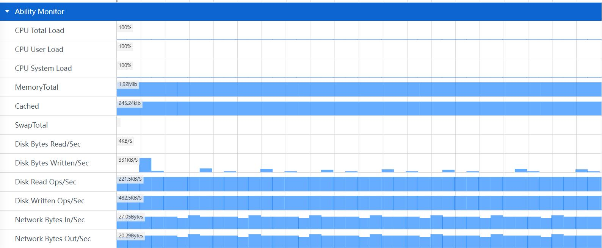
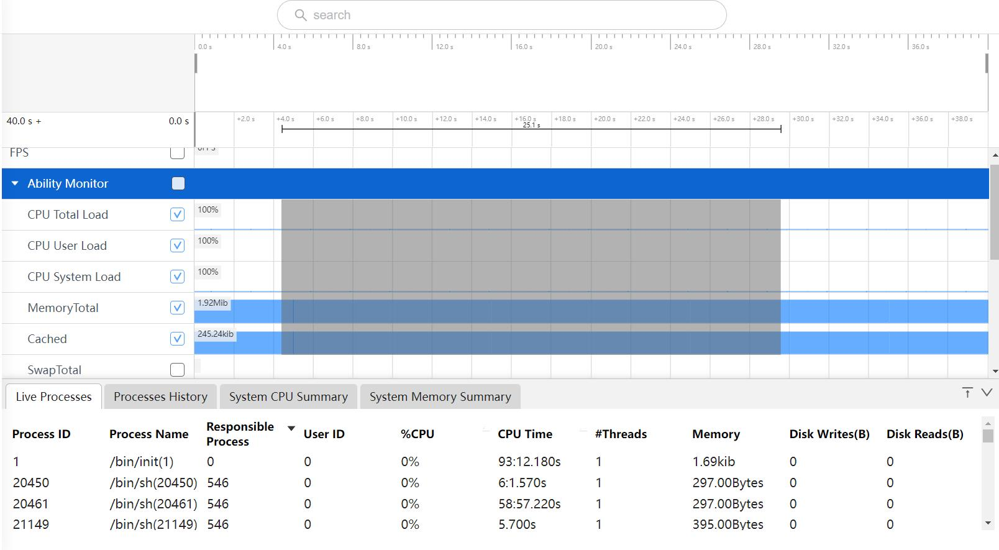
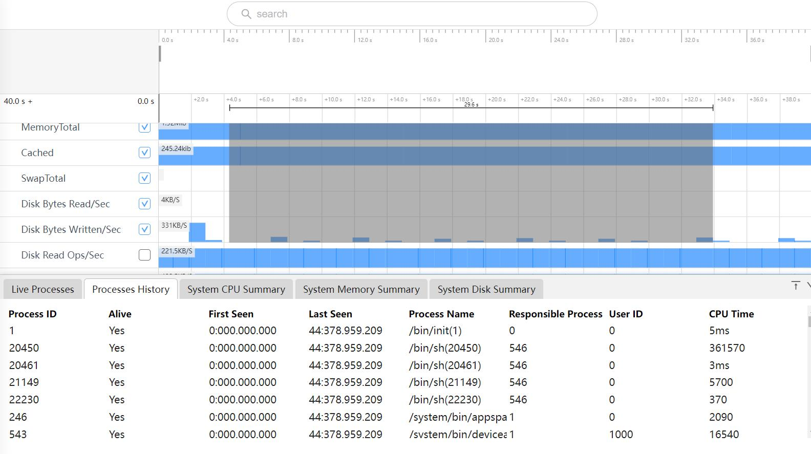
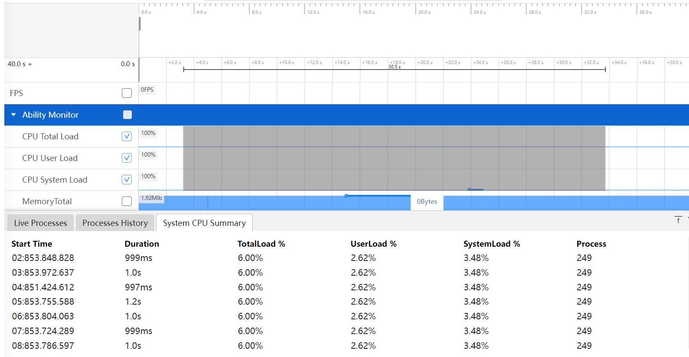
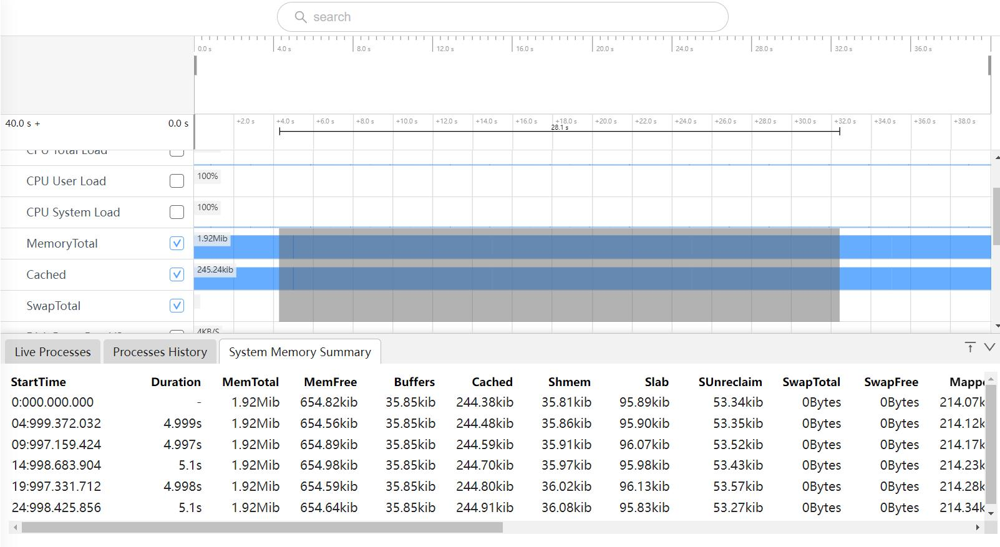
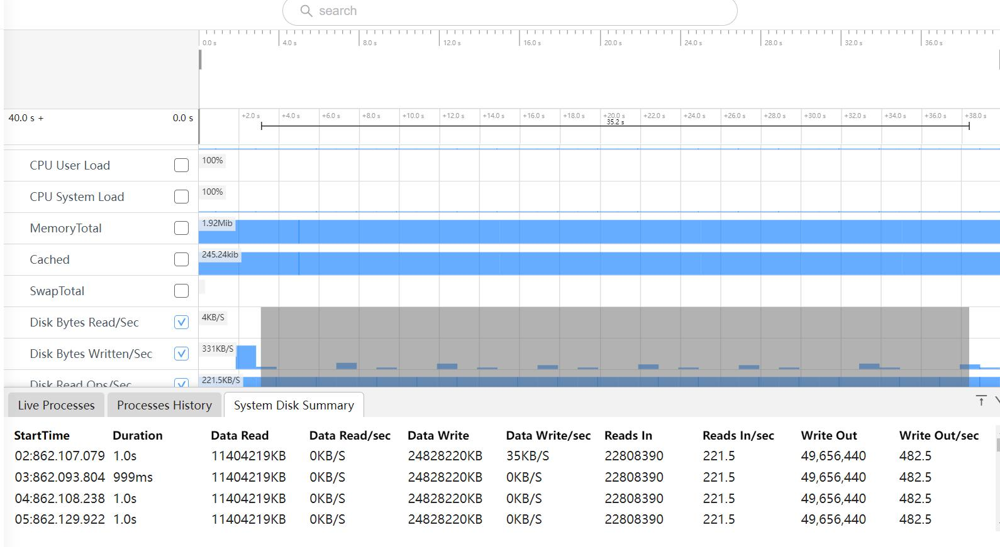
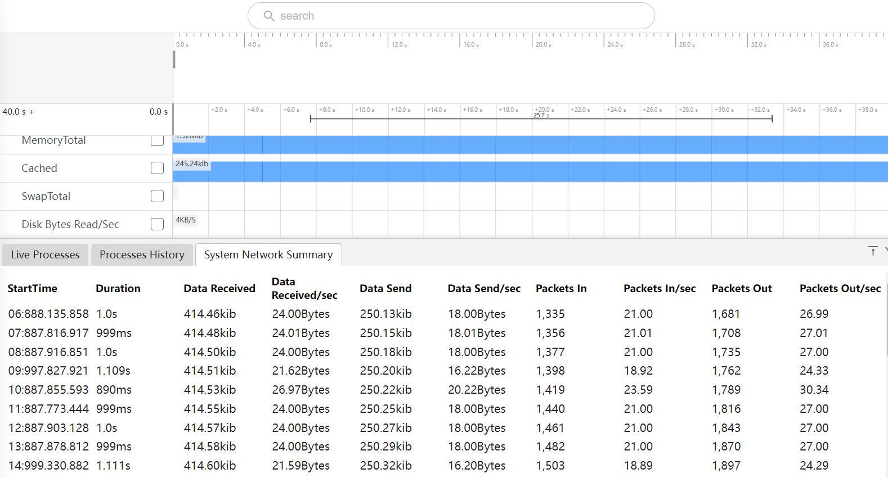

# Ability Monitor 抓取和展示说明

抓取和展示处理的 CPU，内存，磁盘 IO 和网络使用情况统计。

## Ability Monitor 的抓取

### Ability Monitor 抓取界面配置说明

点击 Probes config，如选择抓取 AbilityMonitor。

### Ability Monitor 文件的抓取

点击 Record setting，在 output file path 输入文件名 hiprofiler_data_abilitymonitor.htrace，拖动滚动条设置 buffer size 大小是 64MB，抓取时长是 50s。

点击 Trace command，就会根据上面的配置生成抓取命令，点击复制按钮，会将命令行复制。

输入 hdc shell，进入设备，执行命令。

进入指定目录，cd /data/local/tmp 进入到目录，会看到生成的 trace 文件。

## Ability Monitor 功能介绍

将抓取的文件导入到 smartperf 工具查看，能了解 CPU，内存，磁盘 IO 和网络的使用情况。

### Ability Monitor 泳道图展示

Ability Monitor 展开就可以看到泳道图，包括 CPU，内存，磁盘 IO，网络的使用情况。

-     CPU Total Load：总的CPU使用率。
-     CPU User Load：CPU在用户态空间运行的使用率。
-     CPU System Load：CPU在内核空间运行的使用率。
-     MemoryTotal： 总计物理内存的大小。
-     Cached：缓存的大小。
-     SwapTotal： 虚拟内存。
-     Disk Bytes Read/Sec：每秒从磁盘读取到内存的字节数。
-     Disk Bytes Written/Sec： 每秒从内存写入磁盘的字节数。
-     Disk Read Ops/Sec：读取的字节数。
-     Disk Written Ops/Sec： 写入的字节数。
-     Network Bytes In/Sec：每秒接收的网络数据字节数。
-     Network Bytes Out/Sec： 每秒发送的网络数据字节数。
-     Network Packets In/Sec：每秒接收的网络数据包数。
-     Network Packets Out/Sec： 每秒发送的网络数据包数。
-     Purgeable Total： 可清除总量。
-     Purgeable Pin：可清除编码。
-     DMA：直接内存存取。
-     Skia Gpu Memory：Skia显存。

### Ability Monitor 泳道图的框选功能

可以对 CPU，内存，磁盘 IO 和网络的数据进行框选，框选后在最下方的弹出层中会展示框选数据的统计表格，总共有六个 tab 页。
Live Processes 的 Tab 页如图：

-     Process ID：进程的ID。
-     Process Name：进程名称。
-     Responsible Process：父进程ID。
-     User ID：用户ID。
-     %CPU：进程的CPU占用率。
-     CPU Time：CPU运行时间。
-     #Threads：进程的线程数量。
-     Memory：内存值。
-     Disk Writes(Byte)：磁盘写入的字节数。
-     Disk Reads(Byte)：磁盘读取的字节数。
  Processes History 的 Tab 页如图：
  
-     Process ID：进程ID。
-     Alive：进程是否存活。
-     First Seen：开始时间。
-     Last Seen：所选区域的结束时间。
-     Process Name：进程名称。
-     Responsible Process：父进程ID。
-     User ID：用户ID。
-     CPU Time：CPU运行时间。
  框选 CPU Total Load，CPU User Load，CPU System Load 三个区域的泳道图，会展示 System CPU Summary 的 Tab 页。
  
-     Start Time：采集时间的时间戳。
-     Duration：前一次采集到本次采集的时间差。
-     TotalLoad%：总的CPU使用率。
-     UserLoad%：CPU在用户态空间运行的使用率。
-     SystemLoad%：CPU在内核空间运行的使用率。
-     Process：进程号。
  框选 MemoryTotal，Cached，SwapTotal 三个区域的泳道图，会展示 System Memory Summary 的 Tab 页。
  
-     StartTime：采集时间的时间戳。
-     Duration：前一次采集到本次采集的时间差。
-     MemTotal：总内存大小。
-     MemFree：空闲内存大小。
-     Buffers：文件的缓冲大小。
-     Cached：缓存的大小。
-     Shmem：已被分配的共享内存大小。
-     Slab：内核数据缓存大小。
-     SUnreclaim：不可回收的Slab大小。
-     SwapTotal：交换空间的总大小。
-     SwapFree：未被使用交换空间的大小。
-     Mapped：设备和文件等映射的大小。
-     VmallocUsed：已被使用的虚拟内存大小。
-     PageTables：管理内存分页的索引表大小。
-     KernelStack：Kernel消耗的内存。
-     Active： 在活跃使用中的缓冲或高速缓冲存储器页面文件的大小。
-     Inactive：在不经常使用中的缓冲或高速缓冲存储器页面文件的大小。
-     Unevictable：不能被释放的内存页。
-     VmallocTotal：可以vmalloc虚拟内存大小。
-     CmaTotal：总的连续可用内存。
-     CmaFree：空闲的可用内存。
-     Zram：Zram的使用大小。
  框选 Disk Bytes Read/Sec，Disk Bytes Written/Sec，Disk Read Ops/Sec，Disk Written Ops/Sec 四个区域的泳道图，会展示 System Disk Summary 的 Tab 页。
  
-     StartTime：采集时间的时间戳。
-     Duration：前一次采集到本次采集的时间差。
-     Data Read：从磁盘读取到内存的总字节数。
-     Data Read/sec：每秒从磁盘读取到内存的字节数。
-     Data Write：从内存写入磁盘的总字节数。
-     Data Write/sec：每秒从内存写入磁盘的字节数。
-     Reads In：读入的字节数。
-     Reads In/sec：每秒读取的字节数。
-     Write Out：写入的字节数。
-     Write Out/sec：每秒写入的字节数。
  框选 Network Bytes In/Sec，Network Bytes Out/Sec，Network Packets In/Sec，Network Packets Out/Sec 四个区域的泳道图，会展示 System Network Summary 的 Tab 页。
  
-     StartTime：采集时间的时间戳。
-     Duration：前一次采集到本次采集的时间差。
-     Data Received：接收的网络数据总字节数。
-     Data Received/sec：每秒接收的网络数据字节数。
-     Data Send：发送的网络数据总字节数。
-     Data Send/sec：每秒发送的网络数据字节数。
-     Packets In：接收的网络总数据包数。
-     Packets In/sec：每秒接收的网络数据包数。
-     Packets Out：发送的网络总数据包数。
-     Packets Out/sec：每秒发送的网络数据包数。
