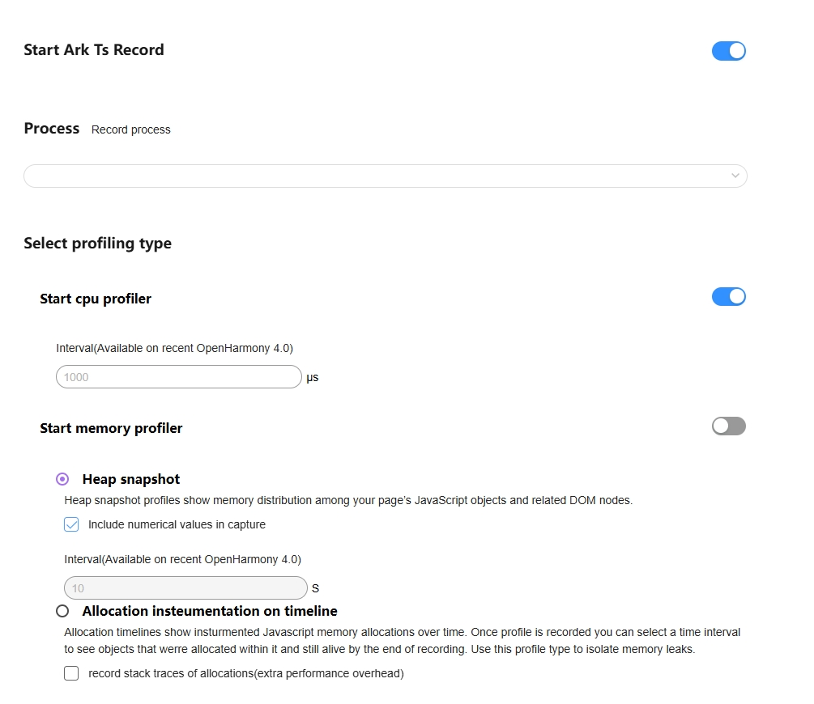
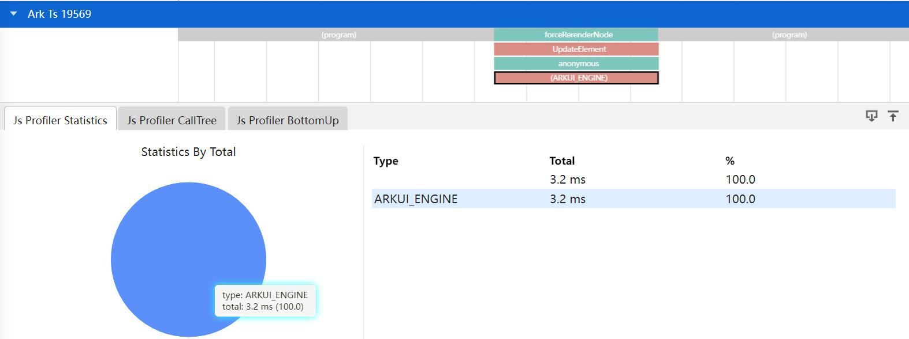

# Cpuprofiler 抓取和展示说明

Cpuprofiler 模板帮助 ArkTs 开发和测试分析虚拟机层执行开销大问题，提供 Ts 层耗时长函数和阶段。

## Cpuprofiler 的抓取

#### Cpuprofiler 的抓取配置参数

打开 Start Ark Ts Record 总开关下面的 Start cpu profiler 开关抓取 cpuprofiler 数据。

### Cpuprofiler 展示说明

将抓取的 cpuprofiler 文件导入到 smartperf 中，查看 Ts 层耗时长的函数和阶段。

### Cpuprofiler 的泳道图悬浮显示

鼠标放到泳道图的 Slice 上会有悬浮框显示。

-     Name : 函数名。
-     Self Time : 函数自身执行时间(不包含其调用者)。
-     Total Time : 函数自身及调用者的调用时间总和。
-     Url : 函数所在的文件名称。

### Cpuprofiler 泳道图的点选和框选功能

点选或者框选泳道图上函数名的 Slice，会显示 Js Profiler Statistics，Js Profiler CallTree，Js Profiler BottomUp 的 Tab 页信息。
Js Profiler Statistics 的 Tab 页显示数据的维度信息，以饼图和 Table 表的方式展示，如下图：

-     Type : 维度名称，有九大维度(NAPI、ARKUI_ENGINE、BUTLTIN、GC、AINT、CINT、AOT、RUNTIME、OTHER）。
-     Total : 时间。
-     % : 时间占比。
  Js Profiler CallTree 的 Tab 页把 name，url，depth，parent 相同的函数合并，构建成一个 top down 的树结构，以树形表格的形式显示，表格中显示函数调用关系，如下图：
  
  
-     Symbol : 函数名。
-     Self Time : 函数自身执行时间(不包含其调用者)。
-     Total Time : 函数自身及调用者的调用时间总和。
  Js Profiler BottomUp 的 Tab 页把 name，url，depth，parent 相同的函数合并，构建成一个 bottom up 的树结构，以树形表格的形式显示，只不过作为根节点的是被调用者，表格中显示函数被调用关系，如下图：
  
  
-     Symbol : 函数名。
-     Self Time : 函数自身执行时间(不包含其调用者)。
-     Total Time : 函数自身及调用者的调用时间总和。

### Cpuprofiler 的 Heaviest Stack 功能

Js Profiler CallTree 的 Tab 页的 Heaviest Stack 表格显示的是选中的函数的完整的调用栈。

Js Profiler BottomUp 的 Tab 页的 Heaviest Stack 表格显示的是选中的函数的完整的逆序调用栈。

-     Symbol : 函数名。
-     Total Time : 函数自身及调用者的调用时间总和。
-     % : 总时间占比。
