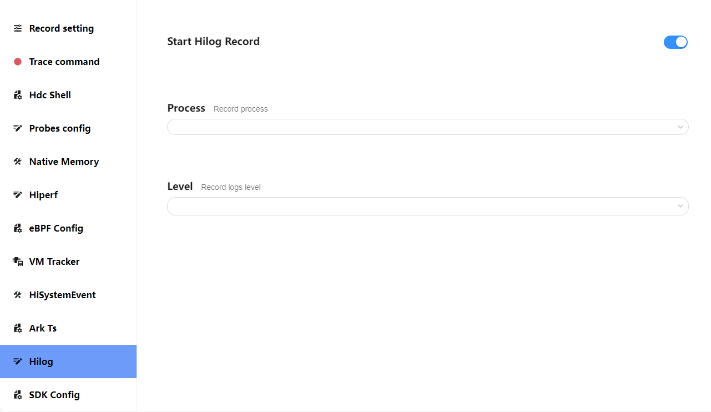
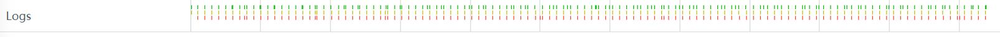
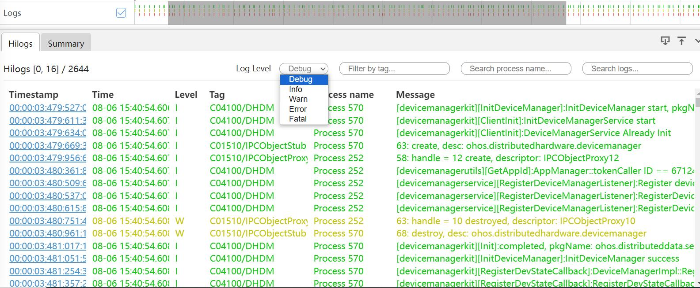
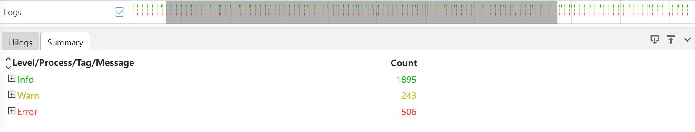

# Hilog 抓取和展示说明

Hilog 分析模块主要展示系统日志信息。

## Hilog 的抓取

#### Hilog 的抓取配置参数

打开 Hilog 开关抓取 taskpool 数据。

### Hilog 展示说明

将抓取的 hilog 文件导入到 smartperf 中，查看日志信息。

### Hilog 泳道图的框选功能

框选 Hilog 的泳道图，展示 Hilog 的 tab 页,Log Level 可以选择日志级别，也能根据 Tag，Process name，Message 去搜索。

-     Timestamp： 时间戳信息。
-     Time： 日志的显示时间。
-     Level：日志级别。
-     Tag：日志的tag。
-     Process name：进程名。
-     Message：日志具体信息。
  框选 Hilog 的泳道图，展示 Summary 的 tab 页。
  
-     Level/Process/Tag/Message： 根据类别显示日志。
-     Count： 各级别日志的条数。
