# Hiperf 的抓取和展示说明

Hiperf 工具是对系统性能数据进行采样记录，并将采样数据保存为文件，进行读取，展示分析。

## Hiperf 的抓取

### Hiperf 抓取配置参数

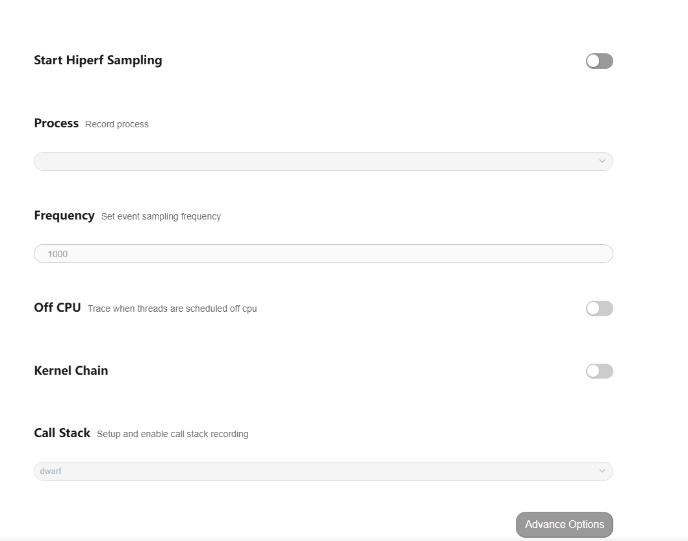

配置项说明：

-     Start Hiperf Sampling：配置项的总开关。
-     Process：离线模式下配置的是整个系统的进程。
-     Frequency：配置抓取的频率。
-     Call Stack：配置抓取的堆栈类型。
-     Advance Options：更多的抓取配置项。
  再点击 Record setting，在 output file path 输入文件名 hiprofiler_data_perf.htrace，拖动滚动条设置 buffer size 大小是 64MB，抓取时长是 50s。
  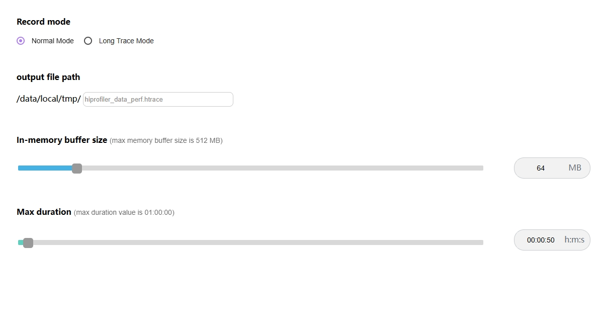
  点击 Trace command，就会根据上面的配置生成抓取命令，点击复制按钮，会将命令行复制。
  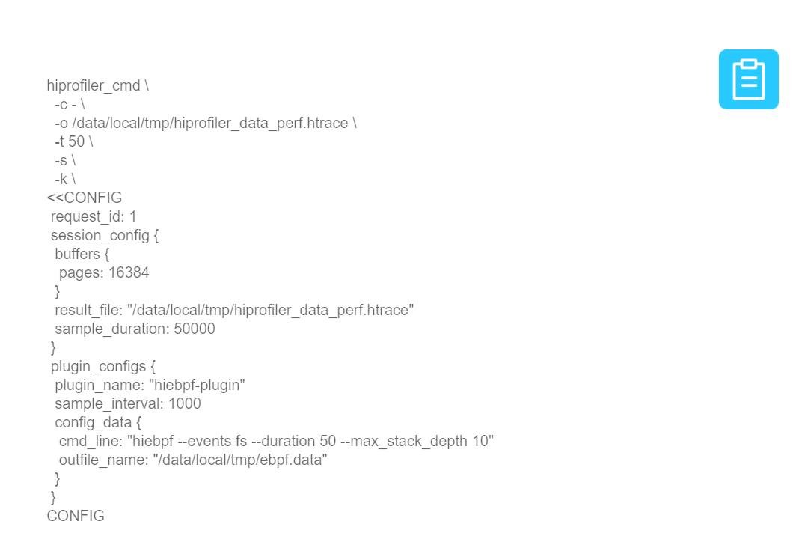
  输入 hdc shell，进入设备，执行命令。
  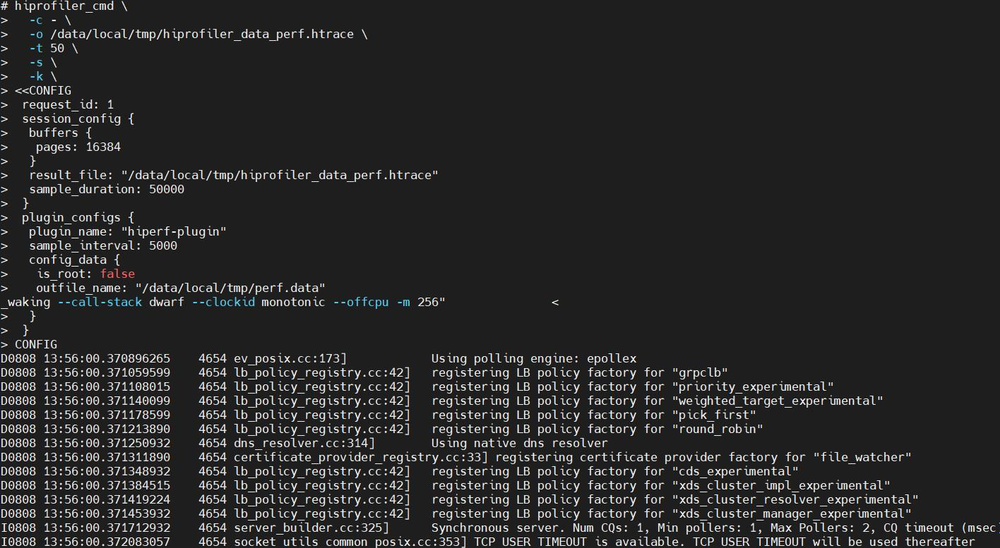
  执行完成后，进入指定目录查看，在/data/local/tmp 下就会生成 trace 文件。
  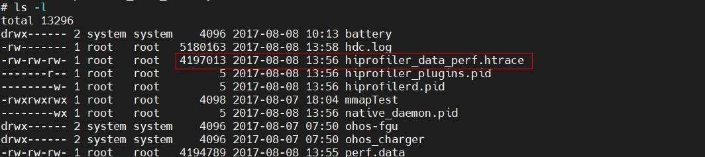

### Hiperf 展示说明

将抓取的 trace 文件导入 smartperf 界面查看。
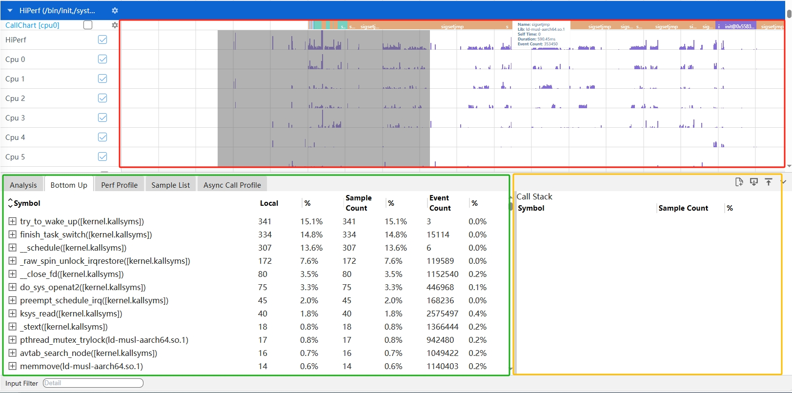

界面布局介绍：Perf 整体界面布局分为 3 个部分：

-     红色区域：泳道图。
-     绿色区域：详细信息(Perf Profile和Sample List)。
-     黄色区域：辅助信息(Call Stack)。

### Hiperf 泳道图展示

Hiperf 泳道图展示按照 CPU 使用量、进程和线程展示，鼠标移动到泳道图上，悬浮框会显示 CPU 的使用量。
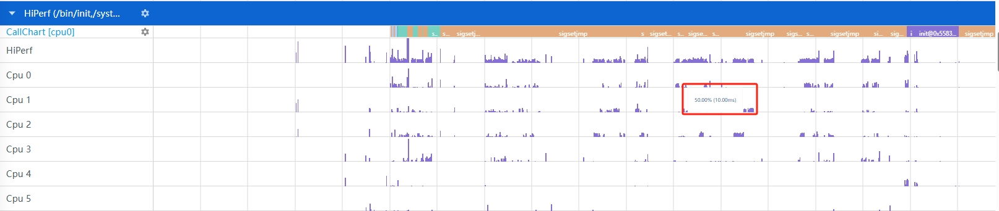
按住 w 键放大界面，泳道图会出现 P 的标志，鼠标移动到 P 图标上，悬浮框会显示每个 callstack 和调用的深度如下图。
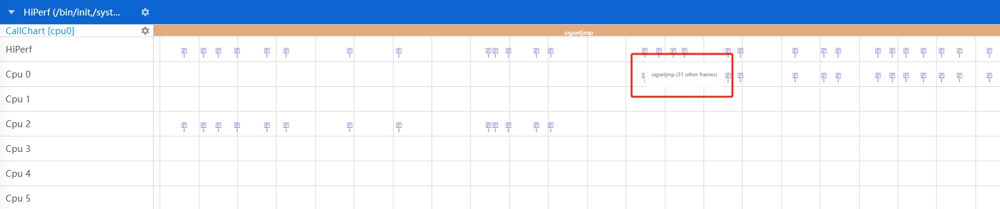
Hiperf 泳道图上浅色表示无效调用栈的采样点，抓取时由于设备上的对应的 so 无符号信息，函数跟地址都无法获取到，固该采样点在 tab 页中不做显示。
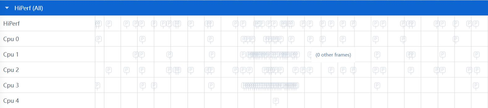

### Hiperf 泳道图的框选功能

可以对 CPU 使用量的线程和进程区数据进行框选，框选后在最下方的弹出层中会展示框选数据的统计表格，总共有四个 tab 页。
Perf Profile 的 Tab 页如图：
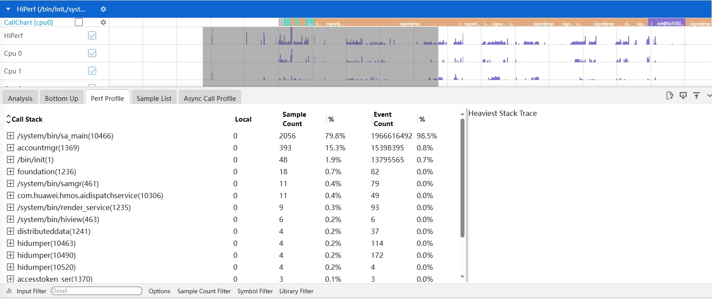

-     Call Stack：为经过符号解析后的Callstack，并且给出动态链接库或者进程名的信息。
-     Local：为该调用方法自身占用的 CPU 时间。
-     Sample Count：采样次数。
-     Event Count：事件次数。
  Sample List 的 Tab 页如图：
  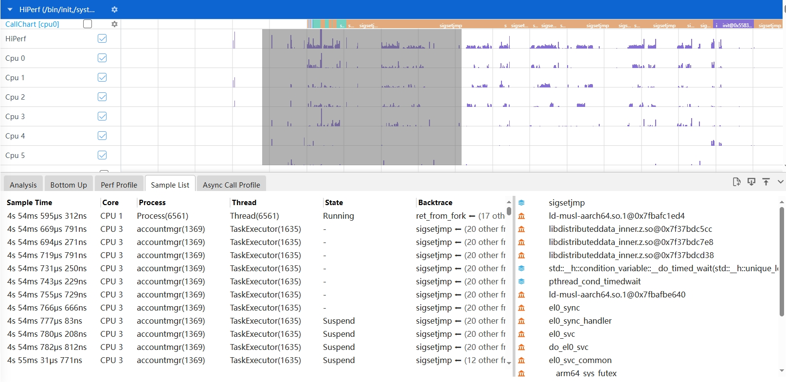
-     Sample Time：采样的时间戳信息。
-     Core：当前的CPU核信息。
-     Process：进程名。
-     Thread：线程名。
-     State：运行状态。
-     Backtrace：栈顶的调用栈名称。

### Hiperf 支持多种 Options 展示风格

点击 Perf Profile 的 Tab 页底部的 Options，会有四个 CheckBox 复选框。
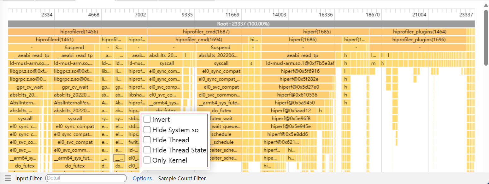

-     Invert：反向输出调用树。
-     Hide System so：隐藏系统库文件。
-     Hide Thread：隐藏线程。
-     Hide Thread State：隐藏线程状态。

### Hiperf 支持过滤调用栈调用次数的展示风格

点击 Perf Profile 的 Tab 页底部的 Sample Count Filter，可以填上区间值。过滤出符合该区间值调用次数的调用栈信息。
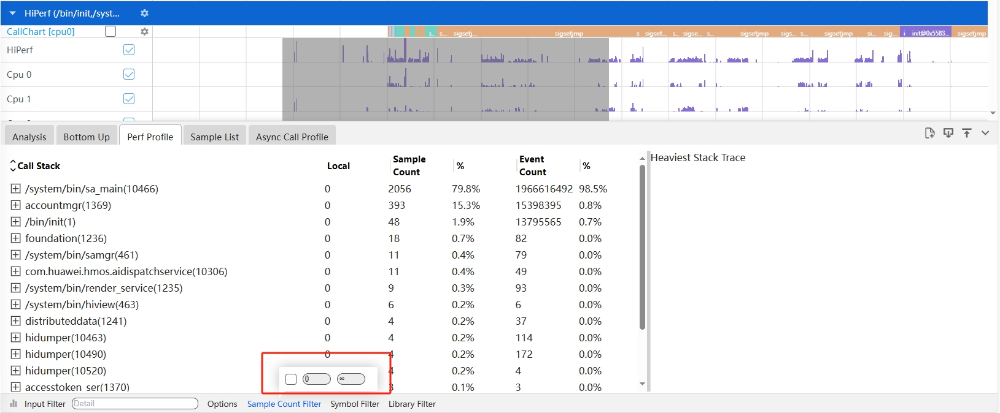

### Hiperf 功能的调用栈 Group 展示-数据分析支持剪裁功能

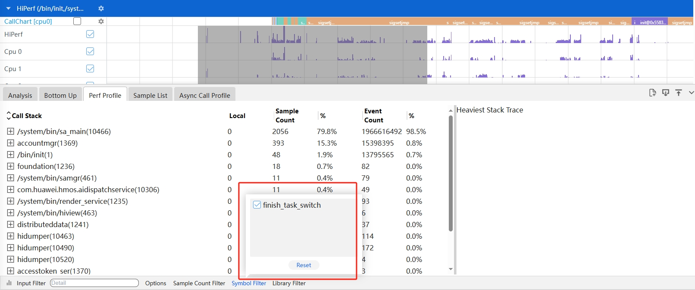

- 裁剪 Callstack，点击 Callstack 上一个节点符号，再点击底部 Symbol Filter 按钮，则该符号自动被裁剪掉，同时将该节点往下所有的 Callstack 内容裁剪掉。

- 裁剪 Library，点击 Library 上一个节点符号，再点击底部 Library Filter 按钮，则该符号自动被裁剪掉，同时将该节点往下所有的 Callstack 内容裁剪掉。
- 点击 Reset 按钮，将恢复选中的裁剪内容。

### Hiperf 功能的调用栈 Group 展示支持按条件过滤

在 Input Filter 输入关键字，会显示出带有该关键字的展示信息。
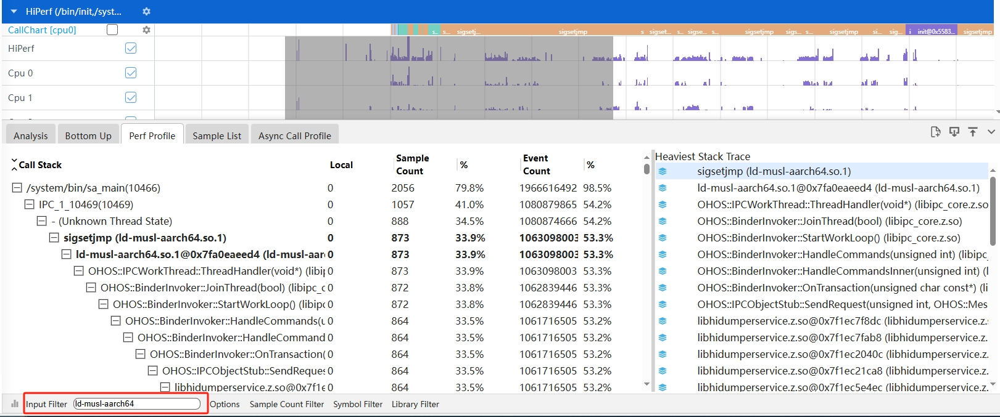

### Hiperf 辅助信息区展示调用栈

当在详细信息区选择一个符号时，将展示与该符号相关的完整的调用栈。对上展示到根节点，对下则展示 CPU 占用率最大的调用栈。调用栈右侧有 Sliding bar 可以滚动。
如下图的 Heaviest Stack Trace：
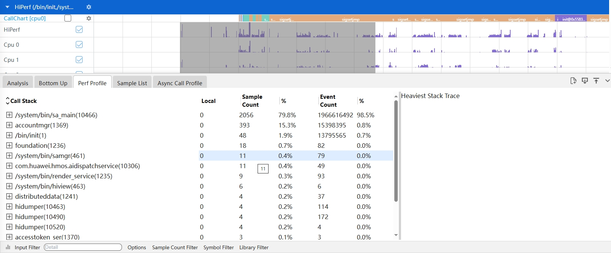

### Hiperf 的火焰图功能

点击 Perf Profile 左下角的柱状图的图标，会切换到火焰图页面。
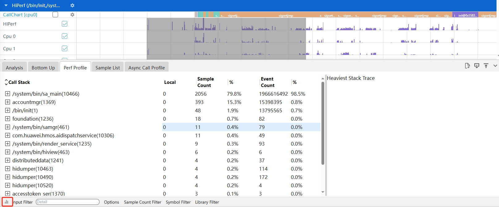
进入到火焰图页面，火焰图的展示跟 Perf Profile的tab页的调用栈显示一致，鼠标放到色块上，悬浮框可以显示调用栈名称，Lib，Addr，Count，% in current Thread，% in current Process，% in all Process。
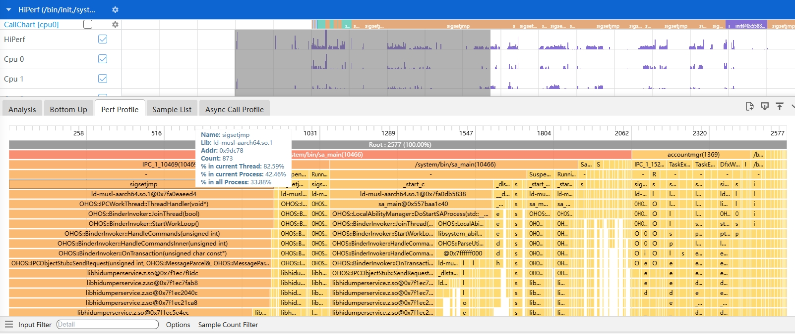

### Hiperf 的 show event count 功能

在 Hiperf 的父级泳道图上增加筛选功能，可在 Cpu Usage 和各种 event type 之间选择，切换选择之后即可将 Hiperf 下级各个泳道图数据更新，悬浮框可以根据选择的事件名显示对应的 event count。

### Hiperf 的 CPU/进程级/线程级泳道支持时序火焰图， 按照每个时间点的调用栈显示功能

 根据 Hiperf 父级泳道图所筛选的类型，来显示各个 CPU 或者线程的时序火焰图，用户可根据自己的需要，点击泳道图旁边的齿轮标志筛选出某个 cpu 或者线程的时序火焰图数据。
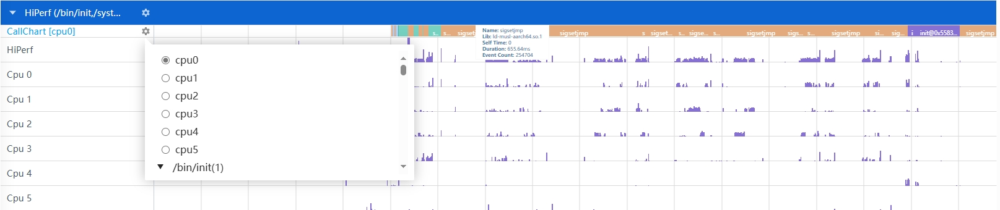

### Hiperf 的调用栈分析饼图/火焰图支持按进程、线程粒度可选， 饼图可以跳转到火焰图功能

Hiperf 分为 process、thread、library、function 四层，调用栈均可在每层的表格上鼠标点击右键跳转到对应的火焰图 Tab 页。火焰图上方标题显示是由哪一层跳转而来，点击关闭图标火焰图重置为当前框选范围的所有数据。
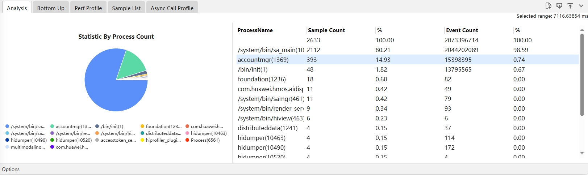
如上图，右键点击 hiprofiler_plugins 可以跳转到下图
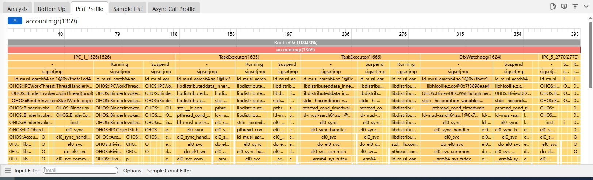
筛选面板包含 Hide Thread、Hide Thread State筛选选项、Hiperf 可隐藏线程和线程状态，以及新增Only Kernel 内核函数合并选项。
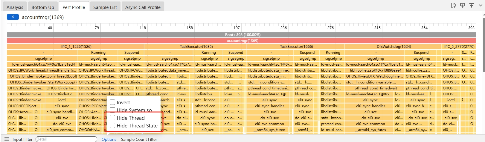

点击Only Kernel合并内核函数后，会使每个函数的Lib名不为[kernel.kallsyms]的从调用者中移除，只保留内核栈。

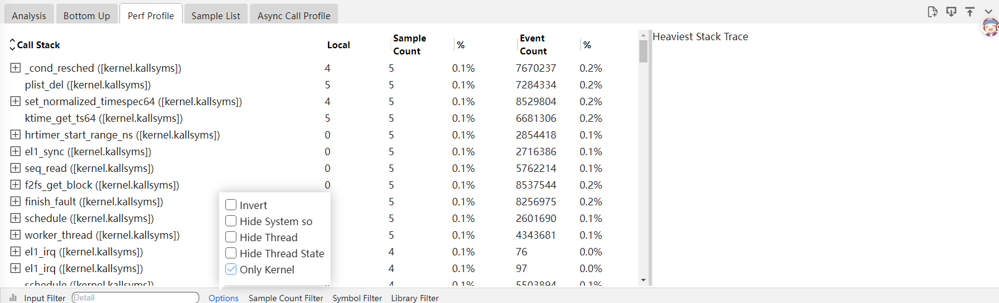

### SO导入获取符号所在行能力

在导入so符号化文件后，新增对elf文件中每个函数的地址定位到具体哪个源文件，以及显示该源文件的具体行号功能。

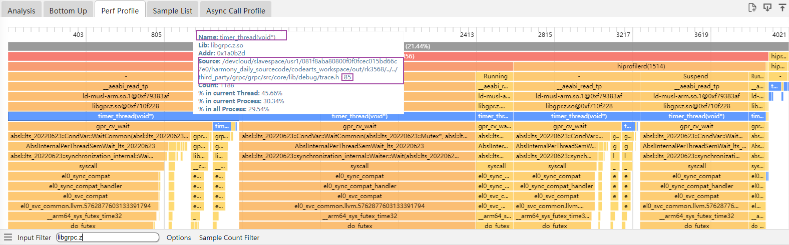