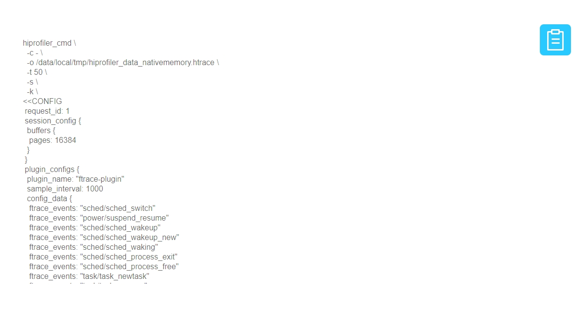
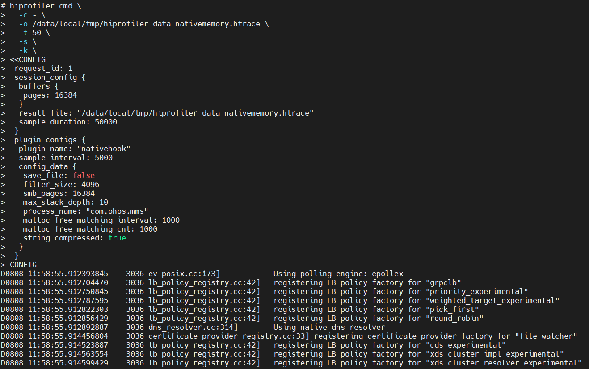
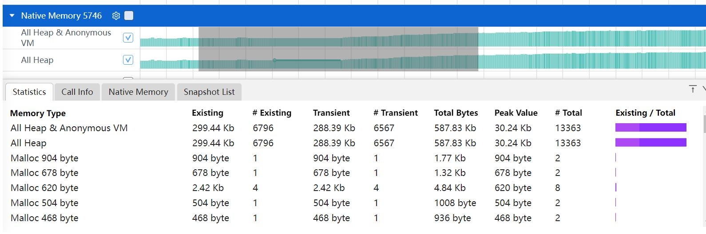

# Native Memory 抓取和展示说明

Native Memory 是查看内存的分配和释放等情况。

## Native Memory 的抓取

### Native Memory 抓取配置参数

配置参数说明：

- ProcessId or ProcessName：设置抓取的进程 ID 或者进程名，此处以输入 com.ohos.mms 进程名为例。
- Max unwind level：抓取的栈的最大深度。
- Shared Memory Size：native_daemon 和 native_hook 进程之间存储数据的共享内存大小。
- Filter Memory Size：只抓取大于该 size 的 malloc 数据（free 不受影响）。
- Use Fp Unwind：Fp 回栈。
- Use Record Accurately：不过滤数据，上报全量的。
- Use Offline Symbolization：离线符号化。
- Use Record Statistics：统计数据上报时间间隔设置。
- Use Startup Mode :抓取应用启动阶段的内存(默认是关闭，需要抓取应用启阶段内存可开启)。

再点击 Record setting，在 output file path 输入文件名 hiprofiler_data_nativememory.htrace，拖动滚动条设置 buffer size 大小是 64M，抓取时长是 50s。

点击 Trace command，就会根据上面的配置生成抓取命令，点击复制按钮，会将命令行复制。

命令行参数说明：

- save_file：是否将 hook 数据保存成文件，不上报 protobuf 形式数据给 hiprofilerd。
- filter_size：过滤 malloc 的大小，最小值是 0，默认值是 4096Byte。
- smb_pages：nativedeamon 与 libnativehook 间的共享内存大小。
- max_stack_depth：最多回栈的层数，也就是抓取的栈的最大深度。
- process_name：抓取的应用进程名。
- string_compressed：是否进行字符串压缩。
- fp_unwind：是否进行 fp 回栈。
- callframe_compress: 是否进行栈帧压缩。
- record_accurately: 是否不过滤数据，上报全量的。
- offline_symbolization: 是否离线符号化。
- statistics_interval: 统计模式下上报数据的时间间隔。
- startup_mode: 是否需要抓取应用启动阶段内存。

输入 hdc_std shell，进入设备，执行命令。

执行完成后，进入指定目录查看，在/data/local/tmp 下就会生成 trace 文件。

## Native Memory 展示说明

将抓取的 nativememory 文件导入到 smartperf 工具中查看，查看内存的分配和释放等情况。

### Native Memory 泳道图展示类型

点击齿轮状的图标可以设置内存的展示单位。

-     Current Bytes：以申请内存的size绘制泳道图。
-     Native Memory Density：以申请内存的数量绘制泳道图。
-     All Heap&AnonuymousVM：malloc分配和mmap分配的总量。
-     All Heap：malloc分配的内存。
-     All Anonymous VM：mmap分配的内存。

### Native Memory 泳道图的框选功能

可以对内存的数据进行框选，框选后在最下方的弹出层中会展示框选数据的统计表格，总共有四个 tab 页。
Statistics 的 Tab 页，主要显示了统计明细类型。

-     Memory Type：内存的类型。
-     Existing：框选区域内申请没有释放的大小。
-     #Existing：框选区域内申请没有释放的次数。
-     Transient：框选区域内释放的大小。
-     #Transient：框选区域内释放的次数。
-     Total Bytes：框选区间内申请的大小。
-     #Total： 框选区间内申请的次数。
-     Peak Value： 框选区间内内存申请的峰值。
-     Existing/Total：框选区间内剩余的内存比上申请的内存，其中浅紫色是框选区间内申请的大小/整个时间轴（申请+释放的总大小)，深紫色是框选区间内(申请+释放)的大小/整个时间轴（申请+释放的总大小）。

Call Info 的 Tab 页，主要显示了调用树详细类型。

-     Symble Name：每个内存分配的调用栈。
-     Size：分配的总大小。
-     Count：相同调用栈出现的次数。
  Native Memory 的 Tab 页，主要显示了单次分配信息列表。
  
-     Address：内存块的地址。
-     Memory Type：内存分配的类型。
-     Timestamp：时间戳信息。
-     State：内存地址当前状态Existed 表示框选范围内未释放，Freed表示已释放。
-     Size：该次申请分配内存的大小。
-     Responsible Library ：调用该函数的库。
-     Responsible Caller  ：调用该函数的方法。
  Snapshot List 的 Tab 页，主要显示了各时刻内存的增长的差值。
  
-     Snapshot：标记的打点说明。
-     Timestamp ：时间戳信息。
-     Net Growth ：自从上次Snapshot的增长量，是计算的分配和释放的。
-     Total Growth ：自从上次Snapshot的增长量，是计算的每一次分配的。
-     #Existing  ：仍然存在的内存数。

### Native Memory 的辅助信息功能

在 Call Info 和 Native Memory 的 Tab 页，点击选中某一行，右边画红线处会显示出该行调用栈的树结构信息。

### Native Memory 详细显示的过滤功能

点击下方的 All Allocations 可以对 Allocation 的 lifeSpan 进行过滤，有三个选择：All Allocatios，Create & Existing，Create & Destroyed。

-      All Allocations：所有的内存。
-      Created & Existing：创建且被存活的内存。
-      Created & Destroyed： 创建且被销毁的内存。
  点击下方的 All Heap&Anonymous 可以对内存类型进行过滤。
  
-     All Heap&AnonuymousVM：Heap和AnonuymousVM的总量。
-     All Heap：malloc分配的内存。
-     All Anonymous VM：mmap的匿名页。
  点击下方的 Mark Snapshot 可以在时间轴上打标签。出现小旗的标志，通过标注多个时间点。点击到 Snapshot List 标签页可以看到各个时间点的内存的增长值。
  

### Native Memory 的火焰图功能

火焰图的展示跟 Callinfo 的 tab 页的调用栈显示一致，鼠标放到色块上，悬浮框可以显示调用栈名称，栈的所在库名，地址，size 大小，栈的个数。

### 基于函数进行调用栈（单个或多个）选择后可以在时间轴上显示内存操作点

点击火焰图函数时，触发火焰图点击中，显示调用栈中该函数出现在时间轴范围的分布情况。

### 内存搜索大小写不敏感，上层火焰图的大小和总内存需要根据搜索内容动态调整

执行搜索的关键字大小写不区分，搜索的函数的 parent 只显示搜索的 children 的大小之和，且可以与点选联动。

### 焦点函数火焰图详细展开：选中函数的全部调用栈展示

点击调用栈某个函数，点击函数调用的函数对应铺满画布，点击函数的 parent，显示以及绘制的大小变化为点击函数的大小，如下图点击 OHOS::EglCoreInit()函数，会显示该函数的全部调用栈。

### 搜索框支持表达式输入

调用栈默认显示火焰图，新增搜索框表达式输入。表达式作用范围为 nativehook 统计与非统计模式。其中处理的均为 Responsible Library 与 Responsible Caller，其中 Responsible Library，Responsible Caller 表示从下往上非 libc++ musl 的第一条调用栈的 lib 跟 symbol，如下图所示，由于最后一条 [ operator new(unsigned long) ] libc++.so 为 libc++.so 的函数，固跳过，所以该条调用栈的 Responsible Library 为 libhilog.so，Responsible Caller 为 OHOS::HiviewDFX::GetDomainLevel(unsigned int) 。

表达式说明:在 InputFilter 输入框可以进行搜索过滤和表达式过滤，其中表达式必须以@开头，英文括号包起所需要过滤的内容，每个括号必须包括 （Responsible Library，Responsible Caller）匹配全量以\*表示，否则认为该输入为搜索过滤。

| 表达式                                        | 含义                                                                                                                                                           |
| --------------------------------------------- | -------------------------------------------------------------------------------------------------------------------------------------------------------------- |
| @(libquickjs tryalloc)                        | 只显示 Responsible Library 为 libquickjs 且 Responsible Caller 包含 tryalloc 的数据                                                                            |
| @(libquickjs \*)                              | 只显示 Responsible Library 包含 libquickjs 的数据                                                                                                              |
| @(\* tryalloc codec bitmapcache skYUV)        | 只显示 Responsible Library 为任意值 且 Responsible Caller 包含 tryalloc 或 codec 或 bitmapcache 或 skYUV 的数据                                                |
| @(libglobal *，*resourceManager)              | 只显示 Responsible Library 包含 libglobal 且 Responsible Caller 为任意值的数据 或 Responsible Library 为任意值，Responsible Caller 包含 resourceManager 的数据 |
| @(/data/user \*)                              | 只显示 Responsible Library 路径/data/user 且 symbol 为任意值的数据                                                                                             |
| @(mali.so _,libGLES_mali.so _)                | 只显示 Responsible Library 包含 mali.so 或者 libGLES_mali.so 的数据                                                                                            |
| @(\* PixelMap:ReadImageData)                  | 只显示 Responsible Caller 包含 PixelMap:ReadImageData 的数据                                                                                                   |
|                                               |                                                                                                                                                                |
| @-(libark jsvm table)                         | 不显示 Responsible Library 包含 libark 且 Responsible Caller 包含 jsvm 或者 table 的数据                                                                       |
| @-(librender picture, libskia picture)   | 不显示 Responsible Library 包含 librender 或者 libskia 且 Responsible Caller 中包含 picture 的数据                                                             |
| @-(libark \*)                                 | 不显示 Responsible Library 包含 libark 的数据                                                                                                                  |
| @-(\* table)                                  | 不显示 Responsible Caller 中 table 的数据                                                                                                                      |
|                                               |                                                                                                                                                                |
| @(_ table) - (libark _)                       | 只显示 Responsible Caller 包含 table 且 Responsible Library 不为 libark 的数据                                                                                 |

### Native Memory 数据统计功能

选择 Use Record Statistics 和 statistics interval 配置项抓取的数据，只会显示 Call Info 的 Tab 页，Call Info 相关功能同上。

### Native Memory 多进程数据显示

前端可以支持多进程数据的展示，通过在 tab 页切换不同进程，可以显示不同进程的 hook 数据。

