# 页内存的抓取和展示说明

页内存从 page 层面更深层次剖析应用程序的虚拟内存操作。

## 页内存的抓取

### 页内存抓取配置参数

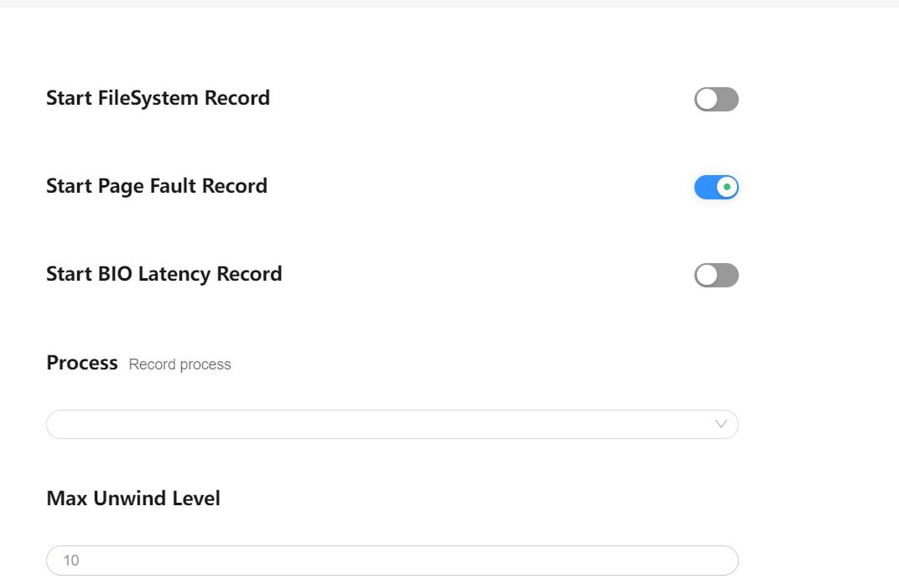
配置项说明：

-     Start Page Fault Record：配置项的总开关。
-     Process：默认配置的是整个系统的，也可选择单进程抓取。
-     Max Unwind Level：配置抓取调用栈的最大深度。

再点击 Record setting，在 output file path 输入文件名 hiprofiler_data_ebpf.htrace，拖动滚动条设置 buffer size 大小是 64MB，抓取时长是 50s。
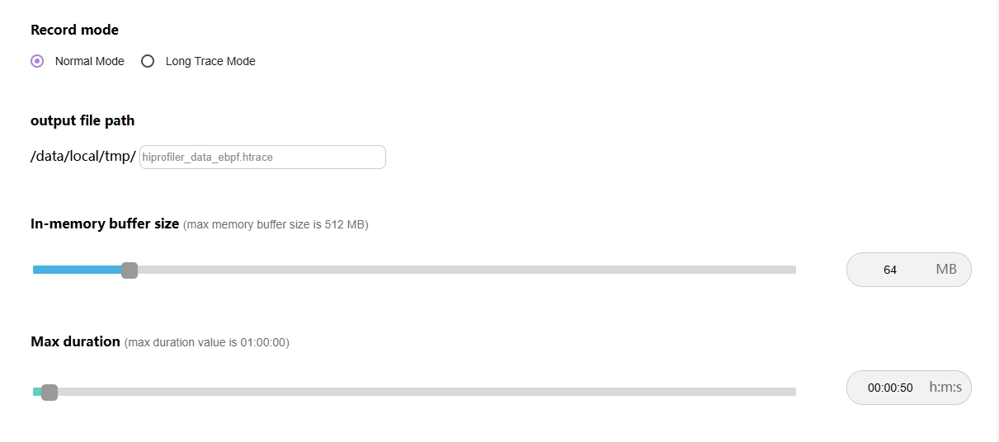
点击 Trace command，就会根据上面的配置生成抓取命令，点击 Record 抓取，抓取过程中会显示抓取时长。

### 页内存展示说明

抓取结束后页内存的 trace 会自动加载展示。
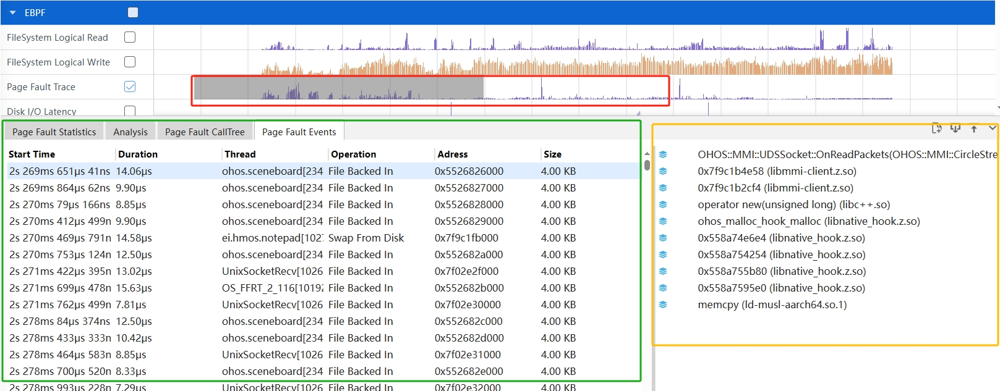

界面布局介绍：页内存整体界面布局分为 3 个部分：

-     红色区域：泳道图。
-     绿色区域：详细信息。
-     黄色区域：辅助信息(Call Stack)。

### 页内存泳道图展示

页内存泳道图展示事件(Operation)发生的次数，每个事件都有持续时间，鼠标悬浮以 10ms 为区间进行次数统计。
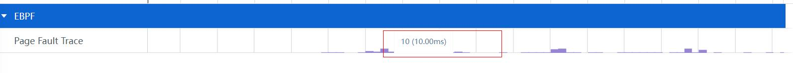
按住 w 键放大界面，悬浮框会显示当前时刻的事件发生次数。
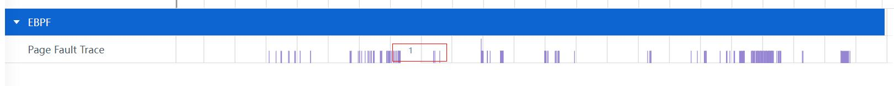

### 页内存泳道图的框选功能

可以对泳道图进行框选，框选后在最下方的弹出层中会展示框选数据的统计表格，总共有三个 tab 页。
Page Fault Statistics 的 Tab 页如图：
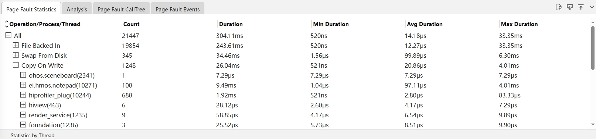

-     Operation/Process/Thread： 按照Operation为基点显示。
-     Count： 事件数量。
-     Duration：总时长。
-     Min Duration：最小时长。
-     Avg Duration： 平均时长。
-     Max Duration：最大时长。
  点击下方的 Statistics by Thread，可以切换到按照 Thread 为基点显示数据。
  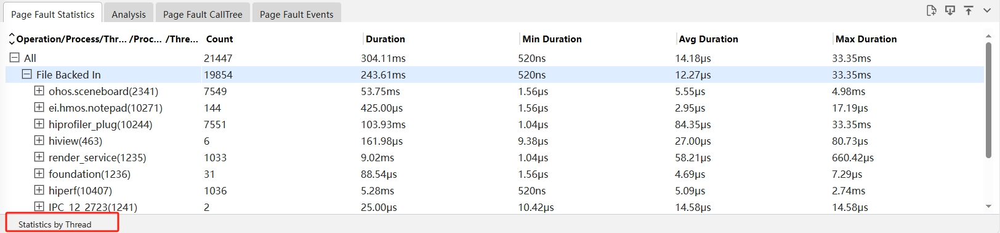
  Analysis 的 Tab 页如图：
  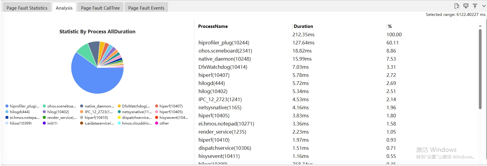
  Page Fault CallTree 的 Tab 页如图：
  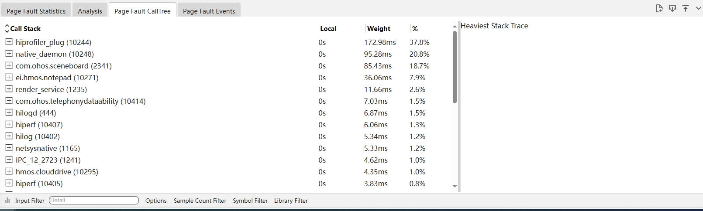
-     Call Stack：为经过符号解析后的Callstack，并且给出动态链接库或者进程名的信息。
-     Local：为该调用方法自身占用的 CPU 时间。
-     Weight：为该调用方法占用的CPU时间。
      %：为该调用方法占用的CPU时间占比。
  Page Fault Events 的 Tab 页如图：
  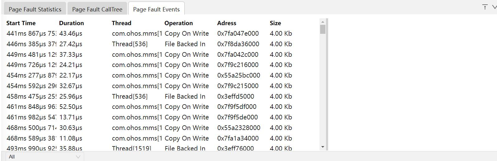
-     Start Time：起始时间。
-     Duration：时长。
-     Thread：线程名。
-     Operation：事件类型。
-     Address：内存地址。
-     Size：内存大小。

### 页内存支持多种 Options 展示风格

点击 Page Fault CallTree 的 Tab 页底部的 Options，会有四个 CheckBox 复选框。

-     Invert：反向输出调用树。
-     Hide System so：隐藏系统库文件。
-     Hide Event：隐藏事件。 
-     Hide Thread：隐藏线程。 

### 页内存支持过滤调用栈调用次数的展示风格

点击 Page Fault CallTree 的 Tab 页底部的 Sample Count Filter，可以填上区间值。过滤出符合该区间值调用次数的调用栈信息。
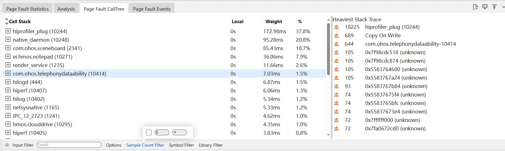

### 页内存功能的调用栈 Group 展示-数据分析支持剪裁功能

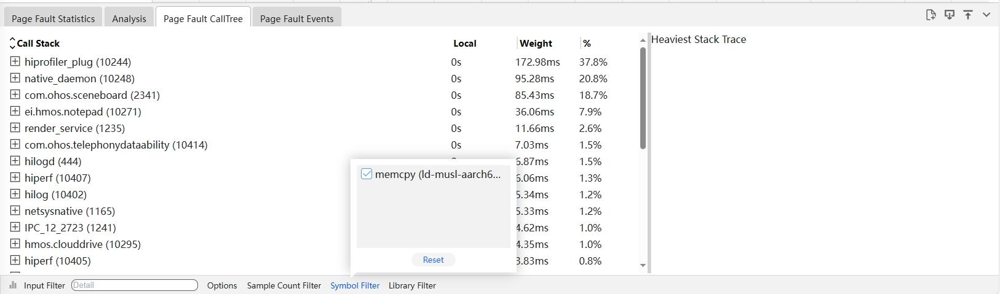

- 裁剪 Callstack，点击 Callstack 上一个节点符号，再点击底部 Symbol Filter 按钮，则该符号自动被裁剪掉，同时将该节点往下所有的 Callstack 内容裁剪掉。
- 裁剪 Library，点击 Library 上一个节点符号，再点击底部 Library Filter 按钮，则该符号自动被裁剪掉，同时将该节点往下所有的 Callstack 内容裁剪掉。
- 先选中要恢复的内容，再点击 Reset 按钮，将恢复选中的裁剪内容。

### 页内存功能的调用栈 Group 展示支持按条件过滤

在 Input Filter 输入关键字，会显示出带有该关键字的展示信息。
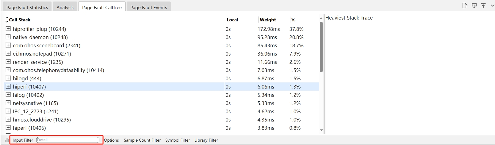

### 页内存辅助信息区展示调用栈

当在详细信息区选择一个符号时，将展示与该符号相关的完整的调用栈。如下图的 Heaviest Stack Trace：
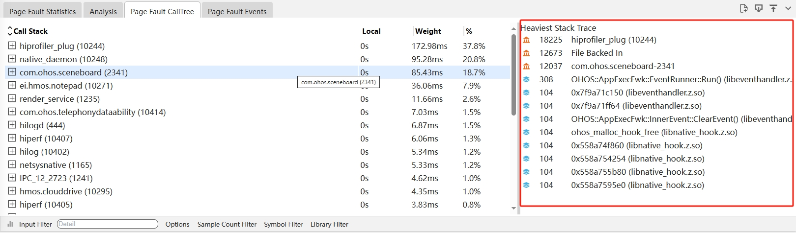

### 页内存的事件类型的过滤

通过选择类型事件进行过滤。
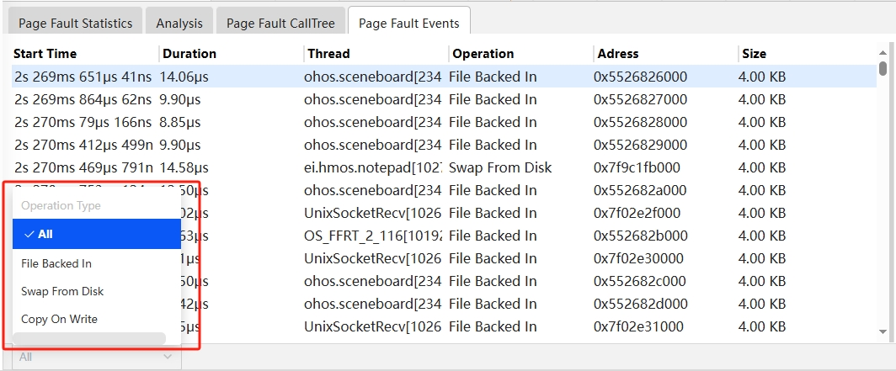

### 页内存的火焰图功能

点击 Page Fault CallTree 左下角的柱状图的图标，会切换到火焰图页面。
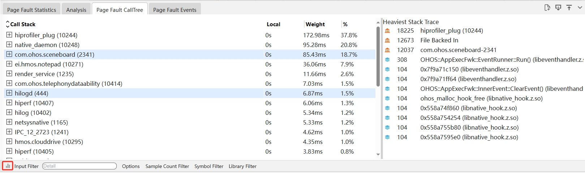
进入到火焰图页面，火焰图的展示跟 Callinfo 的 tab 页的调用栈显示一致，鼠标放到色块上，悬浮框可以显示调用栈名称、所属Lib库、函数地址、耗时及其占比。
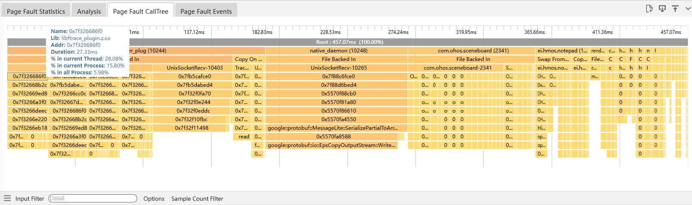
鼠标左键火焰图，会进入下一级界面，左键上级则返回上一级界面。
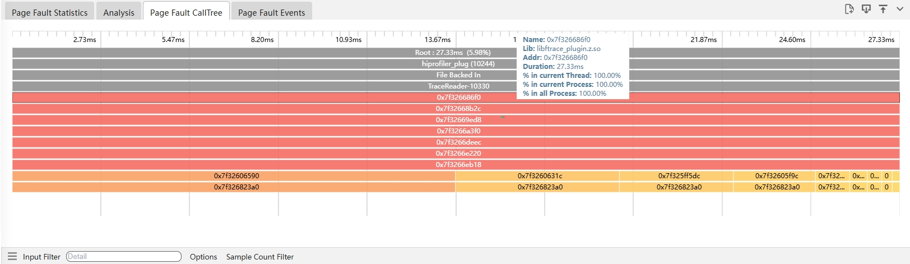
