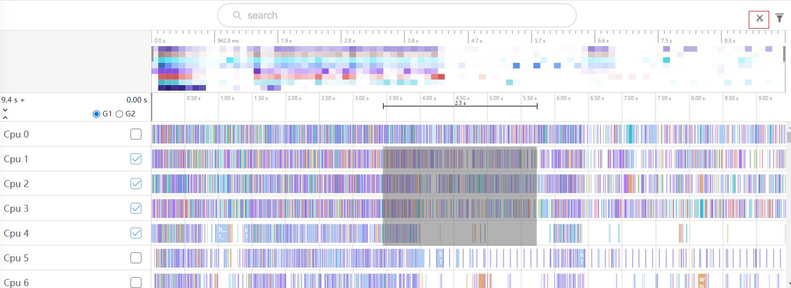
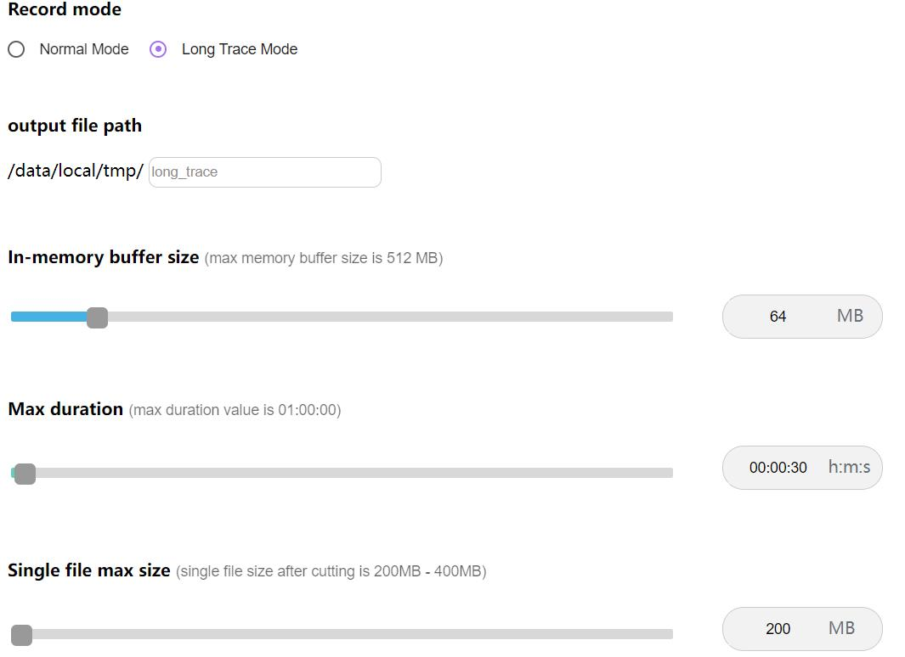
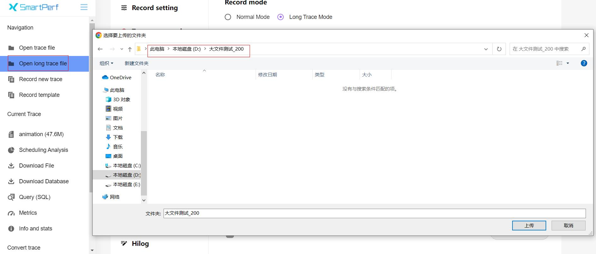
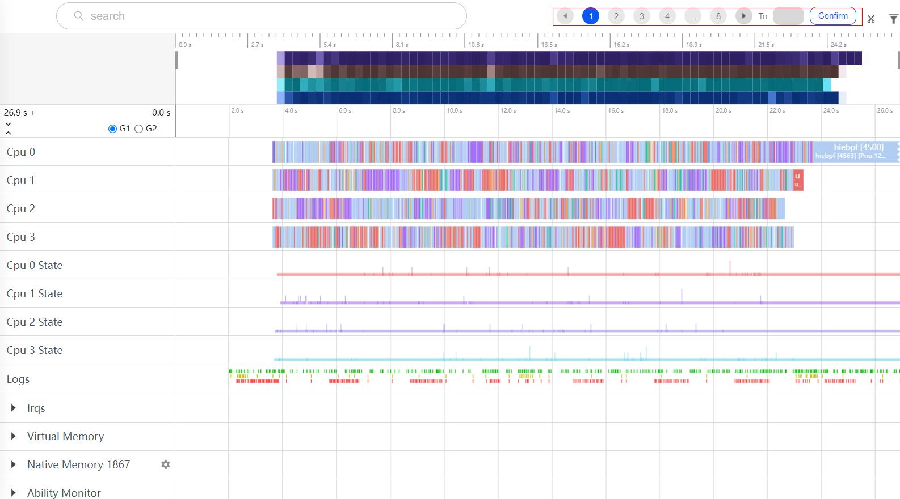
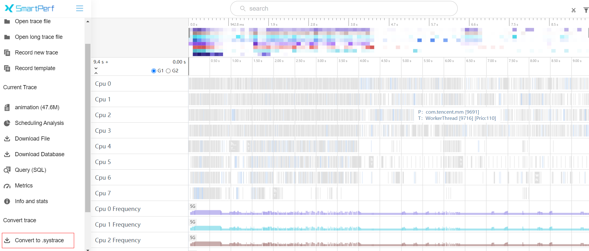
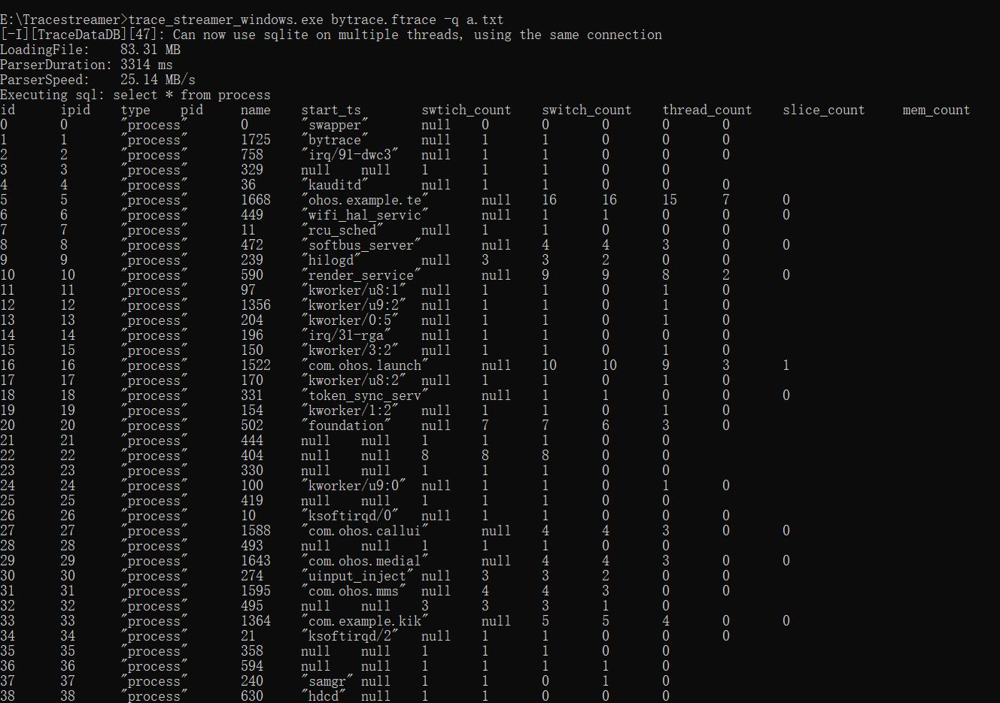
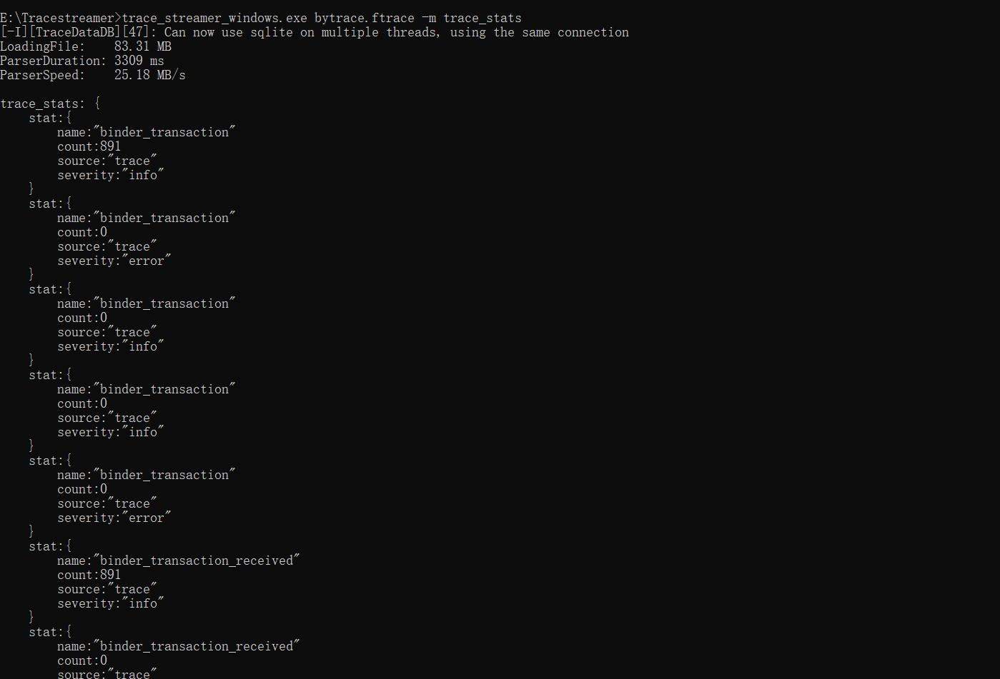

# Trace 解析能力增强

Trace 解析能力增强主要是提高 Trace 的解析能力。

### 焦点问题 trace 切割，选择焦点 trace，聚焦问题发生时间范围，单独打开

焦点问题切割是将现有的 trace 加载到界面时，对指定时间进行框选，截取框选时间范围内的 trace 数据通过跳转的方式去打开新的 trace 界面，新界面的 trace 数据就是按照这段时间范围去切割的。如下图框选一段时间范围，点击右上方的小剪刀图标对框选时间范围数据进行剪切。

### 超大 trace 分段打开，超大 trace 按照固定大小切割，分段打开显示

超大 trace 分段打开是对现有配置抓取的同一种时钟源数据源的。也就是配置命令下发的抓取有效。Htrace 数据按照端测切割的大小的分成多个文件，并将不能切割的 hiperf、ebpf、arkts 的数据单独存储。IDE 通过将这几种源文件数据存储在 IndexedDB，并调用 trace streamer 去进行切割数据，并在 IDE 测过滤筛选出切割的数据进行展示。

#### 超大 trace 浏览器用户数据目录配置说明

由于大文件切割的数据是保存在浏览器的 IndexedDb 中，默认存储在系统盘，所以需要修改用户目录数据存放位置。

##### 找到浏览器的 exe 执行文件位置(或者浏览器 exe 的快捷方式位置)， 在 cmd 窗口执行以下命令(edge 浏览器)

    D:\deskTop\msedge.exe.lnk --user-data-dir=D:\Edgedata
    	D:\deskTop\msedge.exe.lnk     浏览器的exe执行文件位置(或者浏览器exe的快捷方式位置)
    	--user-data-dir=D:\Edgedata   指定用户目录数据位置,本地除系统盘外的位置都可以，内存尽量大一点

##### 浏览器 exe 或者 exe 快捷方式目录和名称不能有带空格

    错误：D:\desk Top\Microsoft Edge.exe.lnk --user-data-dir=D:\Edgedata
    正确：D:\deskTop\MicrosoftEdge.exe.lnk --user-data-dir=D:\Edgedata

##### 配置完成后, 查看【用户配置路径】是否是配置的路径

    edge浏览器:   edge://version/
    chrome浏览器: chrome://version/

#### 超大 trace 抓取配置说明

-     Long Trace Mode： 超大trace抓取模式。
-     Single file max size： trace文件分割的大小。

#### 本地导入超大 trace

本地导入超大 trace 是导入文件夹，将该文件夹中所有文件导入。如下图从 Open long trace file 入口导入。

本地导入以后，点击右上方的切页图标可以切页。

### web 端支持已打开的 trace 文件转换成 systrace，并可下载

已打开的 trace 界面，增加 trace conver 按钮，支持将 htrace 和 row trace 转为 systrace。

### tracestreamer 离线执行 sql 和 metrics 语句，对标 trace_processor_shell –q 和—run-metrics

trace_streamer_shell –q 可以直接将 sql 查询结果显示在命令行里，如下图 bytrace.ftrace 是需要解析的文件，a.txt 是 sql 语句。

trace_streamer_shell –m 可以直接将 metric 接口的查询结果显示在命令行里，如下图 bytrace.ftrace 是需要解析的文件，trace_stats 是 metric 接口名。

