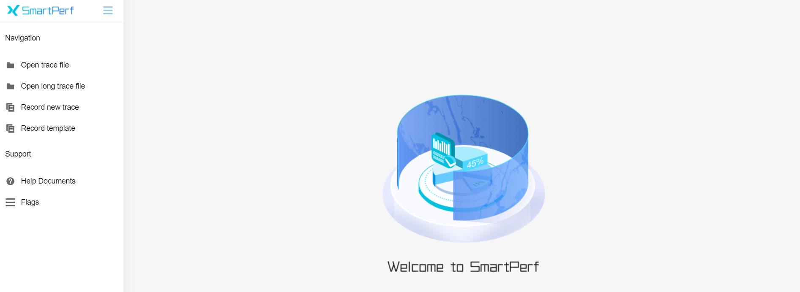
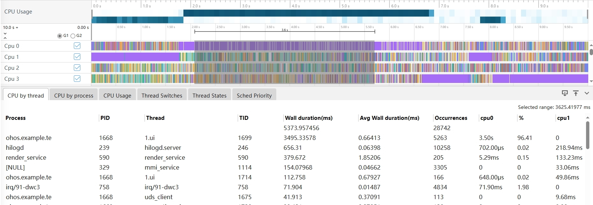
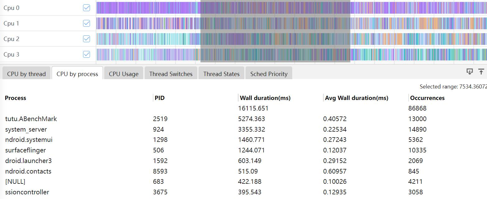
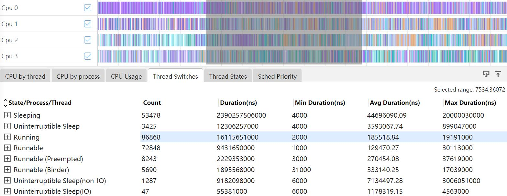
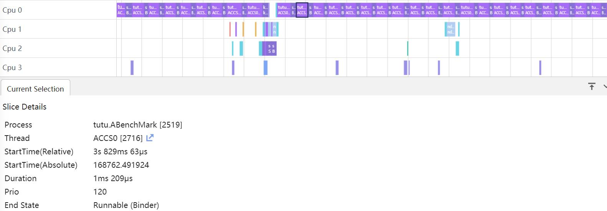
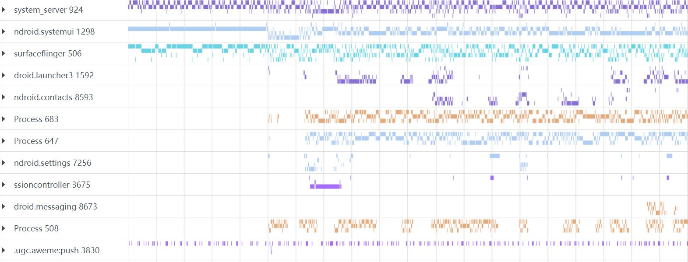
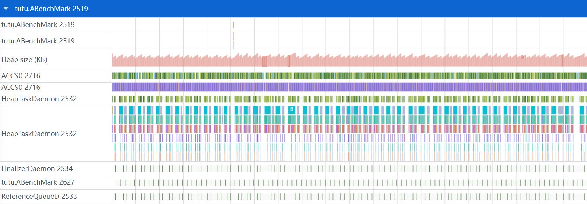
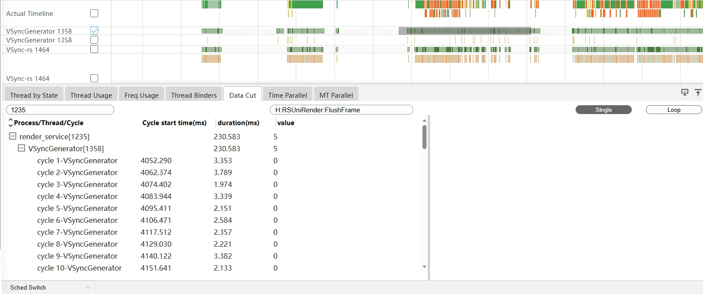
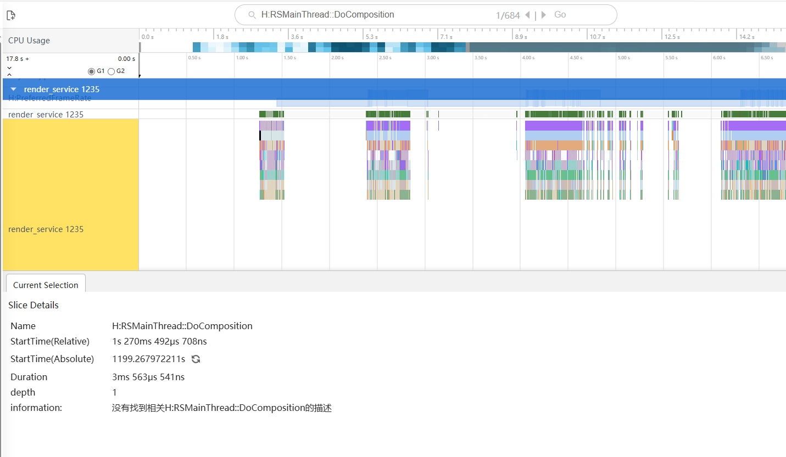
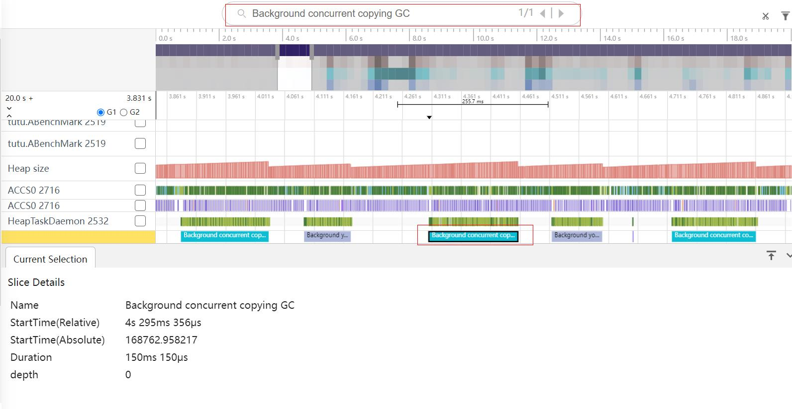

# web 端加载 trace 说明

从 web 端查看 trace 文件，进行性能检测的分析。

## 文件加载入口

将抓取的 trace 导入查看。

说明：

- Open trace file：导入离线 trace 文件入口。
- Open long trace file：导入大文件入口。
- Record new trace：抓取新的 trace 文件入口。
- Record template：抓取指定模块的 trace 入口。

## 导入 trace 文件后显示页面

说明：

- 操作说明：在当前页面可以通过键盘上的 wasd 四个键位操纵当前的时间轴进行缩放，w 为放大，s 为缩小，a 为左移，d 为右移。

## trace 功能介绍

trace 模块从上往下主要展示时间轴、cpu 使用率、cpu 使用情况、进程间通讯数据的方法调用情况、进程、线程和方法调用情况。

### 时间轴和 cpu 使用率

最上方带刻度的为时间轴，主要展示当前抓取数据的总时长和时间刻度的分布情况，如上图所示，左下角展示总时长。
中间区域展示的是抓取数据时间段内的 cpu 使用率，颜色越深代表 cpu 使用率越高，颜色越浅代表 cpu 使用率越低。

在白色背景时间轴区域内可以点击后拖拽鼠标，可以对从鼠标按下到拖拽完成鼠标松开的区域内的数据进行筛选，高亮显示的部分为当前所选区域，如上图所示。

### cpu 使用情况

如上图所示，当前抓取数据有 4 个 cpu 工作，前四组数据对应的是当前调用 cpu 的线程和对应的进程情况，以颜色作为区分。后四组数据则为 cpu 的使用频率信息。鼠标移动到相应的线程上还会将当前选中的进程信息全部置为高亮，其他的进程会置灰，如下图所示。

#### cpu 使用情况的框选功能

可以对 cpu 的数据进行框选，框选后在最下方的弹出层中会展示框选数据的统计表格,总共有六个 tab 页。
CPU by thread 的 Tab 页，主要显示了在框选时间区间内的进程名、进程号、线程名、线程号、总运行时长、平均运行时长和调度次数信息。

CPU by process 的 Tab 页，主要显示了在框选时间区间内的进程名、进程号、总运行时长、平均运行时长和调度次数信息。

CPU Usage 的 Tab 页，主要显示了在框选时间区间内，该频率时间占比前三的信息。

Thread Switches 的 Tab 页，按照状态>进程>线程，统计对应状态下的次数，持续时长，最小时长，平均时长，最大时长信息。

Thread States 的 Tab 页，按进程>线程>状态的维度去统计，需要呈现该状态的线程名、进入该状态次数、该状态下时长、最小时长、平均时长、最大时长。

Sched Priority 的 Tab 页，按优先级显示调度，显示框选范围内所有 Running 以及 Running 之前的 Runnable 线程的最小，最大，平均耗时。

Thread States、Thread Switches 的 2 个 Tab 页，点击移动到某一行，鼠标会变成一个小手的标志，并且会高亮，点击一下，就会进入辅助信息界面，会将选中行的辅助信息展示出来，包括开始时间、进程、线程、线程状态、对应的 CPU、优先级等信息如下图。

#### cpu 使用情况的单选功能

单选 CPU 使用情况数据会在选中的色块外层加上深色边框，能够突出当前选中色块，弹出层中会展示当前 CPU 上的进程名，线程名，开始时间的相对时间，开始时间的绝对时间，运行时长，线程结束状态信息。

### 线程唤醒关系树

线程唤醒关系树功能是点击 GetWakeupList 会以链式结构和表格分别在泳道图和 tab 上展示线程的唤醒关系树信息,点击 GetWakeupList 按钮旁边的星号按钮可以对唤醒树对应的泳道图一键收藏，对优先级最低且运行时长最长或者运行时长最长的线程会以红色字体高亮显示。

### 进程、线程和方法数据

下图是进程数据，左边部分展示进程名称和 id，右边显示线程切换关系，线程的调用方法，进程间内存信息等。

点击进程名前面箭头可以展开对应的线程进行查看，展开后的线程如下图，如果存在堆内存占用情况，会显示出对应泳道图，如果出现两个名字和 id 一样的线程，则第一个为线程的使用情况，第二个为线程内的方法栈调用情况。

#### 进程、线程和方法数据的框选功能

可以对线程的数据进行框选，框选后在最下方的弹出层中会展示框选数据的统计表格，包含线程运行状态，线程调用栈的统计情况。当框选的数据中同时存在线程运行状态和线程调用栈数据，下方的弹出层中就会出现多个 tab 选项，可以进行切换。

下图是线程运行状态框选统计信息,包括进程名、进程号、线程名、线程号、线程状态、状态持续时间、平均持续时间、该线程状态发生的次数。

下图是线程调用栈框选统计信息,包括方法名、持续时间、平均持续时间、调用的次数。

#### 进程、线程和方法数据的单选功能

单选线程的 state 数据时，会展示当前选中线程的状态数据，开始时间(相对和绝对时间)和持续时长，线程状态，所在进程名称，选中状态的前一个状态，选中状态的后一个状态。

单选调用栈数据，单击方法会在选中的方法外层加上黑色边框，能够突出当前选中的方法，弹出层中会展示当前方法的名称、开始时间(相对和绝对时间)和运行时长信息，调用栈深度。

#### 线程的跳转功能

点击画红框处的带箭头的标志，会从 CPU 的线程概览视图跳转到线程的详情视图，同时从线程的详情视图也能跳转到 CPU 的线程概览视图。

#### 获取频点的busy_time
框选Cpu Frequency泳道的Tab页有GetBusyTime的按钮，该按钮获取每个频点在Cpu State等于0时的时间信息，体现频点的忙碌时间。

#### CPU频点数据切割
框选区域内所有running状态的频点数据，以用户输入的某一方法作为切割依据，将频点数据以Single和Loop两种方式切割后展示在Tab标签页的表格中。

#### 关键路径标识
在ftrace数据中的cpu泳道的区域，在界面顶部增加json文件导入按钮，导入json文件后，根据线程号跟对应的时间，在cpu区域高亮该时间的线程色块，点击界面上的x,可以取消高亮。json格式如下：

导入json文件以后，会将ACCS0 [2716]线程对应时间点的slice色块高亮显示

### trace的其他功能
#### 小旗标志的功能

将选中数据的时间点通过小旗的方式在时间轴上展示，直观的展示选中数据的时间。

#### 勾选功能

框选某一区域，该区域左边会出现 CheckBox 的复选框，选中的区域的复选框会出现打勾的状态，可以取消勾选，也可以重新勾选。

#### 搜索功能

在搜索框中，可以输入线程，线程号等搜索自己想要的信息，搜索完成会高亮显示。

在搜索框中输入调用栈的方法名，会跳转到对应的调用栈。

### Tab 页信息和泳道图可跳转(点击和框选场景,框选类似搜索)

泳道图高亮场景：框选 Cpu Frequency 或者 Cpu State 泳道图后，弹出 Cpu Frequency 或 Cpu State Tab 页，在点击 Tab 页表格的行时，框选范围泳道图的当前行的 Value 值一样的部分上方会出现一条以圆点开头颜色比趋势图颜色同色但稍深的粗线条，如下图:

搜索场景：框选函数调用栈的泳道图，弹出 Slices Tab 页，点击表格行，会跳转到框选范围内的第一条调用栈的位置，点击下图 Slices Tab 页的 Background concurrent copying GC 调用栈。

会在搜索栏显示出该调用栈的搜索结果，并且会跳转到框选范围内第一条 Background concurrent copying GC 调用栈的位置。

#### M 键测量功能

放大 trace 中的色块，选中色块，键盘按下 M，会出现像标尺一样的形状。

