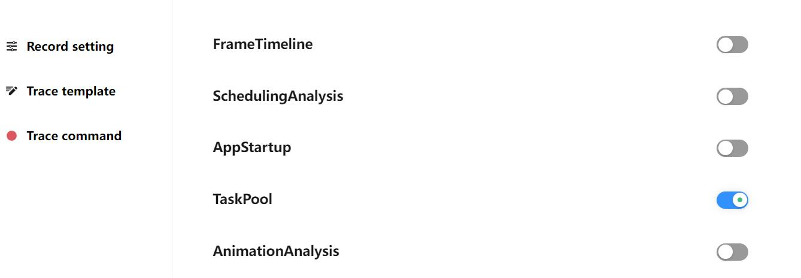
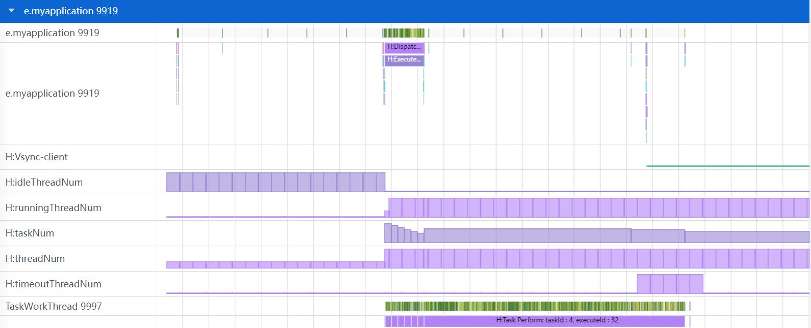
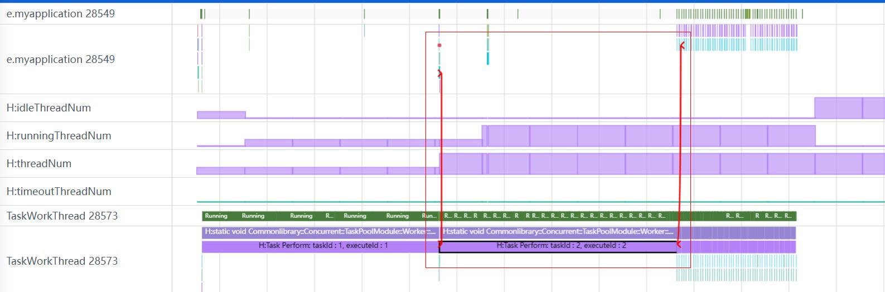
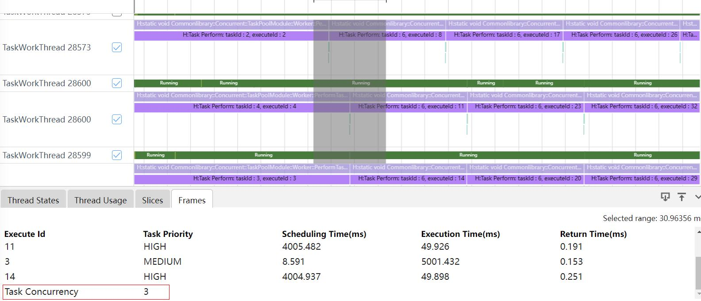
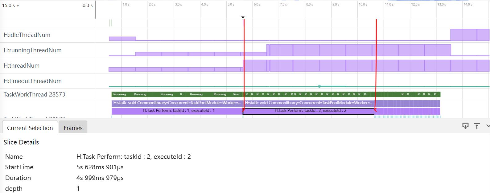
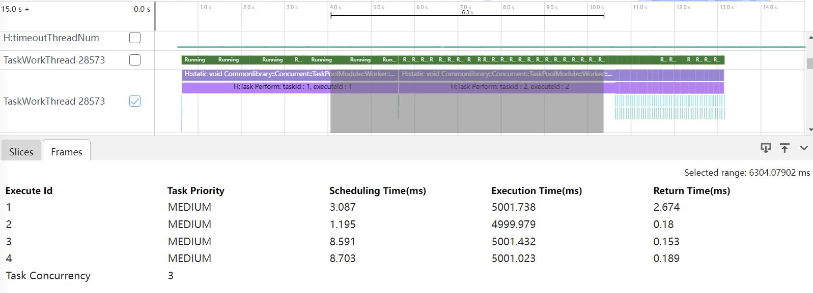
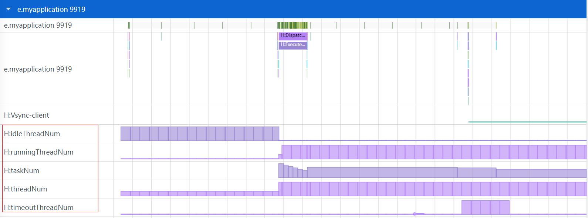
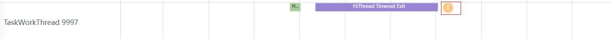

# TaskPool 抓取和展示说明

TaskPool 分析模块主要展示应用程序使用 taskpool 时，任务的关联关系，任务调度开销和任务并发度分析情况，任务各阶段耗时情况，线程池的状态统计，队列任务数，任务是否超时。

## TaskPool 的抓取

#### TaskPool 的抓取配置参数

打开 Task pool 开关抓取 taskpool 数据。

### TaskPool 展示说明

将抓取的 taskpool 文件导入到 smartperf 中，查看任务的关联关系等信息。

### TaskPool 的任务关联关系跟踪

任务关联关系就是根据任务的 executeId，把一个 taskpool 任务的各个执行的函数调用栈连接起来，用于表示一个任务从开始分发到执行，再到最后任务结束的整个过程。

如上图所示，点击 H:Task Perform: taskId : 2, executeId : 2 的调用栈会出现红色连线，红色连线展示了 executeId 是 2 的任务的关联关系，连接的调用栈分别是：

-     H:Task Allocation: taskId : 2, executeId : 2, priority : 1, executeState : 1：任务分发。
-     H:Task Perform: taskId : 2, executeId : 2：任务执行。
-     H:Task PerformTask End: taskId : 2, executeId : 2, performResult : Successful：任务返回。

### TaskPool 的并发度

点选或者框选任务状态为执行会进行任务并发度展示，如图所示并发度是 3。

### TaskPool 泳道图的点选功能

点选 taskpool 的 Slice，展示该 taskpool 信息的 tab 页。

-     Name： 任务调用栈名称。
-     StartTime： 任务调用栈开始时间。
-     Duration：任务调用栈持续时间。
-     depth：调用栈层级。

### TaskPool 泳道图的框选功能

框选 taskpool 的泳道图，展示 Frames 的 tab 页。

-     Execute Id： 任务id。
-     Task Priority： 任务优先级(HIGH，MEDIUM，LOW)。
-     Scheduling Time(ms)：调度耗时(任务执行起始时间 - 任务分发起始时间)。
-     Execution Time(ms)：执行耗时(任务执行的duration)。
-     Return Time(ms)：返回耗时(任务返回的结束时间 – 任务执行的结束时间)。

### TaskPool 的队列任务数和线程池里线程状态统计

如上图，H:threadNum，H:runningThreadNum，H:idleThreadNum，H:timeoutThreadNum 是线程池里线程状态统计，H:taskNum 是队列任务数。

### TaskPool 的任务超时退出

在带有 H:Thread Timeout Exit 的调用栈的泳道图会采用黄色圆圈，中间为白色反叹号标记，代表任务超时退出。

