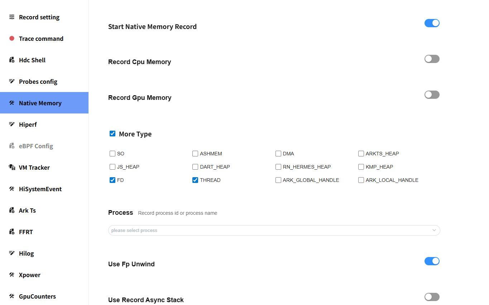
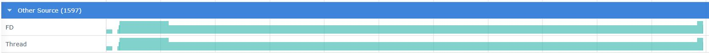

# FD & Thread 抓取和展示说明

FD & Thread 是查看fd、thrad的分配和释放等情况。

## FD & Thread 的抓取

### FD & Thread 抓取配置参数

配置参数说明：

- More Type：抓取更多内存类型(SO、ASHMEM、DMA、ARKTS_HEAP、JS_HEAP、KMP_HEAP、FD、THREAD、 ARK_GLOBAL_HANDLE、ARK_LOCAL_HANDLE)。

fd & thread抓取：
- 打开Start Native Memory Record开关。
- 勾选FD或者THREAD（也可二者都打开开关，同时抓取）。
- 其他操作可参考native memory抓取。

## FD & Thread 展示说明

将抓取的 FD & Thread 文件导入到 smartperf工具中查看，查看fd、thrad的分配和释放等情况。

### FD & Thread 泳道图展示类型

FD & Thread不同于native memory的是，只有count，没有size，因此没有点击齿轮图标设置内存展示单位的功能。

-     FD：FD分配的次数。
-     Thread：Thread分配的次数。

### FD & Thread 泳道图的框选功能

可参考Native Memory 泳道图的框选功能。