# FileSystem 的抓取和展示说明

FileSystem 分析文件系统的信息和活动，比如读和写操作等。

## FileSystem 的抓取

### FileSystem 抓取配置参数

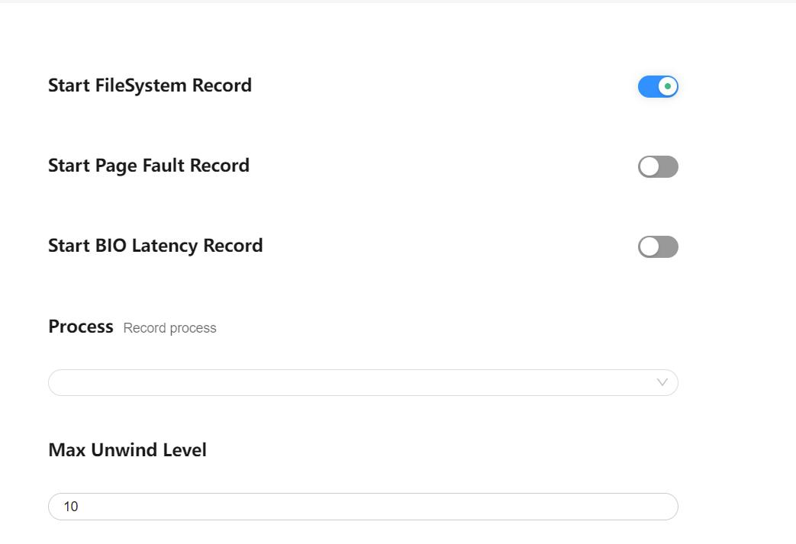
配置项说明：

-     Start FileSystem Record：配置项的总开关。
-     Process：默认配置的是整个系统的，也可选择单进程抓取。
-     Max Unwind Level：配置抓取调用栈的最大深度。

再点击 Record setting，在 output file path 输入文件名 hiprofiler_data_filesystem.htrace，拖动滚动条设置 buffer size 大小是 64MB，抓取时长是 50s。
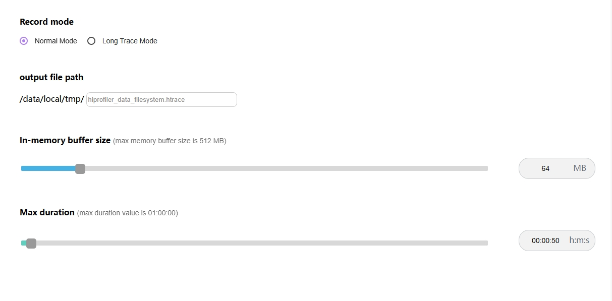
点击 Trace command，就会根据上面的配置生成抓取命令，点击复制按钮，会将命令行复制。
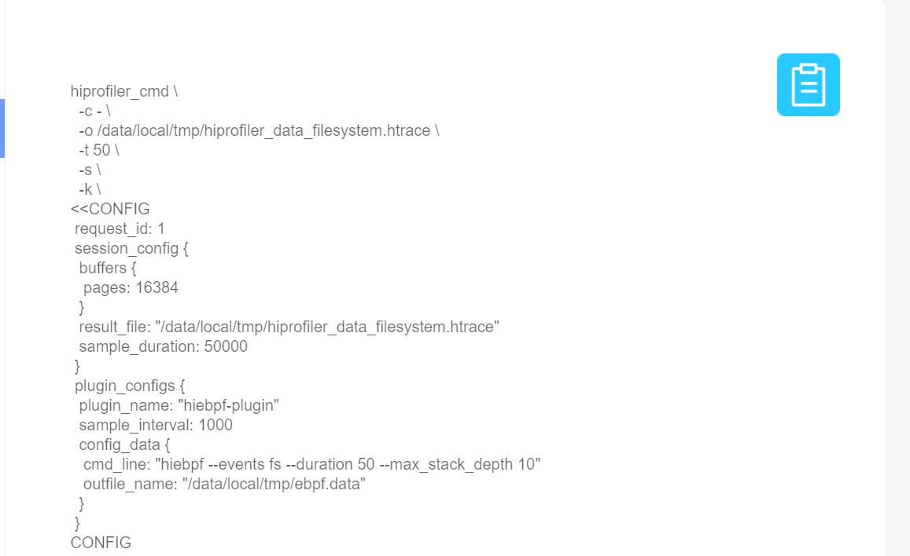
输入 hdc shell，进入设备，执行命令。
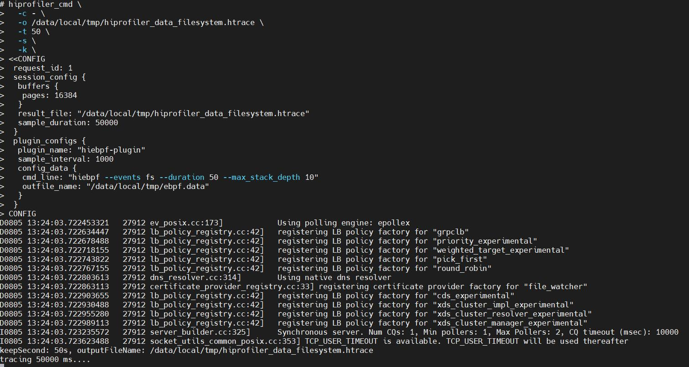
执行完成后，进入指定目录查看，在/data/local/tmp 下就会生成 trace 文件。
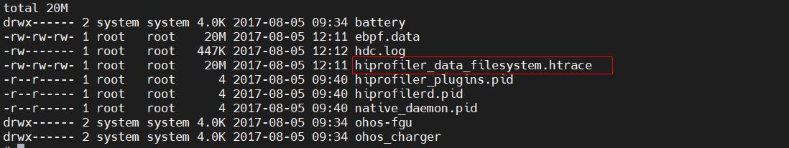

### FileSystem 展示说明

将抓取的 trace 文件导入 smartperf 界面查看。
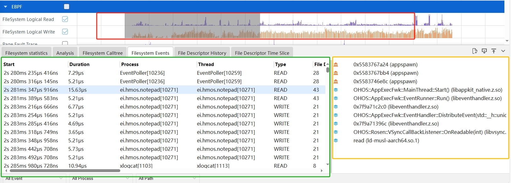

界面布局介绍：FileSystem 整体界面布局分为 3 个部分：

-     红色区域：泳道图。
-     绿色区域：详细信息。
-     黄色区域：辅助信息(Callstack)。

### FileSystem 泳道图展示

FileSystem 泳道图按照读操作和写操作展示，鼠标移动到泳道图上，悬浮框会以 10ms 为周期展示读，写类型系统调用的次数。
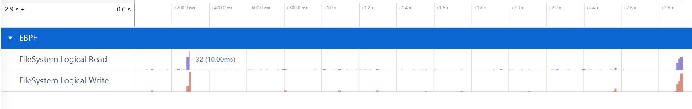
按住 w 键放大界面，悬浮框会显示当前时刻的文件读写次数。
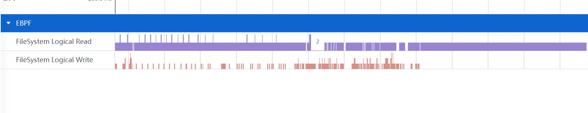

### FileSystem 泳道图的框选功能

可以对读写操作泳道图进行框选，框选后展示框选数据的统计表格，总共有六个 tab 页。
FileSystem statistics 的 Tab 页如图：
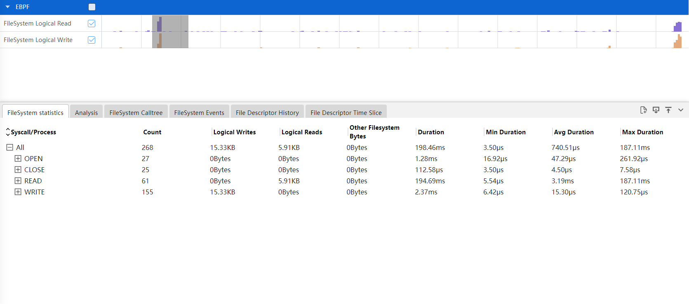

-     Syscall/Process： 按照数据类型，进程分类显示。
-     Count： 系统调用的数量。
-     Logical Writes：写数据统计。
-     Logical Reads：读数据统计。
-     Other Filesystem Bytes：其他数据量。
-     Duration：总时长。
-     Min Duration：最小时长。
-     Avg Duration： 平均时长。
-     Max Duration：最大时长。
  FileSystem CallTree 的 Tab 页如图：
  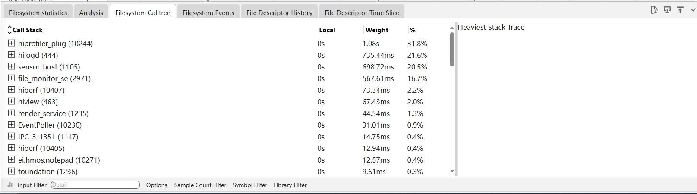
-     Call Stack：为经过符号解析后的Callstack，并且给出动态链接库或者进程名的信息。
-     Local：为该调用方法自身占用的 CPU 时间。
-     Weight：为该调用方法占用的 CPU 时间。
-     %：为该调用方法占用的 CPU 时间占比。
  FileSystem Events 的 Tab 页如图：
  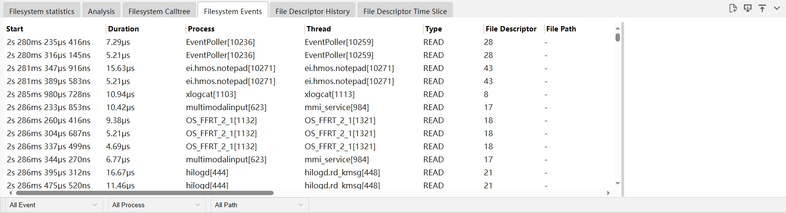
-     Start： 起始时间。
-     Duration：时长。
-     Process：进程名。
-     Thread：线程名。
-     Type：操作类型。
-     File Descriptor：文件描述符。
-     File Path：文件路径。
-     First Argument：系统调用的第一个参数。
-     Second Argument：系统调用的第二个参数。
-     Third Argument：系统调用的第三个参数。
-     Fourth Argument：系统调用的第四个参数。
-     Return：系统调用的返回值。
-     Error：错误码。
-     Backtrace：调用栈顶部函数，并显示调用栈深度。
  File Descriptor History 的 Tab 页如图：
  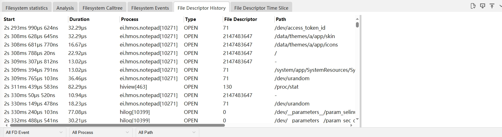
-     Start： 起始时间。
-     Duration：时长。
-     Process：进程名。
-     Type：操作类型。
-     File Descriptor：文件描述符。
-     Path：文件路径。
-     Backtrace：调用栈顶部函数，并显示调用栈深度。
  File Descriptor Time Slice 的 Tab 页如图：
  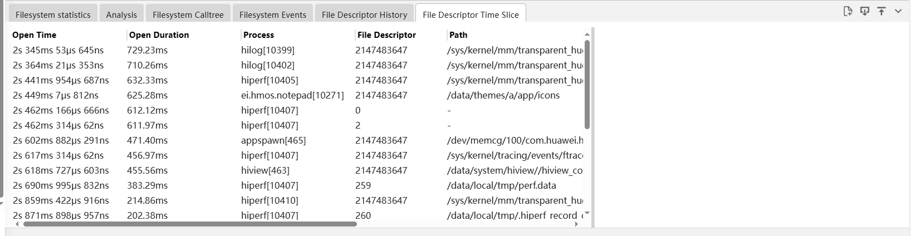
-     Open Time： 打开的起始时间。
-     Open Duration：打开的时长。
-     Process：进程名。
-     File Descriptor：文件描述符。
-     Path：文件路径。
-     Backtrace：调用栈顶部函数，并显示调用栈深度。

### FileSystem 支持多种 Options 展示风格

点击 FileSystem CallTree 的 Tab 页底部的 Options，会有四个 CheckBox 复选框。
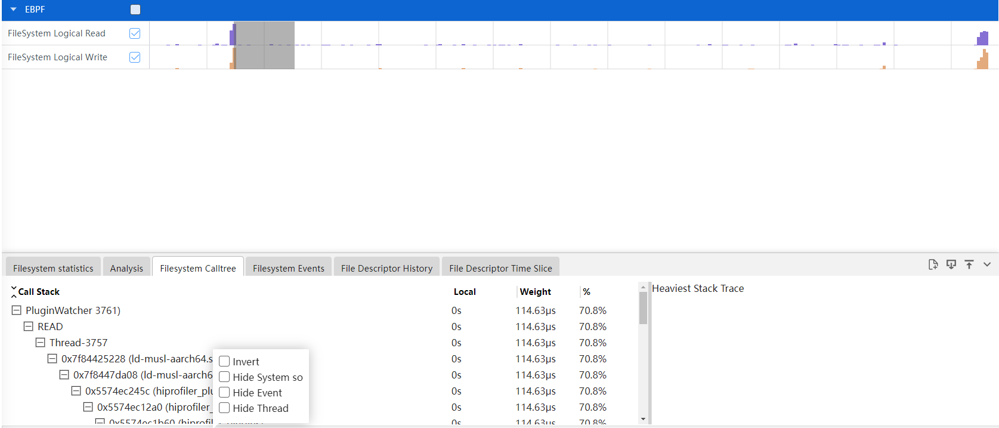

-     Invert：反向输出调用树。
-     Hide System so：隐藏系统库文件。
-     Hide Event：隐藏事件。
-     Hide Thread：隐藏线程。

### FileSystem 支持过滤调用栈调用次数的展示风格

点击 FileSystem CallTree 的 Tab 页底部的 Sample Count Filter，可以填上区间值。过滤出符合该区间值调用次数的调用栈信息。
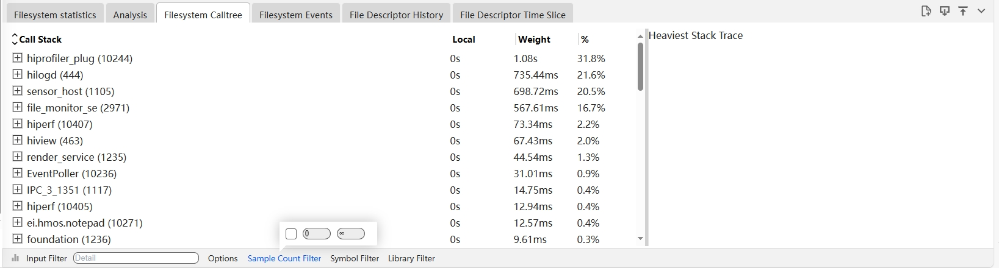

### FileSystem 功能的调用栈 Group 展示-数据分析支持剪裁功能

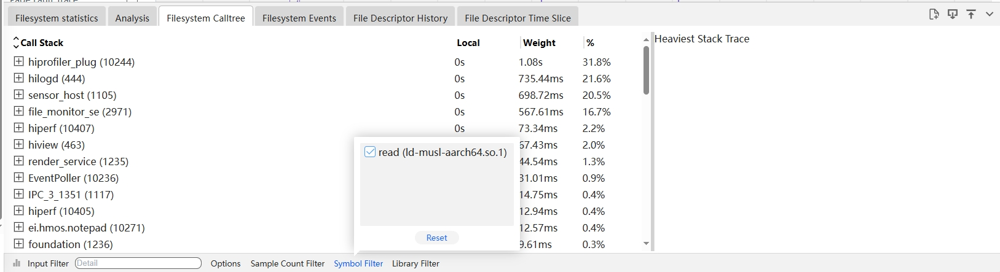

- 裁剪 Callstack，点击 Callstack 上一个节点符号，再点击底部 Symbol Filter 按钮，则该符号自动被裁剪掉，同时将该节点往下所有的 Callstack 内容裁剪掉。

- 裁剪 Library，点击 Library 上一个节点符号，再点击底部 Library Filter 按钮，则该符号自动被裁剪掉，同时将该节点往下所有的 Callstack 内容裁剪掉。
- 点击 Reset 按钮，将恢复选中的裁剪内容。

### FileSystem 功能的调用栈 Group 展示支持按条件过滤

在 Input Filter 输入关键字，会显示出带有该关键字的展示信息。

### FileSystem 辅助信息区展示调用栈

当在详细信息区选择一个符号时，将展示与该符号相关的完整的调用栈。如下图的 Heaviest Stack Trace：
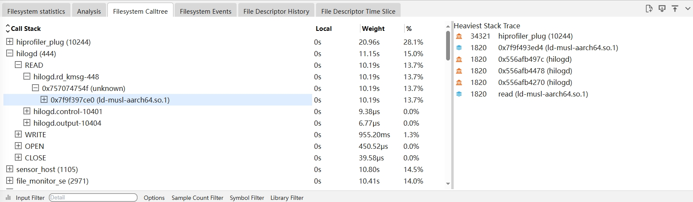

### FileSystem 的事件类型的过滤

通过选择可以过滤是 Open 类型，还是 Close 类型事件。
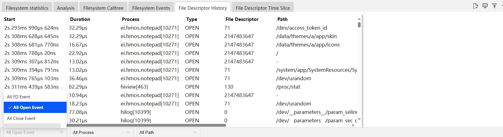

### FileSystem 的火焰图功能

点击 FileSystem CallTree 左下角的柱状图的图标，会切换到火焰图页面。
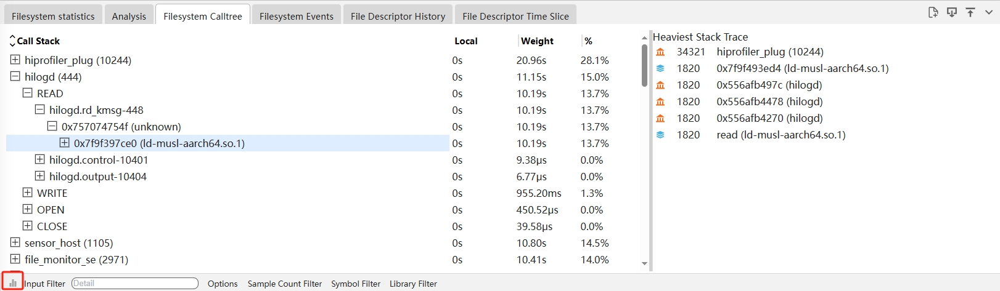
进入到火焰图页面，火焰图的展示跟 Callinfo 的 tab 页的调用栈显示一致，鼠标放到色块上，悬浮框可以显示调用栈名称、所属Lib库、函数地址、耗时及其占比。
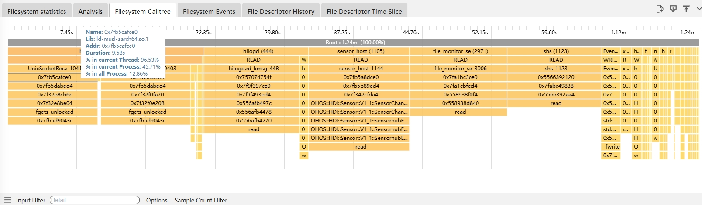
鼠标左键火焰图，会进入下一级界面，左键上级则返回上一级界面。
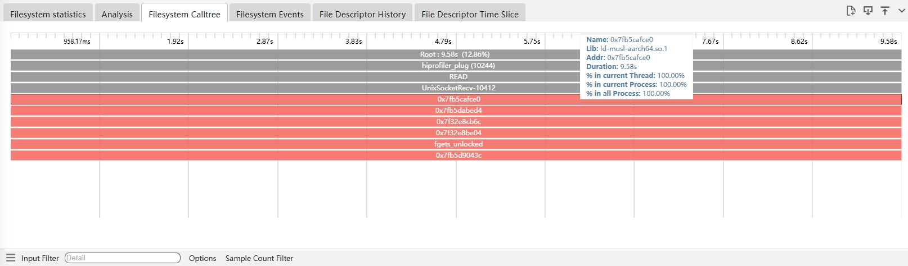
