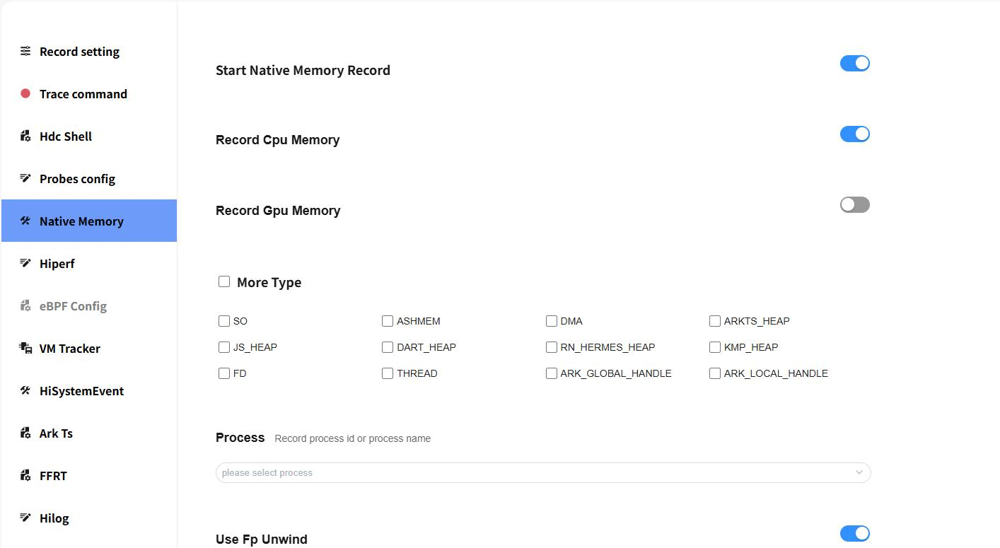
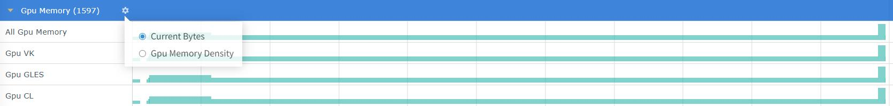

# Gpu Memory 抓取和展示说明

Gpu Memory 是查看gpu内存的分配和释放等情况。

## Gpu Memory 的抓取

### Gpu Memory 抓取配置参数

配置参数说明：

- Record Gpu Memory：打开gpu memory开关。
- Gpu Type：gpu memory类型（包括：RES_GPU_VK、RES_GPU_GLES_IMAGE、RES_GPU_GLES_BUFFER、RES_GPU_CL_IMAGE、RES_GPU_CL_BUFFER）。

gpu memory抓取：
- 打开Record Gpu Memory开关，可以与cpu memory同时抓取，也可单独抓取。
- 其他操作可参考native memory抓取。

## Gpu Memory 展示说明

将抓取的 Gpu Memory 文件导入到 smartperf工具中查看，查看gpu内存的分配和释放等情况。

### Gpu Memory 泳道图展示类型

点击齿轮状的图标可以设置内存的展示单位。

-     Current Bytes：以申请内存的size绘制泳道图。
-     Gpu Memory Density：以申请内存的数量绘制泳道图。
-     All Gpu Memory：VulKan分配和OpenGLES分配和OpenCL分配的总量。
-     Gpu VK：VulKan分配的内存。
-     Gpu GLES：OpenGLES分配的内存。
-     Gpu CL：OpenCL分配的内存。

### GPU Memory 泳道图的框选功能

可参考Native Memory 泳道图的框选功能。