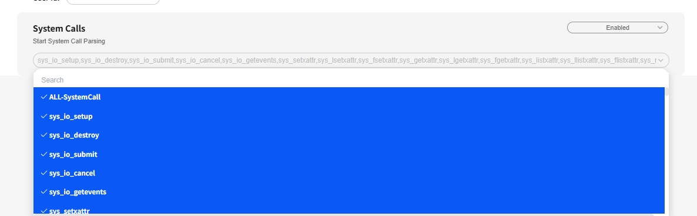
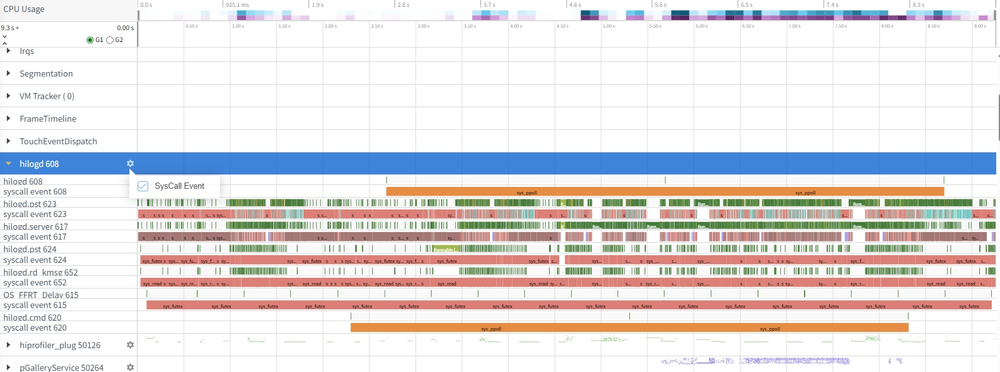
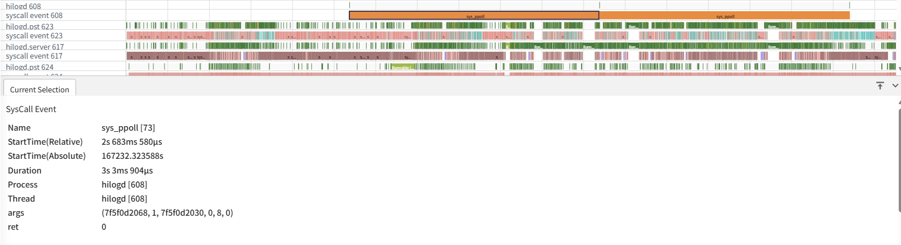

# System Call 函数解析和展示说明

支持打开包含syscall事件的的trace文件，可通过通道图查看单个线程的系统调用情况，可通过框选泳道一段时间查看该时间范围内的系统调用统计详情。

## System Call 函数解析

### System Call 函数解析开关

打开 Flags配置页面， 找到System Calls开关配置项。

再点击下面的syscall event选择框，选择需要解析的系统事件，可选择某几个或者点击“ALL-SystemCall”选项全选，也可在输入框中根据syscall事件名称来搜索系统事件。

根据上述操作，即可打开解析Syscall函数的开关，然后正常打开带syscall函数事件的trace文件，即可完成对syscall函数的解析。

### System Call泳道图展示说明

### System Call泳道图展示

将带System Call事件的trace文件导入 smartperf 界面查看。

点击process 泳道右侧的小齿轮图标，在弹出的泳道图配置面板里面勾选“SysCall Event”选项，即可在各自线程泳道下展示对应的线程SysCall函数调用泳道图。

### System Call 泳道图的点选功能

可以对 System Call 各泳道图进行点选，点选后在最下方的弹出层中会展示点选数据的详细信息。

SysCall Event详细信息字段展示如下：
-     Name： 事件名称和对应的事件ID。
-     StartTime(Relative)： 时间戳信息（相对时间）。
-     StartTime(Absoluate): 时间戳信息（绝对时间）。
-     Duration: 函数执行时长。
-     Process：进程信息，包括进程名和进程id。
-     Thread：线程信息，包括线程名和线程id。
-     args: syscall 函数的调用参数。
-     ret: syscall 函数的返回值。

### System Call 泳道图的框选功能
可以对 System Call 各泳道图进行框选，框选泳道后，可以在底部展示SysCall Event Tab栏，统计框选时间范围内的系统函数调用的统计信息，以Process/Thread/SysCall的树形统计模式来统计数据。 

    字段说明：
-     Process/Thread/SysCall： 以进程、线程、系统事件3个层级统计系统事件。
-     Duration：系统事件在框选时间范围内的执行时长。
-     Count：系统事件在框选时间范围内的执行次数。
  可通过点击每行的count值，跳转至子级tab,查看在框选时间范围内，该进程或者线程或者系统事件的详细调用情况，如图：
  
  各个统计字段含义同点选Tab字段。
