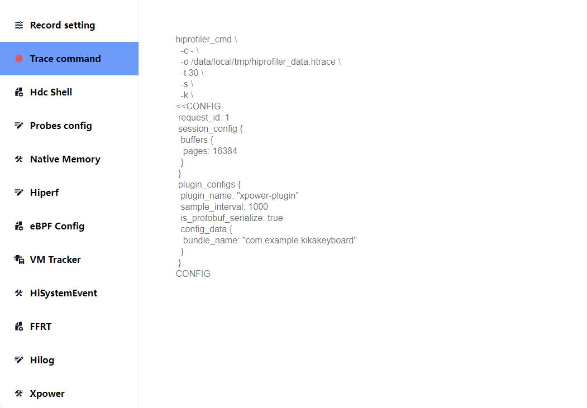
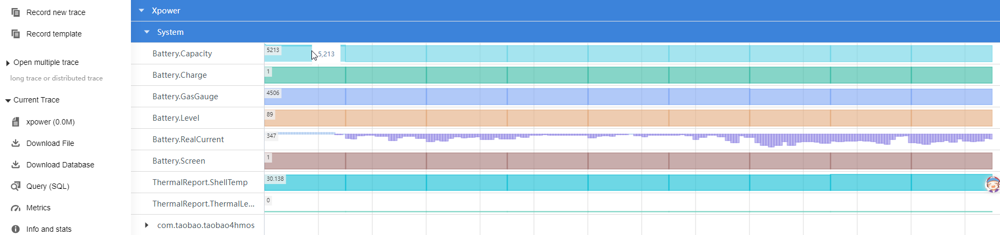
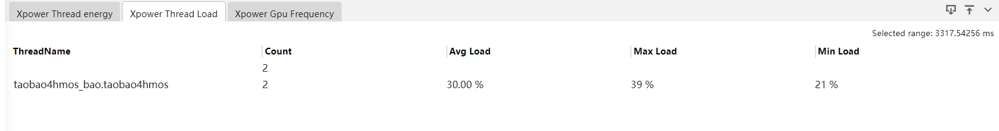

# Xpower 抓取和展示说明

Xpower用于查看系统整机和应用功耗数据，当前支持：电源信息、热温度信息。

## Xpower 的抓取

#### Xpower 的抓取配置参数

打开Start Xpower Record开关抓取Xpower数据。点击Package下拉框，可以选择需要抓取的应用(仅支持单选)

配置项说明：

-     下拉框内数据：应用包名。

选择后Trace command页面显示对应抓取命令

点击MessageType下拉框，可以选择需要抓取的类型(只有选择了应用才会出现COMPONENT_TOP、APP_STATISTIC、APP_DERAIL并且下拉框支持多选)。

配置项说明：

-     REAL_BATTERY：电源信息。
-     THERMAL_REPORT：热温度信息。
-     COMPONENT_TOP：每个器件的TOP应用。
-     APP_STATISTIC：应用每个器件的能耗信息。
-     APP_DETAIL：应用每个器件的详细信息。

选择后Trace command页面显示对应抓取命令：

### Xpower 展示说明

将抓取的Xpower文件导入到HiSmartPerf工具中查看，查看系统整机和应用功耗情况。

### Xpower泳道图说明——REAL_BATTERY

选择REAL_BATTERY会展示六条泳道：

-     Battery.Capacity： 电池容量(单位mAh)。
-     Battery.Charge： 充电状态(充电1,非充电0)。
-     Battery.GasGauge：电池剩余电量(单位mAh)。
-     Battery.Level：电池百分比。
-     Battery.RealCurrent： 实时电流(单位mAh,充电时为正数,耗电时为负数)。
-     Battery.Screen： 屏幕状态(亮屏1,灭屏0)。

### system泳道图点选和框选功能

点击system下的任意通道图弹出Current Selection的tab页

- StartTime(Relative)：相对时间
- StartTime(Absolute) ：绝对时间
- Value：值
- Duration：持续时间

框选system下的任意时间泳道图可以弹出Xpower Counters和Xpower Component Top两个tab页

Xpower Counters的tab页

- Name：器件的名字

- Delta value：增量值

- Rate /s：速率(单位：s)
- Weighted：加权平均值
- avg value：平均值
- Count：数值
- First value：第一个值
- Last value：最后一个值
- Min value：最小值
- Max value：最大值

Xpower Component Top的tab页（此tab页为框选Battery.RealCurrent泳道图出现）

根据选的的参数不同tab页的表头会发生变化，audio/bluetooth/flashlight/location/wifiscan表头为

- TimeStamp：时间戳
- AppName：应用名
- Background Duration：后台持续时间
- Background Energy：后台能耗
- Foreground Duration：前台持续时间
- Foreground Energy：前台能耗
- ScreenOff Duration：锁屏持续时间
- ScreenOff Energy：锁屏能耗
- ScreenOn Duration：亮屏持续时间
- ScreenOn Energy：亮屏能耗

camera的表头为：

- TimeStamp：时间戳
- AppName：应用名
- CameraId：相机id

- Background Duration：后台持续时间
- Background Energy：后台能耗
- Foreground Duration：前台持续时间
- Foreground Energy：前台能耗
- ScreenOff Duration：锁屏持续时间
- ScreenOff Energy：锁屏能耗
- ScreenOn Duration：亮屏持续时间
- ScreenOn Energy：亮屏能耗

CPU表头为：

- TimeStamp：时间戳
- AppName：应用名
- UID：UID
- Load ：负荷

- Background Duration：后台持续时间
- Background Energy：后台能耗
- Foreground Duration：前台持续时间
- Foreground Energy：前台能耗
- ScreenOff Duration：锁屏持续时间
- ScreenOff Energy：锁屏能耗
- ScreenOn Duration：亮屏持续时间
- ScreenOn Energy：亮屏能耗

display/GPU表头

- TimeStamp：时间戳
- AppName：应用名
- Usage Duration：使用时长
- Usage Energy：使用能耗

### Xpower泳道图说明——THERMAL_REPORT

  选择THERMAL_REPORT则展示两条泳道：

-     ThermalReport.ShellTemp： 外壳温度(单位℃)。
-     ThermalReport.ThermalLevel： 温度等级。

### Xpower泳道图说明——COMPONENT_TOP

选择COMPONENT_TOP，框选Battery.RealCurrent则展示Xpower Component Top的tab页。

-     audio：audio的能耗
-     bluetooth：Bluetooth的能耗
-     flashlight：flashlight的能耗
-     location：location的能耗
-     wifi：wifi的能耗
-     camera：camera的能耗
-     cpu：cpu的能耗
-     display：display的能耗
-     gpu：gpu的能耗

### Xpower泳道图说明——APP_STATISTIC

选择APP_STATISTIC则只有statistic泳道图有数据：

- statistic：统计数据

### 系统泳道图的悬浮

鼠标悬浮至任意system的泳道图上鼠标旁边会悬浮当前值的大小

### Xpower泳道图说明——APP_DETAIL

选择APP_DETAIL则有八条泳道图有数据：

- wifi packet：wifi的数据包。
- WIFIBytes：wifi的字节数。
- DisPlay：屏幕的刷新率。
- Thread Count：线程统计。
- Thread Energy：线程能耗。
- Thread Load：线程负载。
- Gpu Freq Count：GPU频率计数。
- Gpu Freq：GPU频率。

### 应用泳道图的点选和框选

statistic泳道图的点选功能：点击statistic泳道图可以弹出Xpower Statistic Current Data的tab页

- Name:器件的名字
- TimeStamp：时间戳
- Duration：持续时间
- Energy：能耗

WIFIPacket、WIFIPacket和DisPlay泳道图的点选功能：点击WIFIPacket、WIFIPacket和DisPlay泳道图可以弹出Current Selection的tab页

- StartTime(Relative) ：相对开始时间
- StartTime(Absolute) ：绝对开始时间
- receive：接收数据大小
- send：发送数据大小

特别地：点击display的泳道图会出现屏幕刷新率的持续时间

Thread Load泳道图的点选功能

- ThreadName：线程名
- TimeStamp：时间戳
- Load：负载
- Duration：持续时间

Thread Energy泳道图的点选功能：

- ThreadName：线程名
- TimeStamp：时间戳
- Energy：能耗
- Duration：持续时间

GPU Freq泳道图的点选功能：

- Frequency：频率
- TimeStamp：时间戳
- RunTime：运行时间
- IdleTime：休眠时间

Thread Count和Gpu Freq Count框选功能：框选Gpu Freq Count、Thread Count泳道图任意处会弹出Xpower Counters的tab页

- Name：器件名字
- Delta value：增量值
- Rate/s：速率（单位：s）
- Weighted avg value：加权平均值
- Count：数量
- First value：第一个值
- Last value：最后一个值
- Min value：最小值
- Max value：最大值

Statistics泳道图的框选功能：框选Statistics泳道图任意处会弹出Xpower Statistics的tab页

- Name：器件名
- Count：数量：
- Avg_Energy：平均能耗
- Max_Energy：最大能耗
- Min_Energy：最小能耗

WIFIPackets、WIFIBytes和Display泳道图的框选功能：框选WIFIPackets、WIFIBytes和Display会出现三个Display Detail、WIFIPackets、WIFIBytes三个tab页，但表头均一致

- Name：名字（display为刷新率，WIFIPackets、WIFIBytes为收发数据）
- Count：数量（display为持续时间，WIFIPackets、WIFIBytes为收发的数据包个数活数据大小）
- Max：最大值（display为刷新率的最大持续时间，WIFIBytes为收发的数据包个数活数据最大值）
- Min：最小值（display为刷新率的最小持续时间，WIFIBytes为收发的数据包个数活数据最小值）
- Avg：平均值（display为刷新率的平均持续时间，WIFIBytes为收发的数据包个数活数据平均数）

Thread energy泳道图的框选功能：框选Thread energy泳道图会弹出Xpower Thread energy的tab页

- ThreadName：线程名
- Count：线程数
- Avg Energy：平均能耗
- Max Energy：最大能耗
- Min Energy：最小能耗

Thread Load泳道图的框选功能：框选Thread Load泳道图会弹出Xpower Thread Load的tab页

- ThreadName：线程名
- Count：线程出现的次数
- Avg Load：平均占比
- Max Load：最大占比
- Min Load：最小占比

Gpu Freq Count泳道图的框选功能：框选Thread energy泳道图会弹出Xpower Gpu Frequency 的tab页

- Frequency：频率
- Count：数量
- Avg RunTime：平均运行时间
- Max RunTime：最大运行时间
- Min RunTime：最小运行时间
- Avg IdleTime：平均休眠时间
- Max IdleTime：最大休眠时间
- Min IdleTime：最小休眠时间

### 应用的鼠标悬浮

鼠标悬浮至应用的任意的泳道图上鼠标旁边会悬浮当前器件的简要信息

