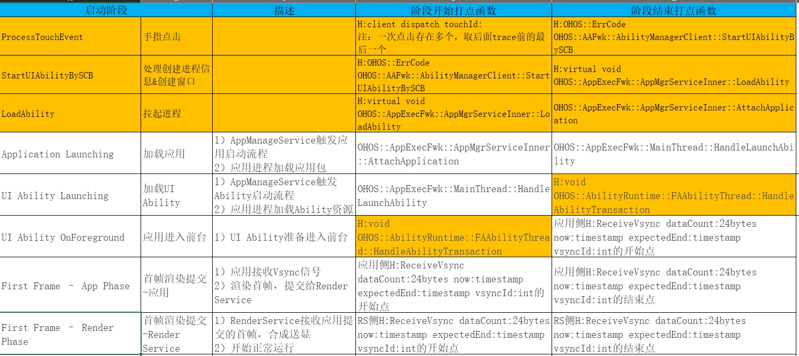

# 应用启动数据说明

TraceStreamer支持解析应用启动数据，数据包含应用拉起的8个阶段及相关的调用栈信息，分别为ProcessTouchEvent(手指点击)，StartUIAbilityBySCB(处理创建进程信息&创建窗口), LoadAbility(拉起进程),ApplicationLaunching(加载应用)，UIAbilityLaunching(加载UIAbility)， UIAbilityOnForeground(应用进入前台)，First Frame-App Phase(首帧渲染提交-应用)，First Frame-Render Phase(首帧渲染提交-Render Service)。

应用启动每个阶段的开始和结束时间如图：

前四个阶段对应的标志事件字符串：
ProcessTouchEvent：在callstack表中查找包含"H:client dispatch touchId:"的字符，即为启动第1阶段。注：一次点击存在多个，取后面trace前的最后一个。

StartUIAbilityBySCB：在callstack表中查找包含"H:OHOS::ErrCode OHOS::AAFwk::AbilityManagerClient::StartUIAbilityBySCB"的字符，即为启动第2阶段。

LoadAbility：在callstack表中查找包含"H:virtual void OHOS::AppExecFwk::AppMgrServiceInner::LoadAbility"的字符，即为启动第3阶段。

Application Launching：在callstack表中查找包含"H:virtual void OHOS::AppExecFwk::AppMgrServiceInner::AttachApplication(const pid_t, const sptrOHOS::AppExecFwk::IAppScheduler &)##"字符的数据，即为启动第4阶段。该数据中第一个'##'之后的字符串即为该应用的名称。在此阶段关联前3阶段数据。

UI Ability Launching：在callstack表中查找包含"H:void OHOS::AppExecFwk::MainThread::HandleLaunchAbility(const std::shared_ptr `<AbilityLocalRecord>` &)##"字符的数据，即为启动的第5阶段，在这个阶段会上报包名和拉起该应用的ipid。如数据中缺少此阶段，可视为应用未启动。

UI Ability OnForeground：在callstack表中查找包含"H:void OHOS::AbilityRuntime::FAAbilityThread::HandleAbilityTransaction(const OHOS::AbilityRuntime::Want &, const OHOS::AbilityRuntime::LifeCycleStateInfo &, sptr<AppExecFwk::SessionInfo>)##"字符的数据，或"H:void OHOS::AbilityRuntime::UIAbilityThread::HandleAbilityTransaction"的数据，即为启动的第6阶段，该阶段会上报ipid，同一个应用UIAbilityLaunching(加载UIAbility)阶段和当前阶段上报的ipid相同。

后两个阶段的计算方式如下：

First Frame-App Phase：使用UIAbilityLaunching(加载UIAbility)阶段得到的ipid关联到frame_slice表中，取到该ipid对应的应用帧的首帧数据，即为该应用第7阶段的数据。

First Frame-Render Phase：通过应用帧首帧数据，可以在frame_slice表中通过dst字段关联到渲染帧首帧数据，即为该应用的第8阶段的数据。
